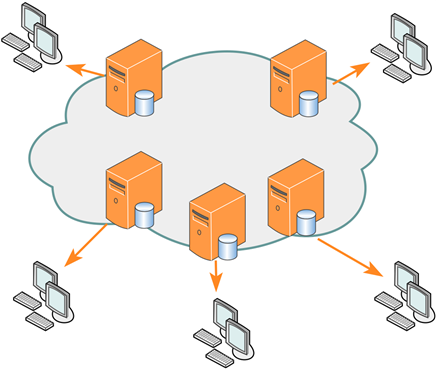

# Deployment model
- ### Public cloud
    

    - eg：Google, Microsoft
- ### Private cloud
    
- ### Community cloud
    
- ### Hybrid cloud：combines two or more 

# Service mode
- ### Software as a Service (SaaS)
    - eg：Adobe
- ### Platform as a Service (PaaS)
    - eg：Google
- ### Infrastructure as a Service (IaaS)

# Extension of Cloud Computing
- ### Fog Computing
- ### Edge Computing
    - ### Content Delivery Network (CDN)
        

    - ### edge server
