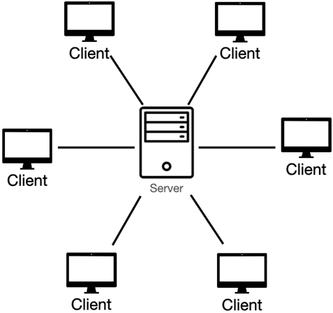
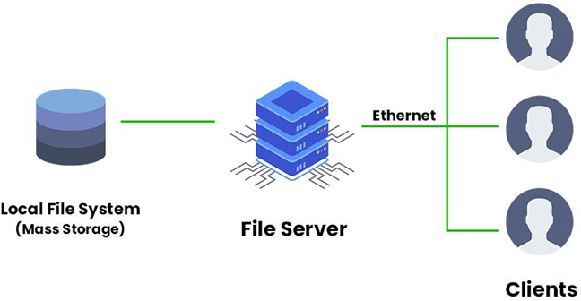
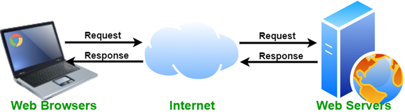
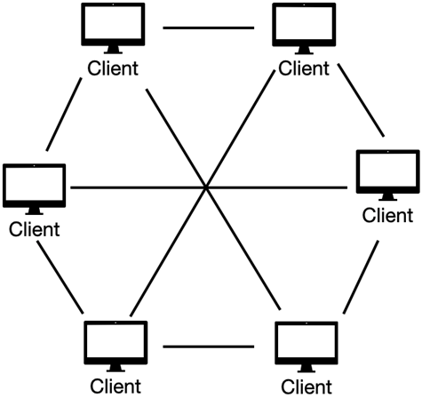

# Distributed Computing System Models
- ### [Architectural Model](#architectural-model-1)
- ### [Interaction Model](#interaction-model-1)
- ### [Failure Model](#failure-model-1)

# Architectural Model
- ### Client–Server model
    
    
    - ### [Remote Procedure Call (RPC)](#remote-procedure-call-rpc-1)
    - ### Applications of Client–Server model
        - ### file server
            
        - ### web server
            
- ### Peer-to-Peer model(P2P model)
    

    - ### node = client = server
    - ### Applications of P2P model
        - ### file sharing
            
        - ### blockchain
            

            - Bitcoin(BTC)

# Interaction Model
- ### Message Passing
    - ### Synchronous Distributed Systems
    - ### Asynchronous Distributed Systems
- ### Publish/Subscribe Pattern (Pub/Sub Pattern)
- ### Remote Procedure Call (RPC)

# Failure Model
- ### Crash Failures
- ### Omission Failures
- ### Timing Failures
- ### Byzantine Failures
- ### Arbitrary Failures

