# History of Computing Hardware
- ### [Early History (~1950)](#early-history-1950-1)
- ### [First Generation (1951~1959)](#first-generation-19511959-1)
- ### [Second Generation (1959~1965)](#second-generation-19591965-1)
- ### [Third Generation (1965~1971)](#third-generation-19651971-1)
- ### [Fourth Generation (1971~)](#fourth-generation-1971-1)
- ### [Parallel Computing and Networking](#parallel-computing-and-networking-1)

# Early History (~1950)
- ### abacus
    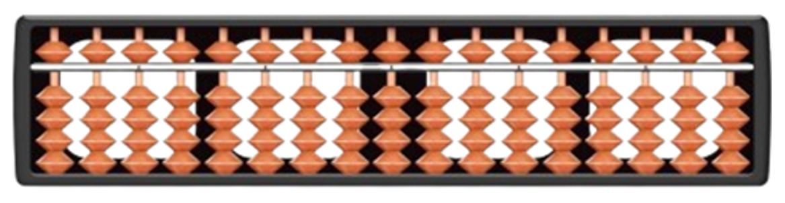
- ### Blaise Pascal
    - ### Pascaline (Pascal's calculator)
        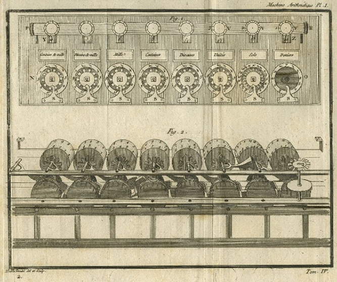
        
        - used for：addition, subtraction
        - type：gear-driven mechanical calculator
        - Components of the Pascaline
            
            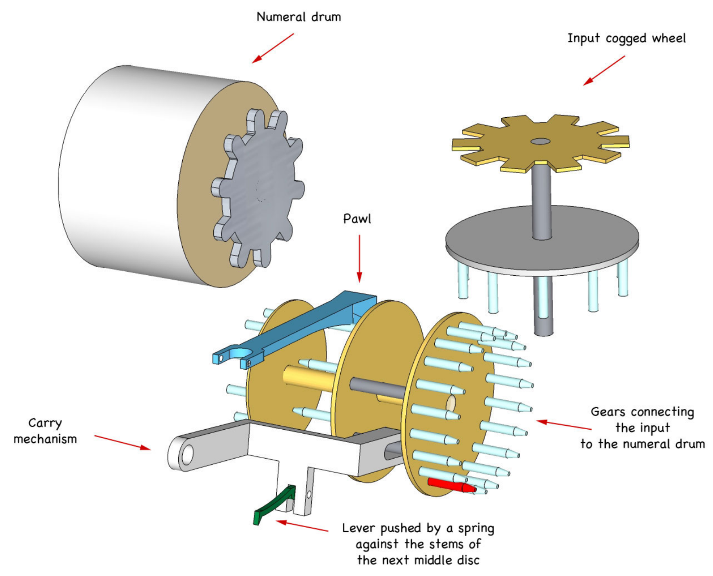

            |Component|Function|
            |:---:|:---:|
            |Gear|registers and accumulates numbers|
            |Sautoir|gravity-assisted carry mechanism, automates the carry operation|
            |Dial, Wheel|input interface, turn with a stylus to enter numbers|
    
    - ### Pascal's Triangle
    - ### Pascal's Principle
- ### Gottfried Wilhelm von Leibniz
    - ### Leibniz wheel (Stepped reckoner)
        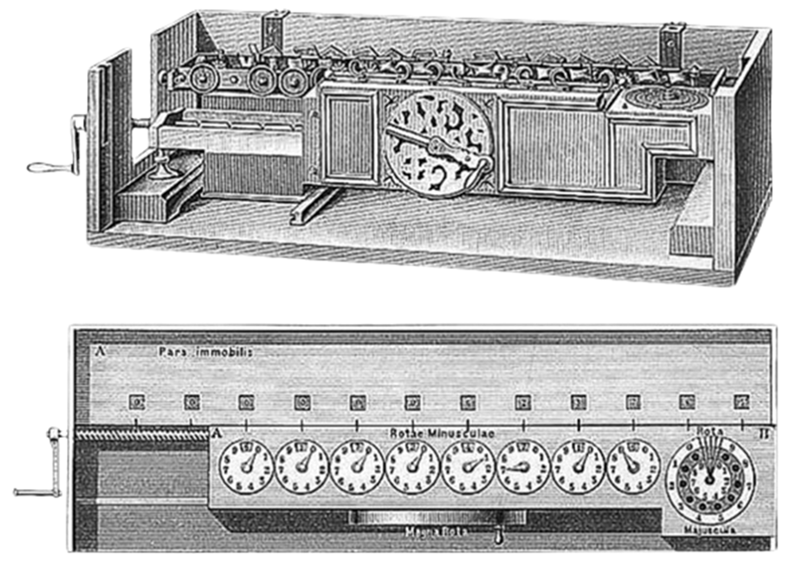

        - used for：four whole-number operations (addition, subtraction, multiplication, division)
    - ### invent：binary system
- ### Joseph Jacquard
    - ### Jacquard Loom
        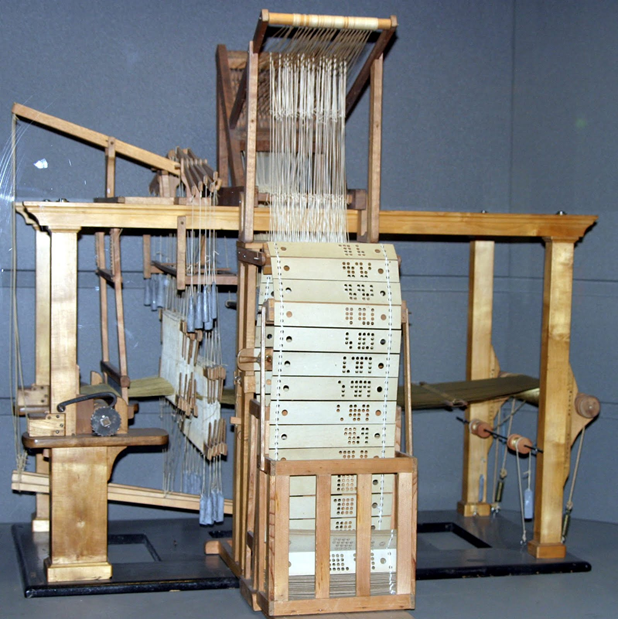
    - ### Punched Card
        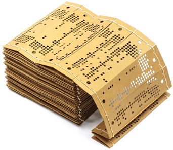
- ### Charles Xavier Thomas de Colmar
    - ### Thomas Arithmometer
- ### Charles Babbage
    - ### Difference Engine
        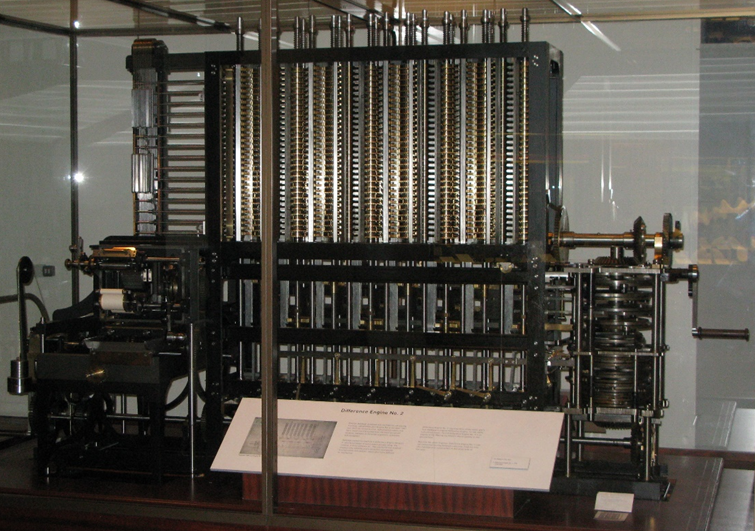

        - used for：tabulate polynomial functions
        - principle：finite difference method
    - ### Analytical Engine
        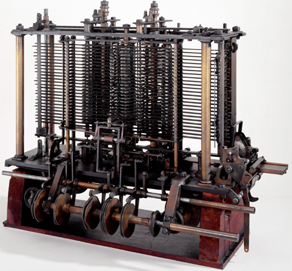
        
        - Components of the Analytical Engine
            |Component|Function|
            |:---:|:---:|
            |Store|storage device, like memory|
            |Mill|like arithmetic logic unit, perform all four arithmetic operations|
            |[Punched Card](#punched-card)|input device, input programs and data|
            |Printer, Curve Plotter, Bell|output device, display results|
- ### Ada Lovelace
    - ### the first programmer
    - ### invent：the concept of the loop
- ### William Seward Burroughs I
    - ### Burroughs Adding Machine
        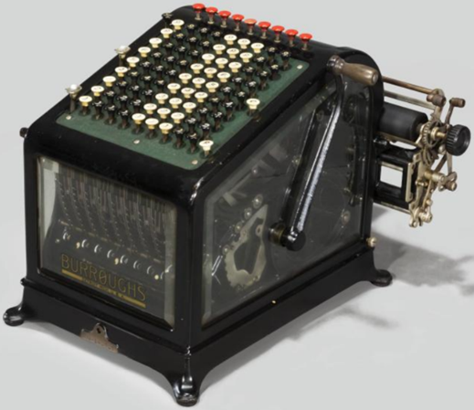
- ### Herman Hollerith
    - ### Tabulating Machine
        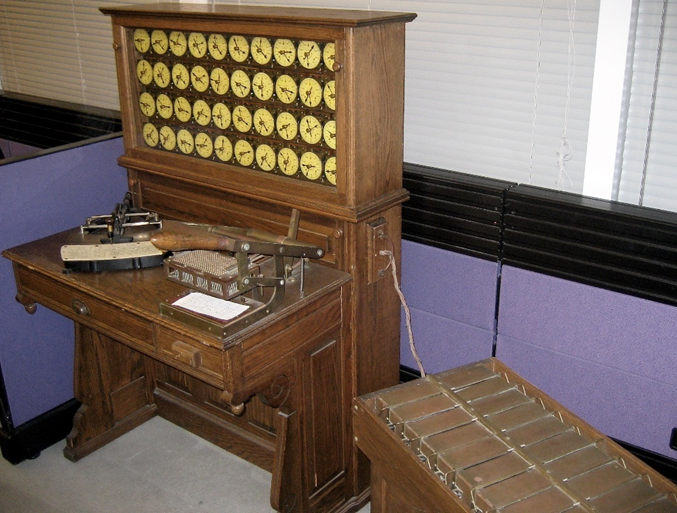
    - ### Hollerith Punched Card
        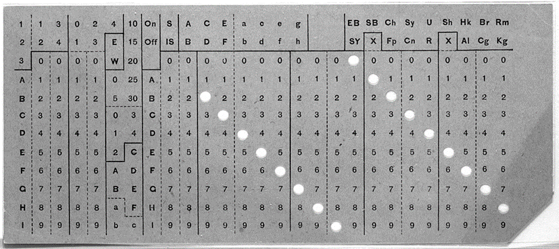
    - ### founded the CTR (IBM)
- ### Curt Herzstark
    - ### Curta Calculator
- ### Alan Turing
    - ### Turing Machine
        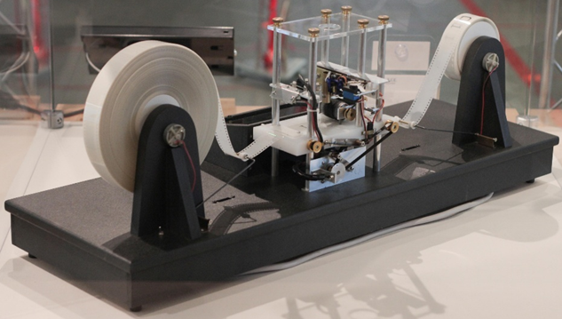
    - ### Turing Test
        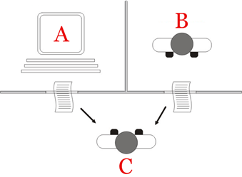
- ### Early computers
    - ### Harvard Mark I
        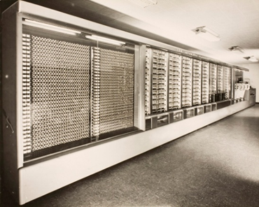

        - based on [Harvard Architecture](../computer-hardware/computer-hardware.md#harvard-architecture)
 
    - ### Electronic Numerical Integrator And Computer (ENIAC)
        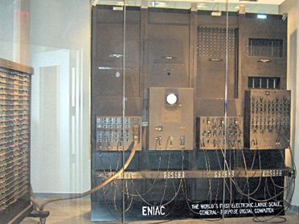

        - the first programmable general-purpose electronic digital computer
    - ### Electronic Discrete Variable Automatic Computer (EDVAC)
        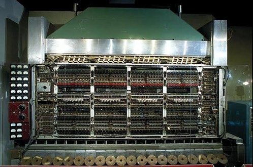

        - based on [Von Neumann Architecture](../computer-hardware/computer-hardware.md#von-neumann-architecture) and binary system
    - ### UNIVersal Automatic Computer I (UNIVAC I)
        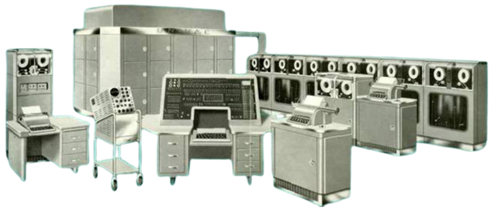

        - the first commercial computer

# First Generation (1951~1959)
- ### Vacuum Tubes
    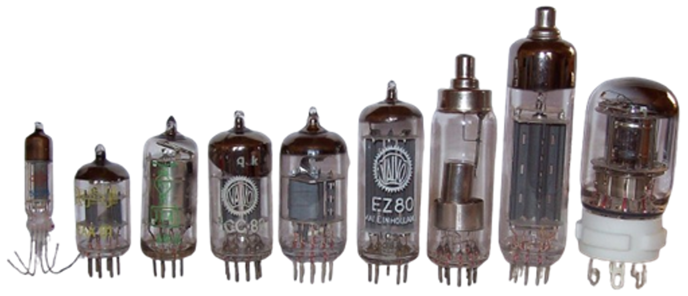

    - #### type：electronic component
    - #### cons：large, unreliable, generated a lot of heat
- ### Magnetic Drums
    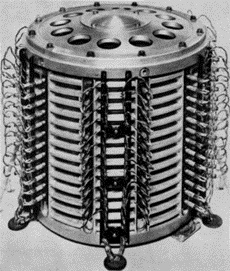

    - #### type：[Magnetic Storage (Non-Volatile)](../computer-hardware/memory/non-volatile-memory.md#magnetic-storage)
- ### Card Readers
    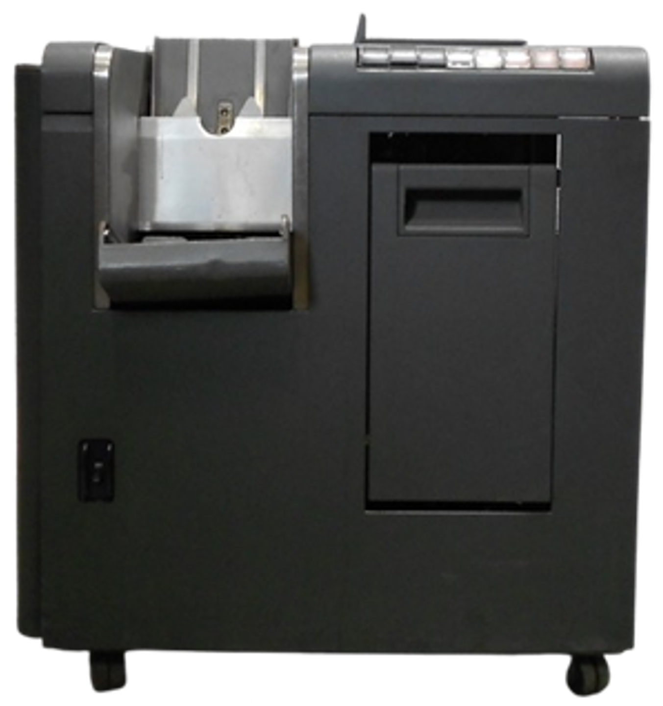

    - #### type：punched card input device
    - #### IBM card
        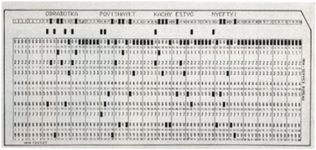
- ### [Magnetic Tape](../computer-hardware/memory/non-volatile-memory.md#magnetic-tape)
    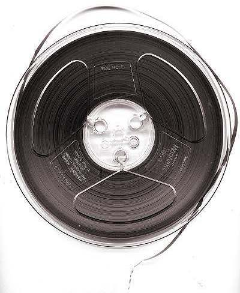

    - #### type：[Magnetic Storage (Non-Volatile)](../computer-hardware/memory/non-volatile-memory.md#magnetic-storage)
        - sequential access
    - #### Magnetic Tape Drives
        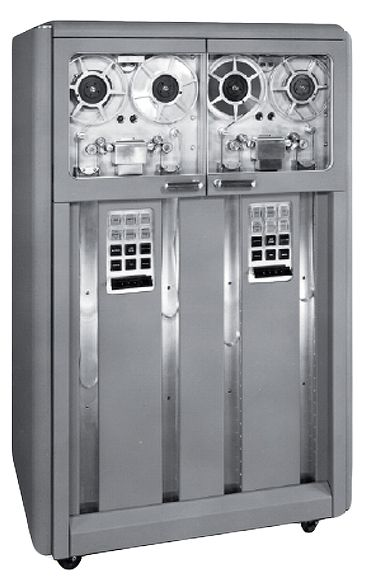
- ### [Peripheral Devices](../computer-hardware/computer-hardware.md#inputoutput-unit-io-unit-peripheral-devices)

# Second Generation (1959~1965)
- ### [Transistor](../../../physics-and-chemistry/electricity/electronic-circuit/electronics/electronics.md#transistor)
    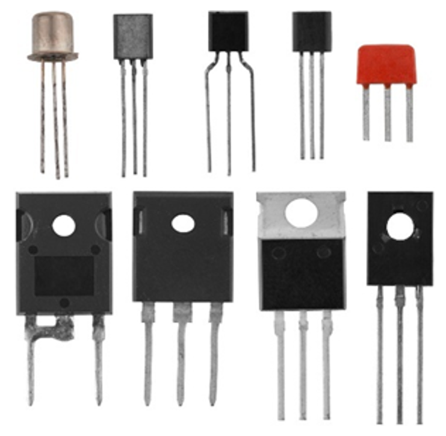
    
    - #### type：electronic component
    - #### pros：small, reliable, fast, durable, cheap
    - #### replaced [Vacuum Tubes](#vacuum-tubes)
- ### Magnetic Core Memory
    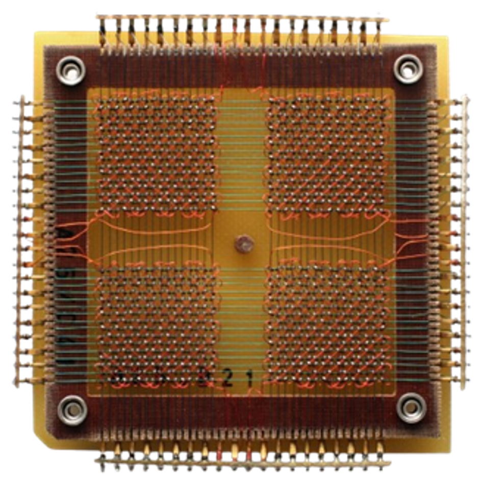
    
    - #### type：[Non-Volatile RAM](../computer-hardware/memory/non-volatile-memory.md#non-volatile-ram-nvram)
        - information available instantly
    - #### replaced [Magnetic Drums](#magnetic-drums)
- ### Magnetic Disks
    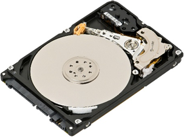
    
    - #### type：[Magnetic Storage (Non-Volatile)](../computer-hardware/memory/non-volatile-memory.md#magnetic-storage)
        - data can be accessed directly
    - #### replaced [Magnetic Tape](#magnetic-tape)

# Third Generation (1965~1971)
- ### [Integrated Circuits (IC)](../../../physics-and-chemistry/electricity/electronic-circuit/electronics/semiconductor/semiconductor-manufacturing-process.md#integrated-circuits-ic-chip)
    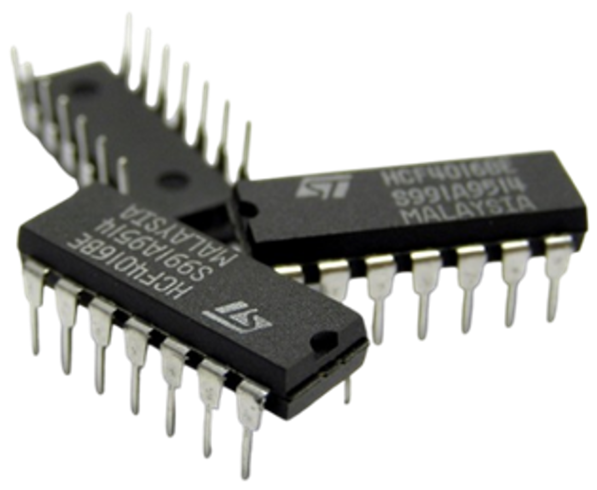

    - #### type：electronic component
    - #### pros：small, reliable, fast, cheap
    - #### replaced Printed Circuit Boards
- ### Semiconductor Memory
   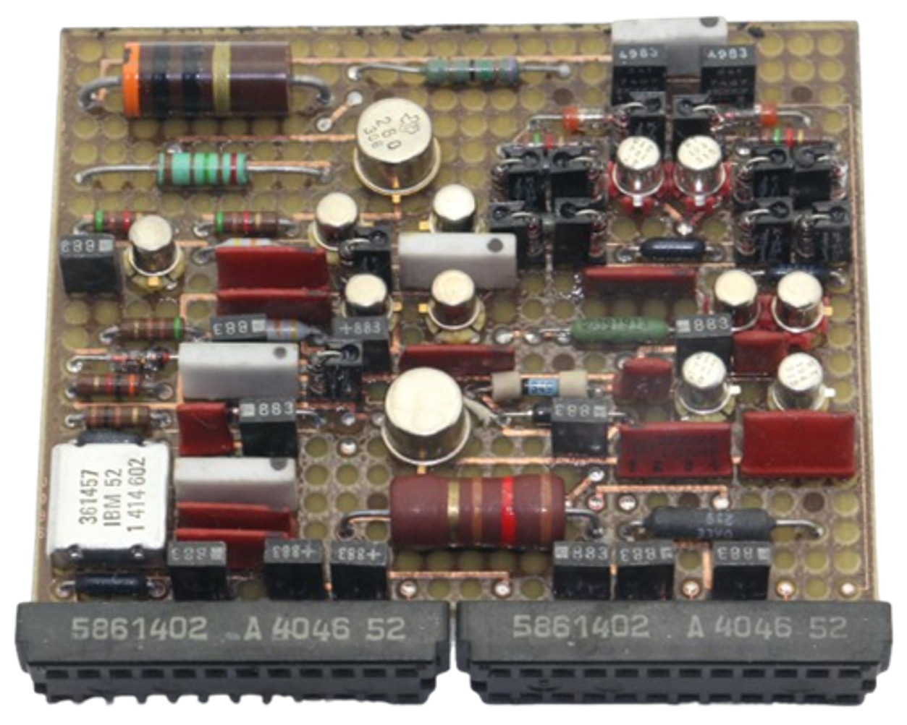
    
    - #### type：[Volatile Memory device](../computer-hardware/memory/volatile-memory.md)
    - #### uses [transistors](../../../physics-and-chemistry/electricity/electronic-circuit/electronics/electronics.md#transistor) and capacitors
- ### Terminal
    - #### type：input/output device
    - #### with a keyboard and screen
- ### Moore's law
    - #### ver.1：the number of [transistors](../../../physics-and-chemistry/electricity/electronic-circuit/electronics/electronics.md#transistor) in an integrated circuit doubles every year

# Fourth Generation (1971~)
- ### [Very Large-Scale Integration (VLSI)](../../../physics-and-chemistry/electricity/electronic-circuit/electronics/semiconductor/semiconductor-manufacturing-process.md#very-large-scale-integration-vlsi)
    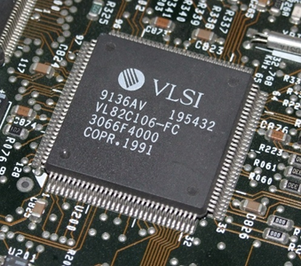

    - #### type：electronic component
- ### Personal Computers
    - #### Workstations
        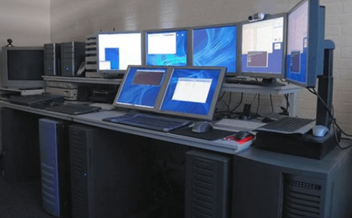
    - #### new companies emerge：Apple, Sun, Dell…
- ### Laptops, Tablet Computers, Smart Phones
- ### Moore's law
    - #### ver.2：the number of [transistors](../../../physics-and-chemistry/electricity/electronic-circuit/electronics/electronics.md#transistor) in an integrated circuit doubles every 18 months
    - #### ver.3：the computer [chip](../../../physics-and-chemistry/electricity/electronic-circuit/electronics/semiconductor/semiconductor-manufacturing-process.md#integrated-circuits-ic-chip) performance double every 18 months, or the price drops by half

# [Parallel Computing](../computer-organization-and-architecture/parallel-computing/parallel-computing.md) and [Networking](../computer-networking/computer-networking.md)
- ### [Parallel Computing](../computer-organization-and-architecture/parallel-computing/parallel-computing.md)
    - #### computers rely on interconnected central processing and/or memory units to increase processing speed
- ### [Networking](../computer-networking/computer-networking.md)
    - #### Ethernet connects small computers to share resources
    - #### file servers connect PCs, in the late 1980s
- ### [ARPANET](../computer-networking/history-of-the-internet.md#1969advanced-research-projects-agency-network-arpanet) and [LANs](../computer-networking/computer-networking.md#local-area-networklan) $`\to`$ Internet

