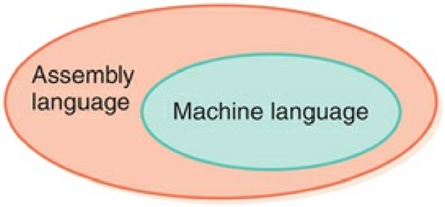
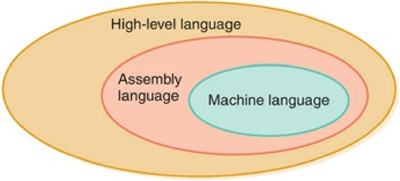
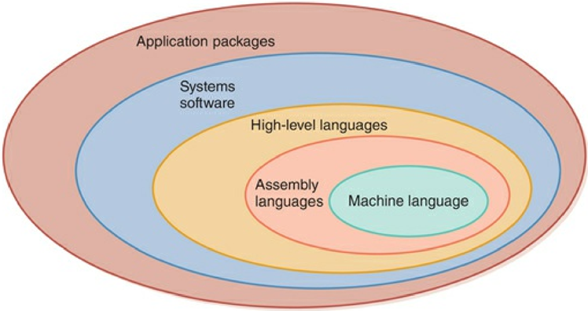

# History of Computing Software
- ### [First-Generation Software (1951~1959)](#first-generation-software-19511959-1)
- ### [Second-Generation Software (1959~1965)](#second-generation-software-19591965-1)
- ### [Third-Generation Software (1965~1971)](#third-generation-software-19651971-1)
- ### [Fourth-Generation Software (1971~1989)](#fourth-generation-software-19711989-1)
- ### [Fifth-Generation Software (1990~)](#fifth-generation-software-1990-1)

# First-Generation Software (1951~1959)

- ### [Machine Language](../computer-organization-and-architecture/isa/isa.md#machine-language)
- ### [Assembly Language](../computer-organization-and-architecture/isa/isa.md#assembly-language)
    - #### [Assembler](../computer-organization-and-architecture/build-process/build-process.md#assembler)
        - translate assembly language into machine language
- ### Computer Users
    - #### systems programmers
    - #### application programmers

# Second-Generation Software (1959~1965)

- ### High-level Language
    - #### Unstructured BASIC
    - #### FORTRAN
        - for numerical applications
    - #### COBOL
        - for business applications
    - #### Lisp
        - for artificial intelligence
        - is Functional Language
- ### [Compiler](../computer-organization-and-architecture/build-process/build-process.md#compiler)

# Third-Generation Software (1965~1971)

- ### Systems Software
    - #### Utility Program
        - [Loader](../computer-organization-and-architecture/build-process/loader.md)
        - [Linker](../computer-organization-and-architecture/build-process/linker.md)
    - #### [Operating System](../operating-system/operating-system.md)
    - #### [Translators](../computer-organization-and-architecture/build-process/build-process.md#translator)
        - [Assemblers](../computer-organization-and-architecture/build-process/build-process.md#assembler)
        - [Compilers](../computer-organization-and-architecture/build-process/build-process.md#compiler)
- ### Computer Users
    - #### non-programmers became computer users

# Fourth-Generation Software (1971~1989)
- ### Structured Programming
    - #### Structured BASIC
    - #### Pascal
    - #### Modula-2
    - #### [C](../../coding/programming-language/c.md)
    - #### [C++](../../coding/programming-language/oop/cpp.md)
- ### Operating Systems (OS)
    |Operating Systems|Developer|
    |:---:|:---:|
    |UNIX|AT&T|
    |Personal Computer [DOS](#disk-operating-system-dos) (PC-[DOS](#disk-operating-system-dos))|IBM|
    |Microsoft [DOS](#disk-operating-system-dos) (MS-[DOS](#disk-operating-system-dos))|Microsoft|
    |Macintosh (Mac)|Apple|
    - #### Disk Operating System (DOS)
- ### Application Software
    - #### Spreadsheets
        - Lotus
    - #### Word processors
        - WordPerfect
    - #### Database management systems
        - dBase

# Fifth-Generation Software (1990~)
- ### Microsoft
    - #### Microsoft Windows
    - #### Microsoft Word
- ### Office Suites
    - #### Microsoft 365
    - #### Google Workspace
- ### Object-Oriented Design (OOD)/[Object-Oriented Programming (OOP)](../../coding/programming-language/programming-language.md#object-oriented-programmingoop)
    - #### Simula
    - #### [C++](../../coding/programming-language/oop/cpp.md)
    - #### Objective-C
    - #### Object Pascal
    - #### [Python](../../coding/programming-language/oop/python.md)
    - #### Object-Oriented BASIC
        - Visual Basic
        - Visual Basic .NET
    - #### [Java](../../coding/programming-language/oop/java.md)
    - #### JavaScript
    - #### PHP
    - #### Ruby
    - #### C#
- ### World Wide Web (WWW)
    - #### HTML
    - #### Browsers
        - Mosaic
        - Netscape Navigator
        - Internet Explorer (IE)
        - Mozilla Firefox
        - Safari
        - Chrome
    - #### Social Networking Service (SNS)
        - Facebook
        - Instagram
        - Twitter (X)
    - #### User-Generated Content (UGC)
        - Wikipedia
- ### Computer Users
    - #### more people became computer users

