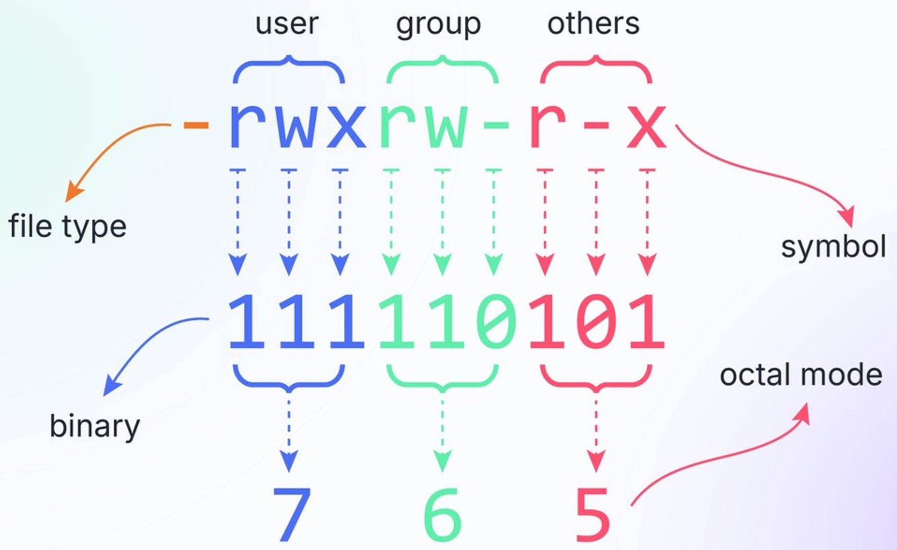

# File and Directory in Bash
- ### [File and Directory in Bash](/stem/it/cli/bash/basic-command-in-bash/file-and-directory-in-bash.md)

# File Permission
- ### Permission
    |File Permission|Symbol|Binary|Octal|
    |:---:|:---:|:---:|:---:|
    |No Permission|---|000|0|
    |Execute (x)|--x|001|1|
    |Write (w)|-w-|010|2|
    |Write + Execute (w+x)|-wx|011|3|
    |Read (r)|r--|100|4|
    |Read + Execute (r+x)|r-x|101|5|
    |Read + Write (r+w)|rw-|110|6|
    |Read + Write + Execute (r+w+x)|rwx|111|7|
- ### User Classes
    |User Classes|Description|
    |:---:|:---:|
    |User (u)|The user who created or owns the file|
    |Group (g)|Users who belong to the file's assigned group|
    |Others (o)|Everyone else on the system who is not User or Group|
    |All (a)|Everyone on the system (User + Group + Others)|
- ### Operators
    |Operators|Description|
    |:---:|:---:|
    |`+`|Add permission|
    |`-`|Remove permission|
    |`=`|Set the entire permission|
- ### Permission Mode
    - #### Octal Mode
        - Format：`<User_permission> <Group_permission> <Others_permission>`
        - Example
            - `753`：rwx(user), r-x(group), -wx(others)
    - #### Symbolic Mode
        - Format：`<User_Classes> <Operators> <Permission>`
        - Example
            - `ug+rx`：user and group add read and execute
            - `u=rwx,g=rx,o=wx`：rwx(user), r-x(group), -wx(others)
- ### File Permission String
    - #### Format：`<File Type> <User_permission> <Group_permission> <Others_permission>`
    - #### Example
        

# File Type
|Symbol|File Type|
|:---:|:---:|
|`-`|Regular file|
|`d`|Directory|
|`l`|[Symbolic Link](/stem/it/cli/bash/basic-command-in-bash/file-and-directory-in-bash.md#symbolic-link-soft-link-symlink)|
|`b`|Block device|
|`c`|Character device|
|`p`|Named Pipe|
|`s`|Socket|

