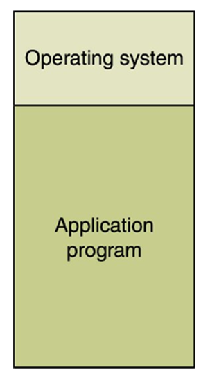
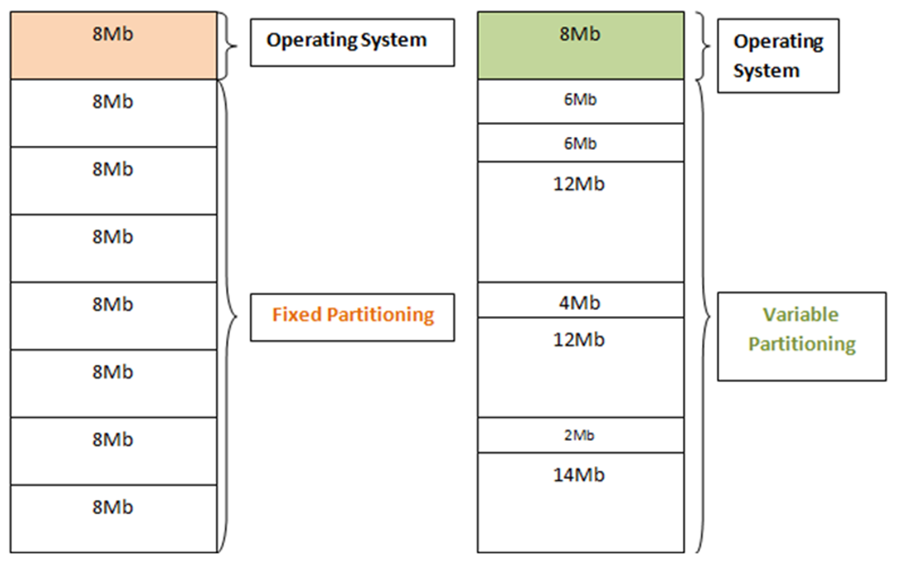
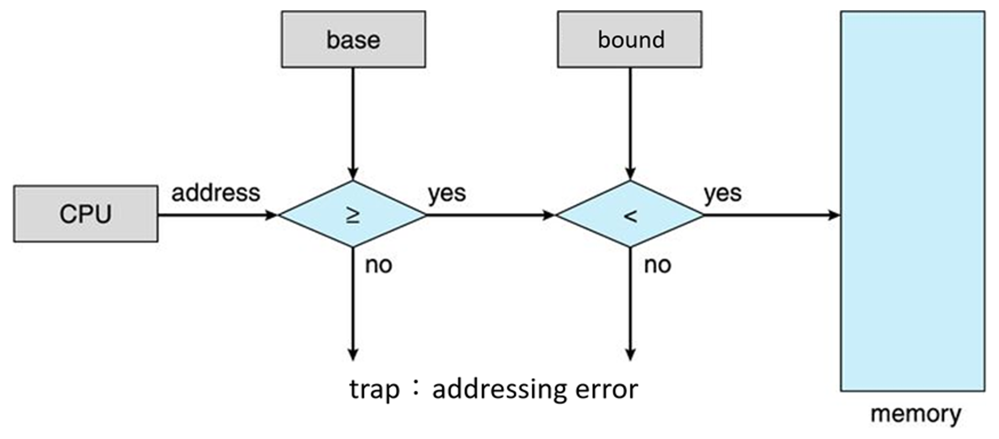
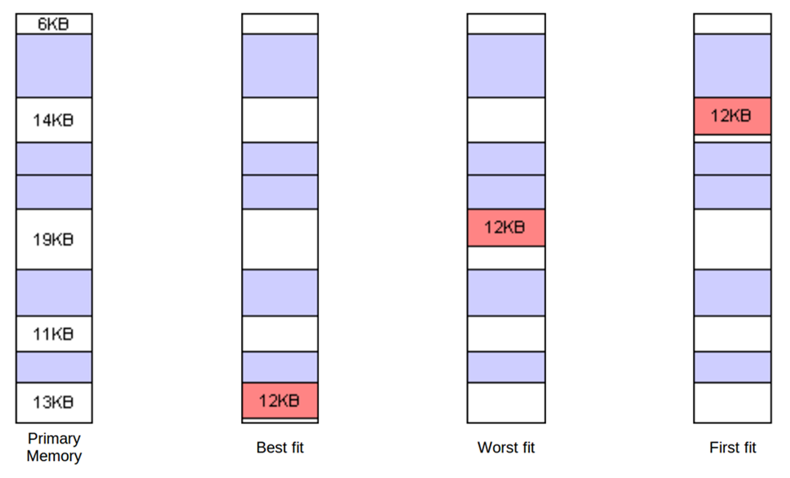

# Contiguous Memory Management Scheme
- ### Single Contiguous
    
- ### Multiple Partition
    

    - #### Fixed Partition
    - #### Dynamic Partition (Variable Partition)

# Single Contiguous
- ### Base and Limit Registers (Base and Bound Registers)
    

    - ### Base register
    - ### Limit register (Bound register)

# Fixed Partition

# Dynamic Partition (Variable Partition)
- ### Storage Allocation Strategies
    

    - #### first fit：the first partition fit
    - #### best fit：the smallest partition fit
    - #### worst fit：the largest partition fit

