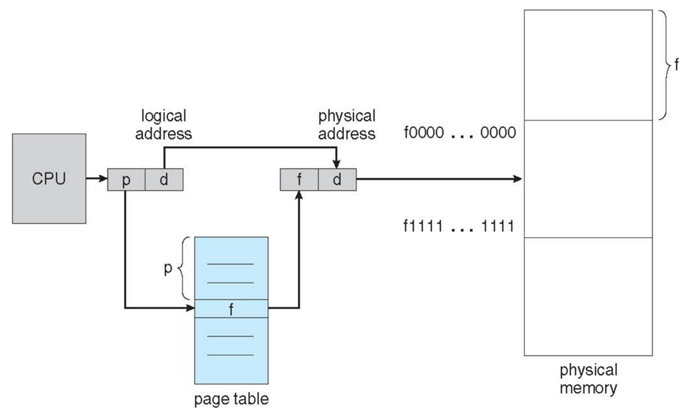
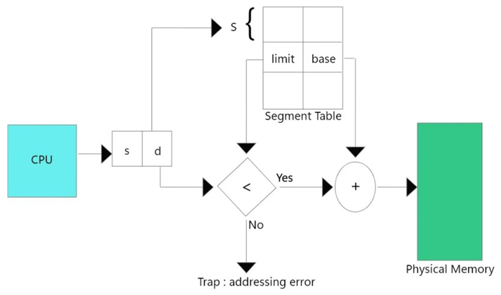

# Non-Contiguous Memory Management Scheme
- ### Paging (fixed-size)
    - #### Demand Paging
- ### Segmentation (variable-size)
    - #### Demand Segmentation

# Paging

- ### Page：a portion of logical memory
    - #### Page number (p)
    - #### Page offset (d)
- ### Frame：a portion of physical memory
    - #### Frame number (f)
    - #### Frame offset (d)
- ### Address translation
    - #### Logical address = p + d
    - #### Physical address = f + d
    - #### [Page offset (d)](#page-offset-d) = [frame offset (d)](#frame-offset-d)
- ### Page size (Frame size)
- ### Page table
    - #### [Page number (p)](#page-number-p) → [Frame number (f)](#frame-number-f)

# Segmentation

- ### Segment Table
    - #### Base address
    - #### Segment limit
    - #### Segmentation number (s)
    - #### Segmentation offset (d)

