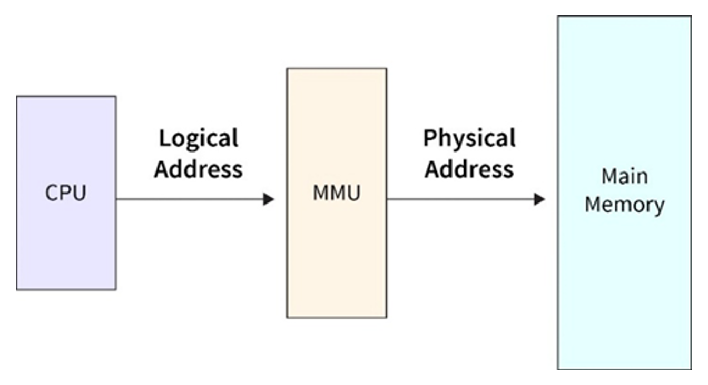
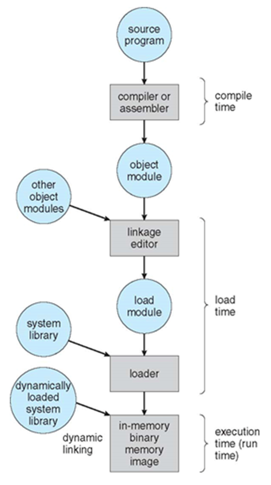
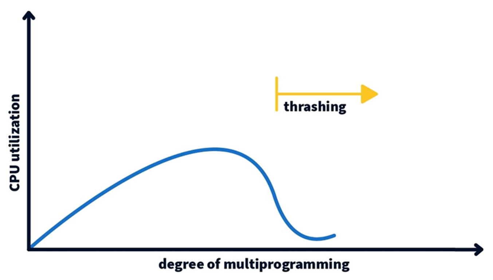
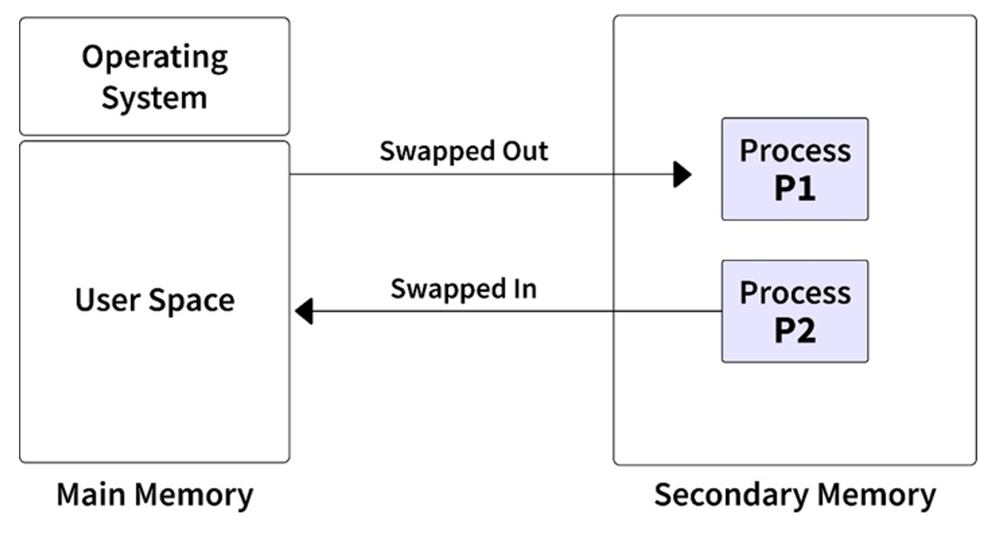

# Memory Hierarch
- ### [Memory Hierarchy](../../computer-hardware/memory.md#memory-hierarchy)

# Address

- ### logical address
- ### physical address
- ### Memory-Management Unit (MMU)

# Address Binding

- ### compile time
- ### load time
- ### execution time

# Register
- ### base register：holds the first logical address
- ### bound register
- ### limit register

# Address Translation
- ### physical address = base + logical address
- ### logical address < bound
- ### bound = base + limit

# Fragmentation
- ### internal fragmentation (fixed-size)
- ### external fragmentation (variable-size)

# Virtual memory
- ### Thrashing
    

# Swapping

# Locality
- ### Temporal Locality
- ### Spatial Locality

# Cache Miss
- ### Compulsory Miss
- ### Capacity Miss
- ### Conflict Miss

# Memory Management Scheme
- ### [Contiguous Memory Management Scheme](./memory-management-scheme/contiguous-memory-management-scheme.md)
- ### [Non-Contiguous Memory Management Scheme](./memory-management-scheme/non-contiguous-memory-management-scheme.md)
