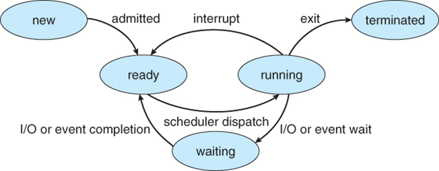
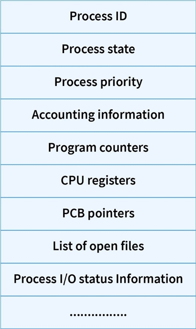

# Multiprogramming

# Multitasking
- ### preemptive
- ### nonpreemptive

# Real-time
- ### hard real-time
- ### soft real-time

# Interrupt

# Time-sharing
- ### virtual memory

# Batch processing
- ### batch file

# Process States

- ### New
- ### Ready
- ### Running
- ### Waiting
- ### Terminated

# Process Control Block (PCB)

- ### context switch：exchange of register information

# Inter-Process Communication (IPC)

# Thread
- ### user thread
- ### kernel thread

