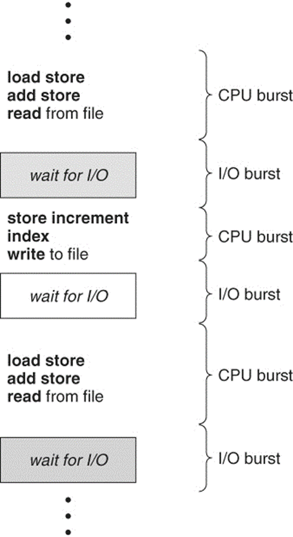

# Scheduler
- ### CPU Scheduler (short-term scheduler)
    - #### preemptive
    - #### nonpreemptive
- ### long-term scheduler
- ### medium-term scheduler

# Dispatcher
- ### dispatch latency

# CPU Scheduling
- ### First Come, First Serve scheduling (FCFS)
- ### Shortest Job First scheduling (SJF)
- ### Round-Robin scheduling (RR)
    - #### time slice (time quantum)
- ### Priority scheduling
- ### Multilevel Queue scheduling
- ### Multilevel Feedback Queue scheduling

# CPU-I/O Burst Cycle

- ### CPU bound
- ### I/O bound

# Scheduling Criteria
- ### CPU utilization
- ### throughput
- ### turnaround time
- ### waiting time
- ### response time

