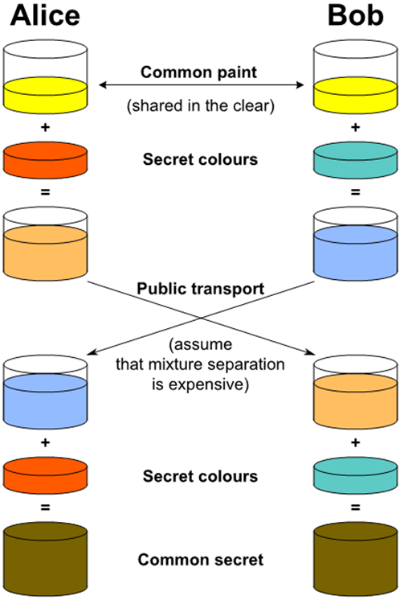

# Cryptography
- ### [Encoding](../../computer-science/data-representation/encoding.md)
- ### Encryption
    - ### Symmetric Encryption
        - ### Stream Cipher
        - ### Block Cipher
    - ### Asymmetric Encryption
    - ### Hybrid Encryption
- ### Cryptographic Hash Function(CHF)

---
- ### Kerckhoffs's Principle：安全的演算法即使公開演算法，只要Key沒有洩漏，Ciphertext也是安全的
- ### Avalanche Effect
    - eg：Block Cipher, CHF

# Diffie-Hellman Key Exchange(DH)

    

