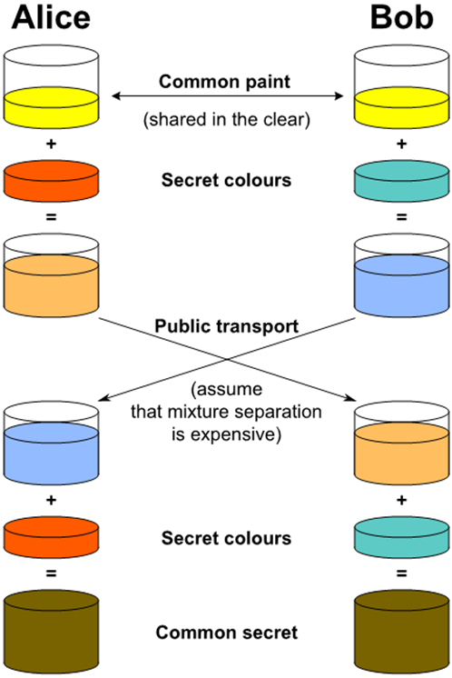

# Cryptography
- ### [Encoding](../../computer-science/data-representation/encoding.md)
- ### Encryption
    - ### [Symmetric Encryption](./encryption/symmetric-encryption/symmetric-encryption.md)
    - ### [Asymmetric Encryption](./encryption/asymmetric-encryption/asymmetric-encryption.md)
    - ### [Hybrid Encryption](./encryption/hybrid-encryption.md)
- ### [Cryptographic Hash Function (CHF)](cryptographic-hash-function.md)

# Kerckhoffs's Principle
- Even if a secure algorithm is made public, as long as the key is not leaked, the ciphertext remains secure.

# Avalanche Effect
- eg：Block Cipher, CHF

# Diffie-Hellman Key Exchange (DH)

    

