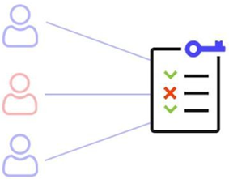

# Security Controls
- ### Access Control
- ### IDS/IPS
    - ### HIDS/HIPS
    - ### NIDS/NIPS
- ### EDR/MDR
- ### Security Information and Event Management(SIEM)
- ### DDoS Mitigation
    - ### High Defense IP(Anti-DDoS IP)
    - ### Traffic Scrubbing
- ### Data Loss Prevention(DLP)
- ### Single Sign-On(SSO)

# Access Control
- ### Access Control Model
    - ### Discretionary Access Control(DAC)
    - ### Mandatory Access Control(MAC)
    - ### Attribute-Based Access Control(ABAC)
    - ### Role-Based Access Control(RBAC)
- ### Access Control Policy
    
- ### Access Control List(ACL)
    
- ### [Authentication, Authorization, Accounting(AAA)](#authentication-authorization-accountingaaa-1)
    - ### Authentication：identity
    - ### Authorization：permission
    - ### Accounting：logging
- ### Firewall

# Authentication, Authorization, Accounting(AAA)
- ### Session-based Authentication
    - ### Flask Session
- ### Token-based Authentication
    - ### JSON Web Token(JWT)
- ### Multi-Factor Authentication(MFA)
    - ### Two-Factor Authentication(2FA)
- ### Open Authorization(OAuth)
- ### Remote Authentication Dial In User Service(RADIUS)
- ### Terminal Access Controller Access-Control System(TACACS)
- ### Biometrics
