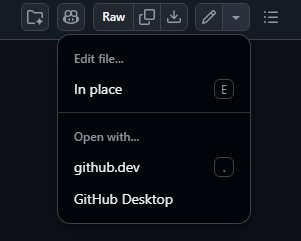

# Git
- ### [Git Command](git-command.md)
- ### [Git Flow](#git-flow-1)
- ### [GitHub](#github-1)
    - ### [GitHub Web Editor](#github-web-editor-1)
- ### Repository (repo)
- ### [Status](#status-1)

# Git Flow
- ### Main Branch
    - ### Master
    - ### Develop
- ### Support Branch
    - ### Hotfix
    - ### Rrelease
    - ### Feature

# Status
- ### Stage
- ### add → commit → push
- ### fetch → merge → pull

# [GitHub Web Editor](https://github.dev/)
- ### How to Access
    - ### Replace `.com` with `.dev` in the URL
        - `https://github.com/user/repo` → `https://github.dev/user/repo`
        - eg：`https://github.dev/hoshiyomi0322/Pi-Brain`
    - ### Keyboard Shortcut：Press the `.` key on any repository or pull request.
    - ### File Menu：When viewing a specific file, click the dropdown menu and select `github.dev`
        
- ### Environment：[VS Code](../vs-and-vs-code.md)

