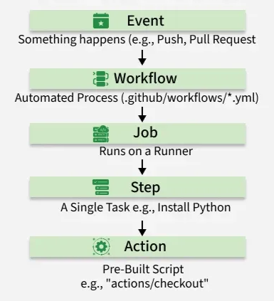
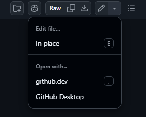

# GitHub Actions

# git fork
- ### [git fork](./git-workflow/git-remote-operations.md#git-fork)

# [GitHub Web Editor](https://github.dev/)
- ### How to Access
    - #### Replace `.com` with `.dev` in the URL
        - `https://github.com/user/repo` → `https://github.dev/user/repo`
        - example：`https://github.dev/hoshiyomi0322/Pi-Brain`
    - #### Keyboard Shortcut：Press the `.` key on any repo or pull request.
    - #### File Menu：When viewing a specific file, click the dropdown menu and select `github.dev`
        
- ### Environment：[VS Code](../vs-and-vs-code.md)

# GitHub Tools
- ### [GitDiagram](https://gitdiagram.com/)：visualize any repo
    - How to Access：Replace `github.com` with `gitdiagram.com` in the URL
- ### [Gitingest](https://gitingest.com/)：turn any repo into a prompt for LLMs
    - How to Access：Replace `github.com` with `gitingest.com` in the URL
