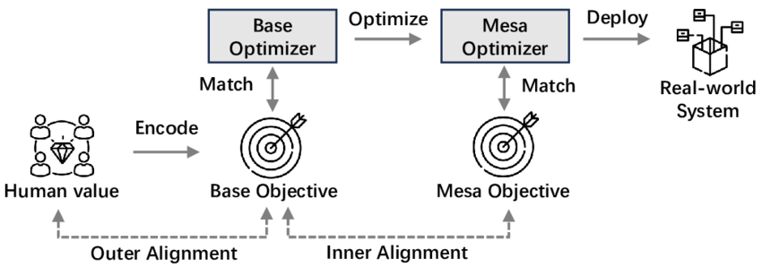

# AI Alignment

- ### ensuring AI systems act in accordance with human goals, preferences, and ethical principles

# Inner Alignment
- ### Deceptive Alignment

# Outer Alignment
- ### Reward Function
- ### Reward Model
- ### Reward Hacking (Specification Gaming)

