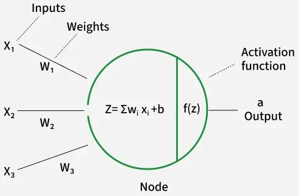

# Activation Function

- ### Net input：$z = \left( \sum{wx} \right) + b$
    - $x$ = input
    - [Parameters](../ann.md#parameters)
        - $w = \href{#/stem/it/machine-learning/ann/ann?id=weight}{\text{weight}}$
        - $b = \href{#/stem/it/machine-learning/ann/ann?id=bias}{\text{bias}}$
- ### Activation Function：$y=f\left(z\right)$
    - $y$ = output

# Types of Activation Functions
- ### Linear Activation Function
    - $f\left(z\right)=az+b$
    - [Parameters](../ann.md#parameters)：$a,~b$
- ### [NonLinear Activation Function](nonlinear-activation-function/nonlinear-activation-function.md)
    - #### [Saturating Activation Function](nonlinear-activation-function/saturating-activation-function.md)
    - #### [Non-Saturating Activation Function](nonlinear-activation-function/non-saturating-activation-function.md)

# Ridge Activation Function

# Radial Activation Function

# Fold Activation Function
