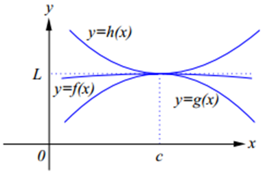
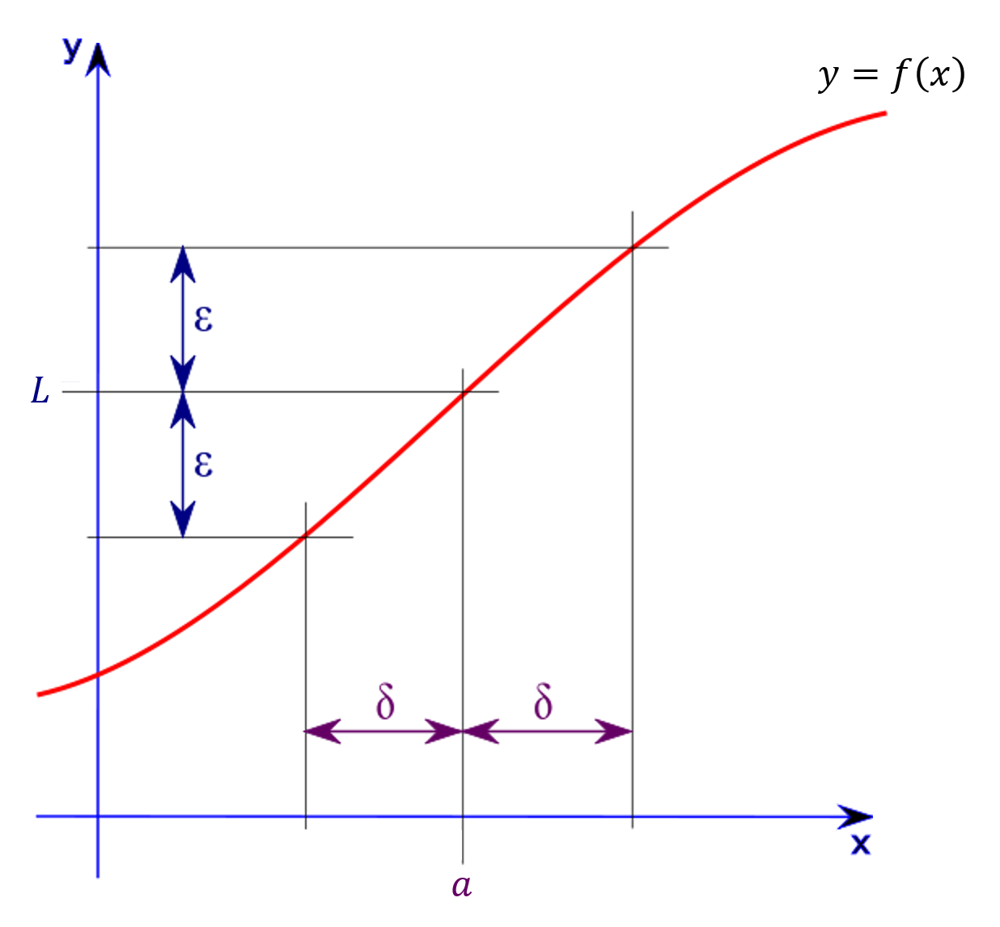

# Properties of Limit
- ### $`\lim\limits_{x\to a}{cf(x)}=c\lim\limits_{x\to a}{f(x)}`$
- ### $`\lim\limits_{x\to a}{[f(x)\pm g(x)]}=\lim\limits_{x\to a}{f(x)}\pm\lim\limits_{x\to a}{g(x)}`$
- ### $`\lim\limits_{x\to a}{[f(x)\times g(x)]}=\lim\limits_{x\to a}{f(x)}\times\lim\limits_{x\to a}{g(x)}`$
- ### $`\lim\limits_{x\to a}{\frac{f(x)}{g(x)}}=\frac{\lim\limits_{x\to a}{f(x)}}{\lim\limits_{x\to a}{g(x)}}`$
- ### $`\lim\limits_{x\to a}{f(g(x))}=f(\lim\limits_{x\to a}{g(x)})`$
    - ### $`\lim\limits_{x\to a}{f(x)^n}=(\lim\limits_{x\to a}{f(x)})^n`$

# One-sided Limit
- ### $`\lim\limits_{x\to a}{f(x)}`$
    |One-sided Limit|$`\lim\limits_{x\to a}{f(x)}`$|
    |:---:|:---:|
    |$`\lim\limits_{x\to a^-}{f(x)}=\lim\limits_{x\to a^+}{f(x)}=L`$|$`\lim\limits_{x\to a}{f(x)}=L`$|
    |$`\lim\limits_{x\to a^-}{f(x)}\neq\lim\limits_{x\to a^+}{f(x)}`$|$`\lim\limits_{x\to a}{f(x)}\text{ does not exist}`$|
- ### One-sided Limit
    - ### Left-sided Limit：$`\lim\limits_{x\to a^-}{f(x)}`$
    - ### Right-sided Limit：$`\lim\limits_{x\to a^+}{f(x)}`$
- ### eg：$`\lim\limits_{x\to 0}{(\frac{x}{|x|}+x)}`$
    - #### Left-sided Limit：$`\lim\limits_{x\to 0^-}{(\frac{x}{|x|}+x)}=\frac{x}{|x|}+x=\frac{x}{-x}+x=-1.\cdots`$
        - $`x=-0.0\cdots 1`$
    - #### Right-sided Limit：$`\lim\limits_{x\to 0^+}{(\frac{x}{|x|}+x)}=\frac{x}{|x|}+x=\frac{x}{x}+x=1.\cdots`$
        - $`x=0.0\cdots 1`$
    - #### $`\lim\limits_{x\to 0^-}{(\frac{x}{|x|}+x)}\neq\lim\limits_{x\to 0^+}{(\frac{x}{|x|}+x)} \Rightarrow \lim\limits_{x\to 0}{(\frac{x}{|x|}+x)}\text{ does not exist}`$
- ### eg：$`\lim\limits_{x\to 1}{(2+[x]+[1-x])}`$
    - #### Left-sided Limit：$`\lim\limits_{x\to 1^-}{(2+[x]+[1-x])}=2+[0.\cdots]+[1-0.9\cdots 9]=2+0+0=2`$
        - $x=0.9\cdots 9$
    - #### Right-sided Limit：$`\lim\limits_{x\to 1^+}{(2+[x]+[1-x])}=2+[1.\cdots]+[1-1.0\cdots 1]=2+1-1=2`$
        - $x=1.0\cdots 1$
    - #### $`\lim\limits_{x\to 1^-}{(2+[x]+[1-x])}=\lim\limits_{x\to 1^+}{(2+[x]+[1-x])}=2 \Rightarrow \lim\limits_{x\to 1}{(2+[x]+[1-x])}=2`$

# Squeeze Theorem (Sandwich Theorem)

- ### $`g(x)\leq f(x)\leq h(x)`$
    - ### $`\text{If }\lim\limits_{x\to a}{g}=\lim\limits_{x\to a}{h}=L,~\text{then }\lim\limits_{x\to a}{f}=L`$
- ### eg

# ε-δ definition

- ### $`\lim\limits_{x\to a}{f(x)}=L\iff\text{ε-δ definition}`$
- ### ε-δ definition ($`\forallε>0,~\existsδ>0`$)
    - #### $`0<|x-a|<δ\Rightarrow|f(x)-L|<ε`$
- ### eg：$`\lim\limits_{x\to 3}{(4x+1)}=13`$
    1. $`\forallε>0,~\existsδ>0,~\text{Such that }0<|x-3|<δ\Rightarrow|(4x+1)-13|<ε`$
    2. $`|4x-12|<ε`$
    3. $`|x-3|<\frac{ε}{4}`$
    4. $`δ=\frac{ε}{4}\Rightarrow \lim\limits_{x\to 3}{(4x+1)}=13`$
- ### eg：$`\lim\limits_{x\to 3}{x^2}=9`$
    1. $`\forallε>0,~\existsδ>0,~\text{Such that }0<|x-3|<δ\Rightarrow|x^2-9|<ε`$
    2. $`|x|<\sqrt{ε+9}`$
    3. $`|x-3|<\sqrt{ε+9}-3`$
    4. $`δ=\sqrt{ε+9}-3\Rightarrow \lim\limits_{x\to 3}{x^2}=9`$

# L'Hopital's Rule
- ### [L'Hopital's Rule](lhopitals-rule.md)

# Asymptote
- ### [Asymptote](asymptote.md)

# Convergence Tests
- ### [Convergence Tests](convergence-tests.md)
