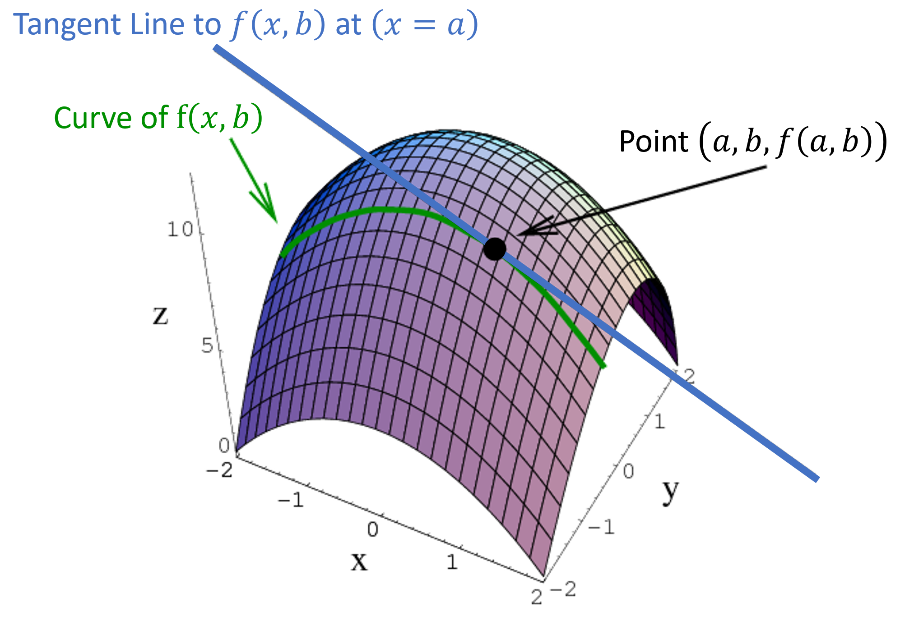
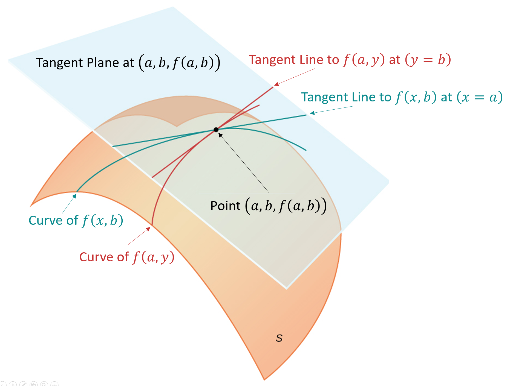

# Partial Derivative
- ### $`\frac{\partial}{\partial x_i}f\left(x_1,~\cdots,~x_n\right)=\lim\limits_{h\to 0}{\frac{f\left(x_1,~\cdots,~x_i+h,~\cdots,~x_n\right)-f\left(x_1,~\cdots,~x_n\right)}{h}}`$
    - ### $`\frac{\partial}{\partial x_i}f\left(x_1,~\cdots,~x_n\right)=\frac{\partial f\left(x_1,~\cdots,~x_n\right)}{\partial x_i}=\frac{\partial f}{\partial x_i}`$
    - ### $`\frac{\partial}{\partial x_i}f\left(x_1,~\cdots,~x_n\right)=\text{Differentiate with respect to }x_i,~\text{holding all other variables as constants}`$
- ### Total Derivative：$`df=\frac{\partial f}{\partial x_1}dx_1+\cdots+\frac{\partial f}{\partial x_n}dx_n`$
- ### Clairaut's Theorem：$`\frac{\partial^2}{\partial x_i\partial x_j}f\left(x_1,~\cdots,~x_n\right)=\frac{\partial}{\partial x_i}\left(\frac{\partial f}{\partial x_j}\right)=\frac{\partial}{\partial x_j}\left(\frac{\partial f}{\partial x_i}\right)`$
- ### eg：$`f\left(x,~y\right)=2x^2+5xy+3y^2-10`$
    - #### $`\frac{\partial f}{\partial x}=4x+5y`$
	- #### $`\frac{\partial f}{\partial y}=5x+6y`$
	- #### $`df=\left( 4x+5y \right)dx + \left( 5x+6y \right)dy`$
    - #### $`\frac{\partial^2 f}{\partial x\partial y}=5`$

# Geometric Interpretation of Partial Derivatives
- ### Slope of the Tangent Line
    - ### $`\frac{\partial}{\partial x_i}f\left(α_1,~\cdots,~α_n\right) = \text{the Slope of the Tangent Line to }f\left(α_1,~\cdots,~x_i,~\cdots,~α_n\right)\text{ at }\left(x_i=α_i\right)`$
- ### Linear Approximation of $`f\left(x_1,~\cdots,~x_n\right)`$ at $`\left(α_1,~\cdots,~α_n\right)`$
    - ### $`L\left( x_1,~\cdots,~x_n \right)=f\left( α_1,~\cdots,~α_n \right)+\sum\limits^n_{i=1}{\left( \frac{\partial f\left( α_1,~\cdots,~α_n \right)}{\partial x_i}\left(x_i-α_i\right) \right)}`$
- ### eg：$`z=f\left(x,~y\right)`$
    - ### $`\frac{\partial}{\partial x}f\left(a,~b\right)=\text{the Slope of the Tangent Line to }f\left(x,~b\right)\text{ at }\left(x=a\right)`$
        
    - ### Linear Approximation：[Equation of Tangent Plane](../../expression/equation/equation-of-plane.md#point-slope-form) to $`f\left(x,~y\right)`$ at $`\left( a,~b \right)`$
        - ### $`z-f\left(a,~b\right)=\frac{\partial f\left(a,~b\right)}{\partial x}\left(x-a\right)+\frac{\partial f\left(a,~b\right)}{\partial y}\left(y-b\right)`$
            

# Multivariable [Chain Rule](../differential-calculus.md#chain-rule)
- ### $`f\left(g_1\left(x\right),~\cdots,~g_n\left(x\right)\right)`$
    - ### $`\frac{df}{dx} = \left(f\left(g_1\left(x\right),~\cdots,~g_n\left(x\right)\right)\right)^\prime = \frac{\partial f}{\partial g_1}\times {g_1}^\prime\left(x\right)+\cdots+\frac{\partial f}{\partial g_n}\times {g_n}^\prime\left(x\right)=\frac{\partial f}{\partial g_1}\frac{dg_1}{dx}+\cdots+\frac{\partial f}{\partial g_n}\frac{dg_n}{dx}`$
    - ### $`df=\frac{\partial f}{\partial g_1}dg_1+\cdots+\frac{\partial f}{\partial g_n}dg_n`$
    - ### $`{g_i}^\prime\left(x\right)=\frac{dg_i}{dx}`$
- ### $`f\left(g_1\left(x_1,~\cdots,~x_m\right),~\cdots,~g_n\left(x_1,~\cdots,~x_m\right)\right)`$
    - ### $`\frac{\partial f}{\partial x_k} = \frac{\partial f}{\partial g_1}\frac{\partial g_1}{\partial x_k}+\cdots+\frac{\partial f}{\partial g_n}\frac{\partial g_n}{\partial x_k}`$
    - ### $`df=\frac{\partial f}{\partial g_1}dg_1+\cdots+\frac{\partial f}{\partial g_n}dg_n=\frac{\partial f}{\partial x_1}dx_1+\cdots+\frac{\partial f}{\partial x_m}dx_m`$
    - ### $`dg_i=\frac{\partial g_i}{\partial x_1}dx_1+\cdots+\frac{\partial g_i}{\partial x_m}dx_m`$
- ### eg

# Implicit Function
- ### Implicit Function：$`f\left(x_1,~\cdots,~x_n\right)=0`$
- ### Implicit Differentiation：$`\frac{\partial x_j}{\partial x_i}=-\frac{\frac{\partial f}{\partial x_i}}{\frac{\partial f}{\partial x_j}}`$
    - ### Total Derivative：$`df=\frac{\partial f}{\partial x_1}dx_1+\cdots+\frac{\partial f}{\partial x_n}dx_n=0`$

# Lagrange Multiplier

