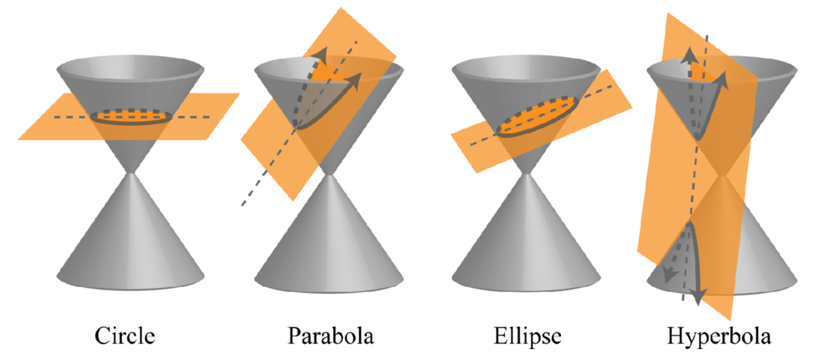

# Vector of a function
- ### Normal Vector
    - #### A vector that is Perpendicular to a function
- ### Direction Vector
    - #### A vector that is Parallel to a function
- ### $`\text{Normal Vector}\cdot \text{Direction Vector}=0`$

# Types of Functions
- ### Even Function, Odd Function
    |Even Function|Odd Function|
    |:---:|:---:|
    |Function is symmetric with respect to the Y-axis| Function is symmetric with respect to the Origin|
    |$`f\left(x\right)=f\left(-x\right)`$|$`-f\left(x\right)=f\left(-x\right)`$|
- ### Concave Function, Convex Function
    - ### Jensen's Inequality
- ### Inverse Function
    - #### $`f^{-1}\left(y\right)=x,~f\left(x\right)=y`$
    - #### $`f^{-1}\left(f\left(x\right)\right)=x,~f\left(f^{-1}\left(y\right)\right)=y`$
- ### Periodic Function
    - ### $`f\left(x+n\times \text{Period}\right)=f\left( x \right)`$

# Equation
- ### [Equation of the Line](equation/equation-of-the-line.md)
- ### [Equation of Plane](equation/equation-of-plane.md)
- ### [Equation of the Line in 3D](equation/equation-of-the-line-in-3d.md)
- ### Conic Section
    

    - ### [Equations of Circle](equation/conic-section/equations-of-circle.md)
    - ### [Equations of Parabola](equation/conic-section/equations-of-parabola.md)
    - ### [Equations of Ellipse](equation/conic-section/equations-of-ellipse.md)
    - ### [Equations of Hyperbola](equation/conic-section/equations-of-hyperbola.md)

# Polynomial
- ### Polynomial Inequality
- ### Polynomial Interpolation

# Function
- ### Polynomial Functions
    - ### [Linear Function](equation/equation-of-the-line.md)
    - ### Quadratic Function
    - ### Cubic Function
- ### Transcendental function
    - ### Exponential Function
    - ### Logarithmic Function
    - ### Trigonometric Functions
- ### Piecewise Function
    - ### Step Function
- ### Absolute Value Function
- ### Error Function (erf)
- ### Kronecker Delta

