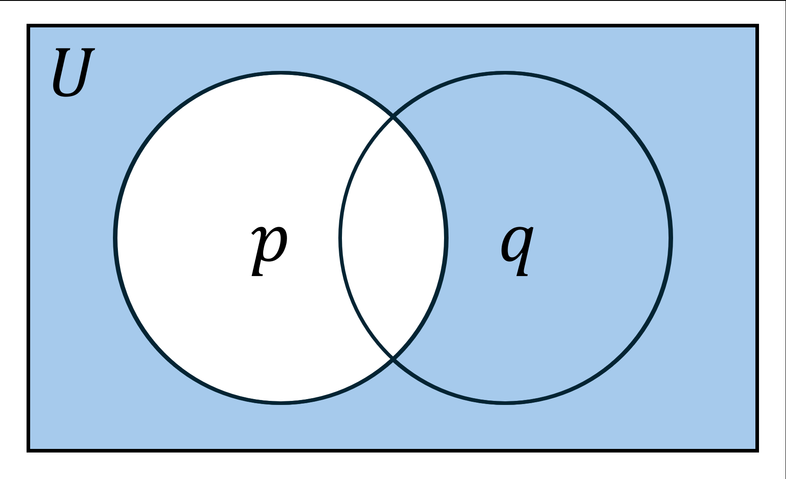
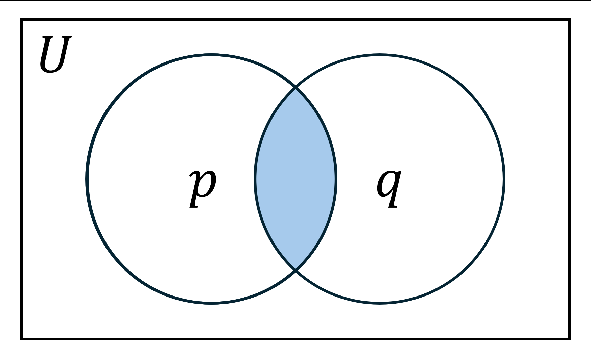
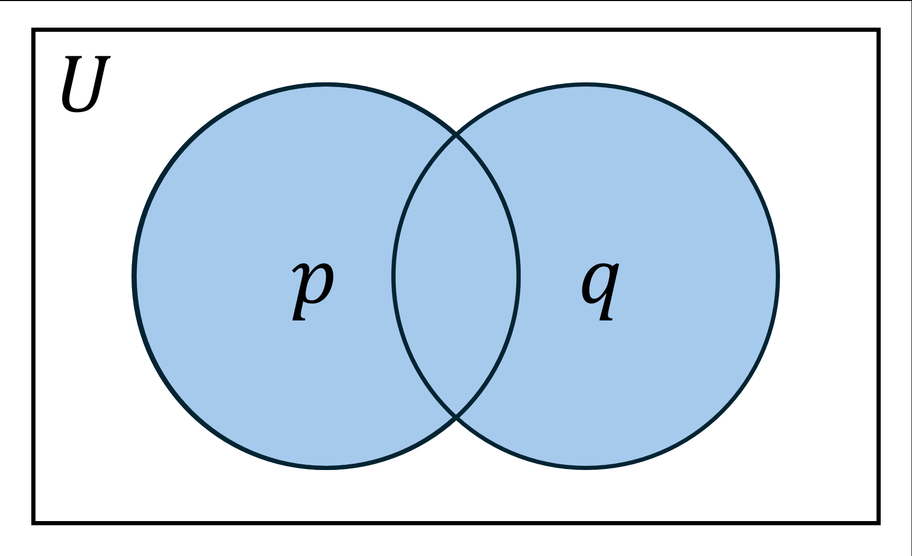
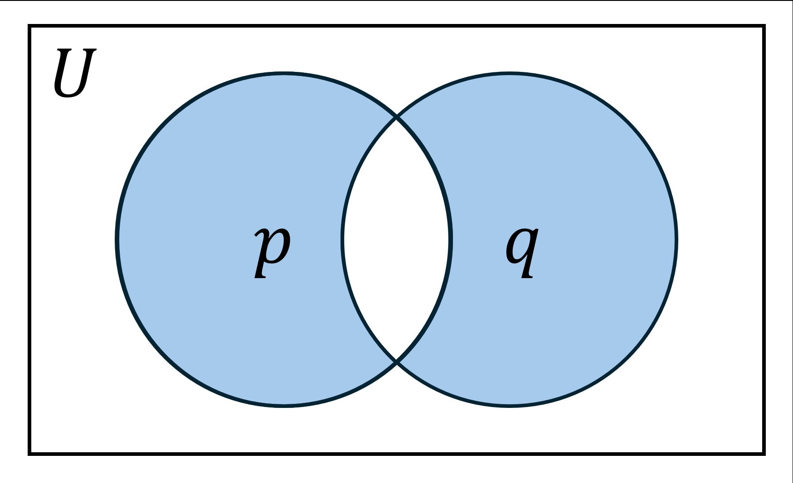
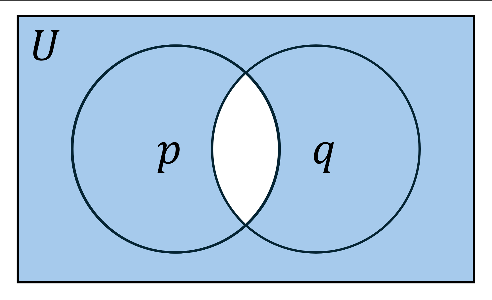
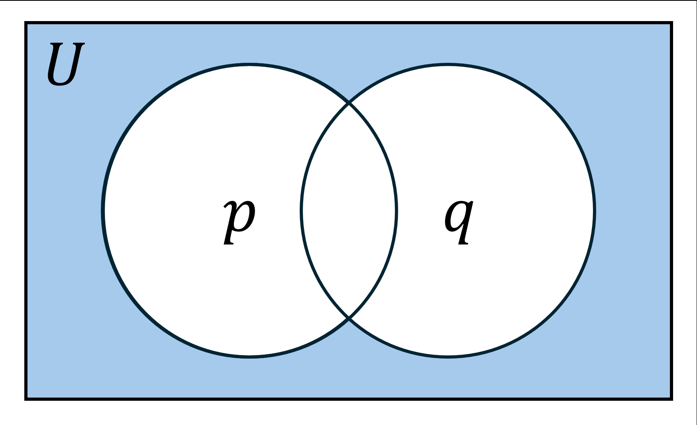
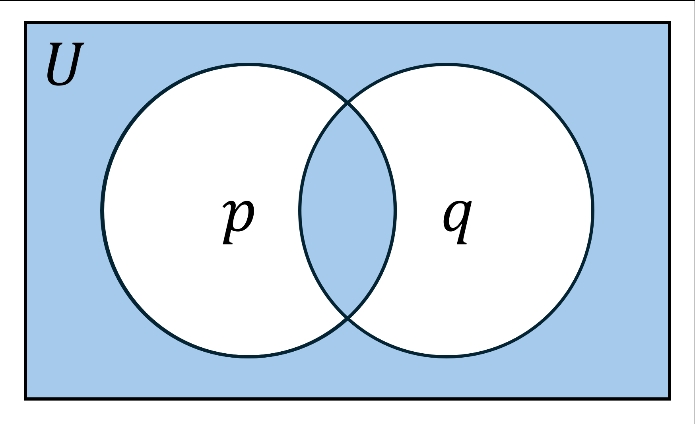
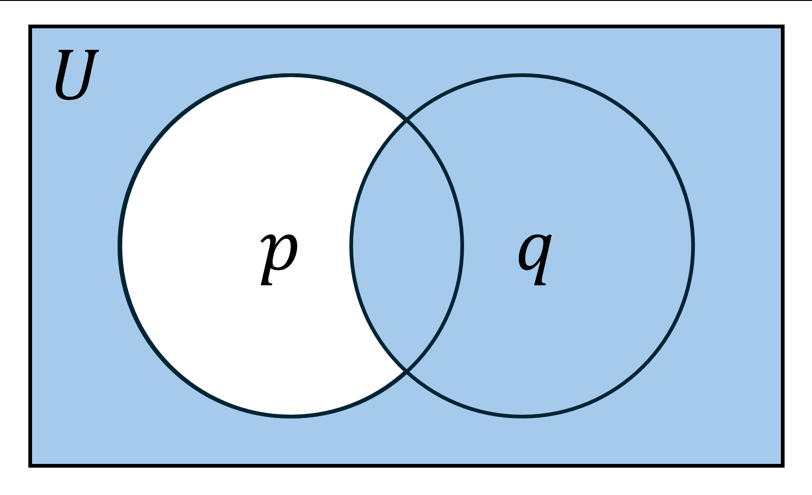

# Mathematical Logic
- ### Propositional Logic
- ### Predicate Logic
    - #### First-Order Logic
    - #### High-Order Logic
- ### Proof Theory

# Logical Connective (Logical Operator)
|Name|Symbol|Definition|Venn Diagram|
|:---:|:---:|:---:|:---:|
|NOT (Negation)|$`\neg p ,~ \sim p ,~ \overline{p}`$|||
|AND (Conjunction)|$`p \land q ,~ p\cdot q`$|||
|OR (Disjunction)|$`p \lor q ,~ p+q`$|||
|Exclusive OR (XOR)|$`p \veebar q ,~ p\oplus q`$|||
|NAND (Non-conjunction)|$`p\barwedge q ,~ p\uparrow q ,~ p \mid q ,~ \overline{p\cdot q}`$|||
|NOR (Non-disjunction)|$`p \overline{\vee} q ,~ p\downarrow q ,~ \overline{p+q}`$|||
|Exclusive NOR (XNOR)|$`p\odot q ,~ \overline{p\veebar q} ,~ \overline{p\oplus q}`$|||
|Equivalence (Biconditional, If and only if)|$`p\leftrightarrow q ,~ p\Leftrightarrow q ,~ p\iff q ,~ p\equiv q`$|$`\text{If and only if }p,~\text{then }q`$||
|Nonequivalence|$`p\not\leftrightarrow q ,~ p\not\Leftrightarrow q ,~ p\not\iff q ,~ p \not\equiv q`$|||
|Implication (Conditional, If)|$`p\to q,~p\Rightarrow q,~p\implies q`$|$`\text{If }p,~\text{then }q`$||
- ### Truth Table
    |$`p`$|$`q`$|$`\neg p`$ (NOT)|$`p \land q`$ (AND)|$`p \lor q`$ (OR)|$`p \veebar q`$ (XOR)|$`p\barwedge q`$ (NAND)|$`p \overline{\vee} q`$ (NOR)|$`\overline{p\veebar q}`$ (XNOR)|$`p\leftrightarrow q`$ (Equivalence)|$`p\not\leftrightarrow q`$ (Nonequivalence)|$`p\to q`$ (Implication)|
    |:---:|:---:|:---:|:---:|:---:|:---:|:---:|:---:|:---:|:---:|:---:|:---:|
    |T|T|F|T|T|F|F|F|T|T|F|T|
    |T|F|F|F|T|T|T|F|F|F|T|F|
    |F|T|T|F|T|T|T|F|F|F|T|T|
    |F|F|T|F|F|F|T|T|T|T|F|T|
- ### XNOR = Equivalence
    - #### XOR = Nonequivalence
- eg
    - $`x=2+y\iff y=2+x`$
    - $`x=2\implies x^2=4`$
