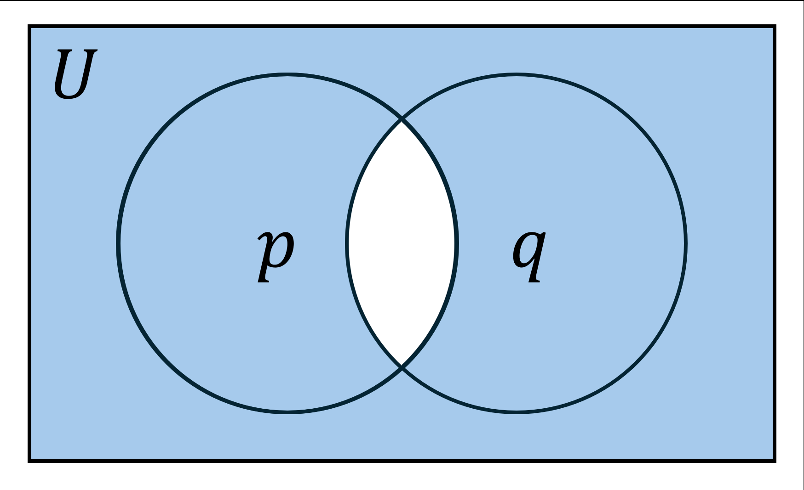
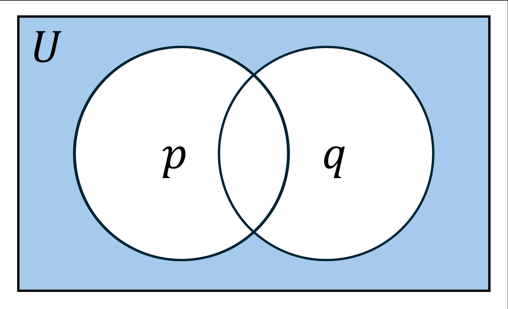

# Mathematical Logic
- ### [Propositional Logic](propositional-logic.md)
- ### [Predicate Logic](predicate-logic.md)
    - #### First-Order Logic
    - #### High-Order Logic
- ### Proof Theory

# Truth Value (Logical Value)
- ### True (T, $`\top`$)
- ### False (F, $`\bot`$)

# Logical Connective (Logical Operator)
|Name|Symbol|Definition|Venn Diagram|
|:---:|:---:|:---:|:---:|
|NOT (Negation)|$`\neg p ,~ \sim p ,~ \overline{p}`$|||
|AND (Conjunction)|$`p \land q ,~ p\cdot q`$|||
|OR (Disjunction)|$`p \lor q ,~ p+q`$|||
|NAND (Non-conjunction)|$`p\barwedge q ,~ p\uparrow q ,~ p \mid q ,~ \overline{p\cdot q}`$|||
|NOR (Non-disjunction)|$`p \overline{\vee} q ,~ p\downarrow q ,~ \overline{p+q}`$|||
|Exclusive OR (XOR)|$`p\oplus q,~p \veebar q`$|||
|Exclusive NOR (XNOR)|$`p\odot q ,~ \overline{p\veebar q} ,~ \overline{p\oplus q}`$|||
|Equivalence (Biconditional, If and only if)|$`p\leftrightarrow q ,~ p\Leftrightarrow q ,~ p\iff q ,~ p\equiv q`$|$`\text{If and only if }p,~\text{then }q`$||
|Nonequivalence|$`p\not\leftrightarrow q ,~ p\not\Leftrightarrow q ,~ p\not\iff q ,~ p \not\equiv q`$|||
|Implication (Conditional, If)|$`p\to q,~p\Rightarrow q,~p\implies q`$|$`\text{If }p,~\text{then }q`$||
- ### Truth Table
    |$`p`$|$`q`$|$`\neg p`$ (NOT)|$`p \land q`$ (AND)|$`p \lor q`$ (OR)|$`p \veebar q`$ (XOR)|$`p\barwedge q`$ (NAND)|$`p \overline{\vee} q`$ (NOR)|$`\overline{p\veebar q}`$ (XNOR)|$`p\leftrightarrow q`$ (Equivalence)|$`p\not\leftrightarrow q`$ (Nonequivalence)|$`p\to q`$ (Implication)|
    |:---:|:---:|:---:|:---:|:---:|:---:|:---:|:---:|:---:|:---:|:---:|:---:|
    |T|T|F|T|T|F|F|F|T|T|F|T|
    |T|F|F|F|T|T|T|F|F|F|T|F|
    |F|T|T|F|T|T|T|F|F|F|T|T|
    |F|F|T|F|F|F|T|T|T|T|F|T|
- ### Example
    - $`x=2+y\iff y=2+x`$
    - $`x=2\implies x^2=4`$

# Logical Equivalences
- ### Commutative Laws
    - $`p\land q \equiv q\land p`$
    - $`p\lor q \equiv q\lor p`$
    - $`p\leftrightarrow q \equiv q\leftrightarrow p`$
- ### Associative Laws
    - $`\left(p\land q\right) \land r \equiv p \land \left(q\land r\right)`$
    - $`\left(p\lor q\right) \lor r \equiv p \lor \left(q\lor r\right)`$
- ### Distributive Laws
    - $`\left(p\land q\right) \lor r \equiv \left(p \lor r\right) \land \left(q \lor r\right)`$
    - $`\left(p\lor q\right) \land r \equiv \left(p \land r\right) \lor \left(q \land r\right)`$
    - #### Conditional Distributive Laws
        - $`\left(p\land q\right) \to r \equiv \left(p \to r\right) \lor \left(q \to r\right)`$
        - $`\left(p\lor q\right) \to r \equiv \left(p \to r\right) \land \left(q \to r\right)`$
        - $`r \to \left(p\land q\right) \equiv \left(r \to p\right) \land \left(r \to q\right)`$
        - $`r \to \left(p\lor q\right) \equiv \left(r \to p\right) \lor \left(r \to q\right)`$
- ### Absorption Laws
    - $`\left(p\land q\right) \lor p \equiv p`$
    - $`\left(p\lor q\right) \land p \equiv p`$
- ### Domination Laws
    - $`p\lor T \equiv T`$
    - $`p\land F \equiv F`$
- ### Identity Laws
    - $`p\land T \equiv p`$
    - $`p\lor F \equiv p`$
- ### Idempotent Laws
    - $`p\lor p \equiv p`$
    - $`p\land p \equiv p`$
- ### Negation Laws
    - $`p\lor \neg p \equiv T`$
    - $`p\land \neg p \equiv F`$
- ### Double Negation Laws
    - $`\neg \left(\neg p \right) \equiv p`$
- ### De Morgan's Laws
    - $`\neg \left(p \land q\right) \equiv \neg p\lor \neg q`$

        
    - $`\neg \left(p \lor q\right) \equiv \neg p\land \neg q`$

        
- ### Equivalences of [Logical Connectives](#logical-connective-logical-operator)
    |[Logical Connectives](#logical-connective-logical-operator)|Equivalences|
    |:---:|:---:|
    |XOR|$`p\oplus q \equiv \left(\neg p \land q \right) \lor \left( p \land \neg q \right)`$|
    |XNOR|$`p\odot q \equiv \overline{p \oplus q} \equiv \left(p \land q\right) \lor \left(\neg p \land \neg q\right)`$|
    |Implication (Conditional)|$`p\to q \equiv \neg p \lor q`$|
    |Equivalence (Biconditional)|$`p\leftrightarrow q \equiv p\odot q \equiv \left(p \to q\right) \land \left(q \to p\right)`$ (Equivalence = XNOR)|
    |Nonequivalence|$`p\not\leftrightarrow q \equiv p\oplus q`$ (Nonequivalence = XOR)|
- ### [Equivalences of Conditional Statements](propositional-logic.md#equivalences-of-conditional-statements)

# Precedence
- ### [Quantifier](predicate-logic.md#quantifier) > NOT > AND > OR > Implication > Equivalence
- ### eg
    - $`\begin{aligned} {\forall xP \left(x\right) \land Q \left(x\right) \to \neg R \left(x\right) \lor S(x)} \end{aligned}`$
    - $`=\forall xP \left(x\right) \land Q \left(x\right) \to \neg R \left(x\right) \lor S(x)`$
