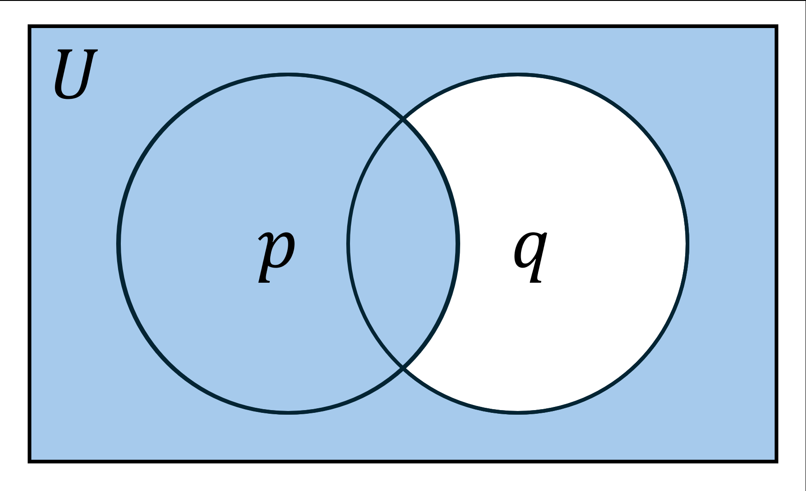

# Conditional Sentence
|Name|Symbol|Definition|Venn Diagram|
|:---:|:---:|:---:|:---:|
|Implication (Conditional, If)|$`p\to q,~p\Rightarrow q,~p\implies q`$|$`\text{If }p,~\text{then }q`$||
|Converse|$`q \to p`$|$`\text{If }q,~\text{then }p`$||
|Inverse|$`\neg p \to \neg q`$|$`\text{If not }p,~\text{then not }q`$||
|Contrapositive|$`\neg q \to \neg p`$|$`\text{If not }q,~\text{then not }p`$||
- ### Truth Table
    |$`p`$|$`q`$|$`\neg p`$|$`\neg q`$|$`p\to q`$ (Implication)|$`q \to p`$ (Converse)|$`\neg p \to \neg q`$ (Inverse)|$`\neg q \to \neg p`$ (Contrapositive)|
    |:---:|:---:|:---:|:---:|:---:|:---:|:---:|:---:|
    |T|T|F|F|T|T|T|T|
    |T|F|F|T|F|T|T|F|
    |F|T|T|F|T|F|F|T|
    |F|F|T|T|T|T|T|T|
- ### Equivalence
    - Implication $\equiv$ Contrapositive
    - Converse $\equiv$ Inverse