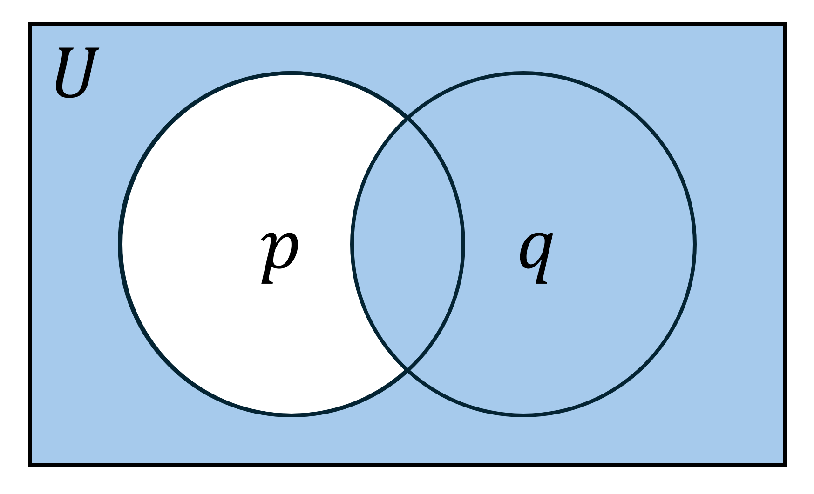
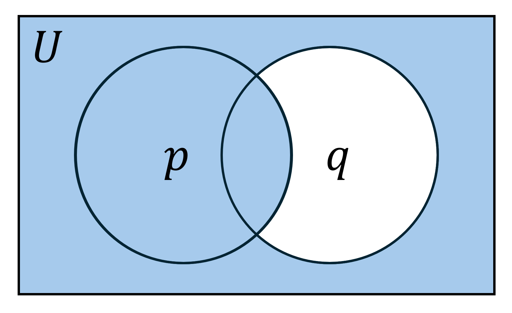

# Conditional Statements
|Name|Symbol|Definition|Venn Diagram|
|:---:|:---:|:---:|:---:|
|Implication (Conditional, If)|$p\to q,~p\Rightarrow q,~p\implies q$|$\text{If }p,~\text{then }q$||
|Converse|$q \to p$|$\text{If }q,~\text{then }p$||
|Inverse|$\neg p \to \neg q$|$\text{If not }p,~\text{then not }q$||
|Contrapositive|$\neg q \to \neg p$|$\text{If not }q,~\text{then not }p$||
- ### Truth Table
    |$p$|$q$|$\neg p$|$\neg q$|$p\to q$ (Implication)|$q \to p$ (Converse)|$\neg p \to \neg q$ (Inverse)|$\neg q \to \neg p$ (Contrapositive)|
    |:---:|:---:|:---:|:---:|:---:|:---:|:---:|:---:|
    |$T$|$T$|$F$|$F$|$T$|$T$|$T$|$T$|
    |$T$|$F$|$F$|$T$|$F$|$T$|$T$|$F$|
    |$F$|$T$|$T$|$F$|$T$|$F$|$F$|$T$|
    |$F$|$F$|$T$|$T$|$T$|$T$|$T$|$T$|
- ### Equivalences of Conditional Statements
    |Equivalences|Symbol|
    |:---:|:---:|
    |Implication $\equiv$ Contrapositive|$p\to q \equiv \neg q \to \neg p$|
    |Converse $\equiv$ Inverse|$q \to p \equiv \neg p \to \neg q$|

# Tautology, Contradiction, and Contingency
|Name|Definition|Example|
|:---:|:---:|:---:|
|Tautology|A statement that is always True|$p \lor \neg p$|
|Contradiction|A statement that is always False|$p \land \neg p$|
|Contingency|A statement that can be either True or False depending on its variables|$p \lor q$, $\neg p$|

# Rules of Inference
- ### Format
    |Rules of Inference|Corresponding Tautology|
    |:---:|:---:|
    |$\begin{array}{l} \text{Premise}\\ \hline \therefore\text{Conclusion} \end{array}$|$\text{Premise} \to \text{Conclusion}$|
    |$\begin{array}{l} \text{Premise}_1 \\ \vdots \\ \text{Premise}_n \\ \hline \therefore\text{Conclusion}_1 \\ \vdots \\ \text{Conclusion}_m \end{array}$|$\left(\text{Premise}_1 \land \cdots \land \text{Premise}_n\right)\to \left(\text{Conclusion}_1 \land \cdots \land \text{Conclusion}_m\right)$|
    |$\begin{array}{l} \text{Premise}_1 ,~ \cdots ,~ \text{Premise}_n \\ \hline \therefore\text{Conclusion}_1 ,~ \cdots ,~ \text{Conclusion}_m \end{array}$|$\left(\text{Premise}_1 \land \cdots \land \text{Premise}_n\right)\to \left(\text{Conclusion}_1 \land \cdots \land \text{Conclusion}_m\right)$|
- ### Rules of Implication
    |Name|Rules of Inference|Tautology|
    |:---:|:---:|:---:|
    |Modus Ponens (MP, Law of Detachment)|$\begin{array}{l} p \to q \\ p \\ \hline \therefore q \end{array}$|$\biggl(\left(p \to q\right) \land p\biggr) \to q$|
    |Modus Tollens (MT, Law of Contrapositive)|$\begin{array}{l} p \to q \\ \neg q \\ \hline \therefore \neg p \end{array}$|$\biggl(\left(p \to q\right) \land \neg q\biggr) \to \neg p$|
    |Hypothetical Syllogism|$\begin{array}{l} p \to q \\ q \to r \\ \hline \therefore p \to r \end{array}$|$\biggl( \left(p \to q\right) \land \left(q \to r\right) \biggr) \to \left(p \to r\right)$|
    |Disjunctive Syllogism|$\begin{array}{l} p \lor q \\ \neg p \\ \hline \therefore q \end{array}$|$\biggl(\left(p \lor q\right) \land \neg p\biggr) \to q$|
    |Constructive Dilemma|$\begin{array}{l} p \to q \\ r \to s \\ p \lor r \\ \hline \therefore q \lor s \end{array}$|$\biggl( \left(p \to q\right) \land \left(r \to s\right) \land \left(p \lor r \right) \biggr) \to \left(q \lor s \right)$|
    |Addition|$\begin{array}{l} p \\ \hline \therefore p \lor q \end{array}$|$p \to \left(p \lor q\right)$|
    |Simplification|$\begin{array}{l} p \land q \\ \hline \therefore p \end{array}$|$\left(p \land q\right) \to p$|
    |Conjunction|$\begin{array}{l} p \\ q \\ \hline \therefore p \land q \end{array}$|$\left(p \land q\right) \to \left(p \land q\right)$|
    |Absorption|$\begin{array}{l} p \to q \\ \hline \therefore p \to \left(p \land q\right) \end{array}$|$\left(p \to q\right) \to \biggl( p \to \left(p \land q\right) \biggl)$|
    |Resolution|$\begin{array}{l} p \lor q \\ \neg p \lor r \\ \hline \therefore q \lor r \end{array}$|$\biggl( \left(p \lor q\right) \land \left(\neg p \lor r\right) \biggr) \to \left(q \lor r\right)$|
- ### Rules of Replacement
    |Name|Rules of Inference|Tautology|
    |:---:|:---:|:---:|
    
