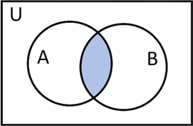
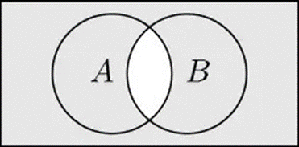
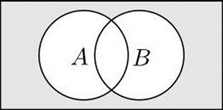
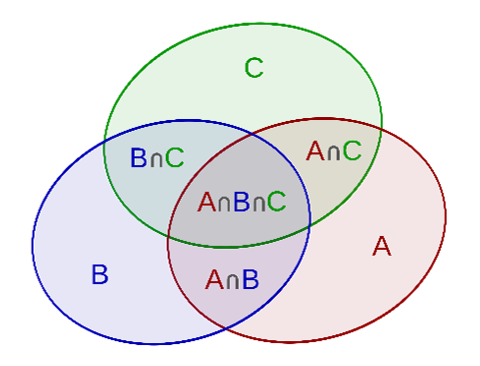

# Set
- ### Set：$`S=\set{a_1,~\cdots ,~a_n}`$
- ### Universal Set：$`U`$
- ### Empty Set：$`\varnothing`$
- ### Venn Diagram
    

# Set Operations
- ### Intersection：$`A\cap B`$
    
	
    - $`\bigcap\limits_{i=1}^{n}A_i=A_1\cap\cdots\cap A_n`$
- ### Union：$`A\cup B`$
    
    
    - $`\bigcup\limits_{i=1}^{n}A_i=A_1\cup\cdots\cup A_n`$
- ### Complement：$`\overline{A},~A^\prime`$
    

# Set Relations
- ### Superset：$`A\supseteq B=A\text{ is a superset of }B=A\text{ contains }B`$
    - eg：$`\set{1,~2,~3}\supseteq \set{1,~2}`$
- ### Subset：$`A\subseteq B=A\text{ is a subset of }B=B\text{ contains }A`$
    - eg：$`\set{1,~2}\subseteq \set{1,~2,~3}`$
- ### Element of：$`A\in B=A\text{ is a element of }B`$
    - eg：$`1\in \set{1,~2,~3}`$

- ### Properties of Relations
    - ### Reflexive
    - ### Symmetric
        - ### Asymmetric
    - ### Transitive

# Properties of Sets
- ### Commutative Law
    - $`A\cap B=B\cap A`$
    - $`A\cup B=B\cup A`$
- ### Associative Law
    - $`\left(A\cap B\right)\cap C=A\cap\left(B\cap C\right)`$
    - $`\left(A\cup B\right)\cup C=A\cup\left(B\cup C\right)`$
- ### Distributive Law
    - $`\left(A\cap B\right)\cup C=\left(A\cup C\right)\cap\left(B\cup C\right)`$
    - $`\left(A\cup B\right)\cap C=\left(A\cap C\right)\cup\left(B\cap C\right)`$
- ### Idempotent Law
    - $`A\cup A=A\cap A=A`$
- ### Identity Law
    - $`A\cap U=A\cup\emptyset=A`$
- ### Complement Law
    - $`A\cap A^\prime=\emptyset`$
    - $`A\cup A^\prime=U`$
- ### De Morgan's Laws
    - $`\left(A\cap B\right)^\prime=A^\prime\cup B^\prime`$
        
        
    - $`\left(A\cup B\right)^\prime=A^\prime\cap B^\prime`$
        
        

# Inclusion–Exclusion Principle
- ### $n$ sets：$`\bigcup\limits_{i=1}^{n}A_i=\sum\limits_{k=1}^{n}\left(\left(-1\right)^{k+1}\left(\sum\limits_{1\le i_1<\cdots<i_k\le n}\left(A_{i_1}\cap\cdots\cap A_{i_k}\right)\right)\right)=\sum\limits_{i=1}^{n}A_i-\sum\limits_{1\le i_1<i_2\le n}\left(A_{i_1}\cap A_{i_2}\right)+\cdots+\left(-1\right)^{n+1}\left(A_1\cap\cdots\cap A_n\right)`$
- ### 2 sets：$`\left(A\cup B\right)=\left(A+B\right)-\left(A\cap B\right)`$
- ### 3 sets：$`\left(A\cup B\cup C\right)=\left(A+B+C\right)-\left(\left(A\cap B\right)+\left(A\cap C\right)+\left(B\cap C\right)\right)+\left(A\cap B\cap C\right)`$
    

