# Set
|Set|Notation|Definition|
|:---:|:---:|:---:|
|Set|$`S=\set{a_1,~\cdots ,~a_n}`$|a collection of different things|
|Universal Set|$`U`$|a set that contains all of the objects|
|Empty Set|$`\varnothing=\Set{}`$|a set having no elements|

# Venn Diagram
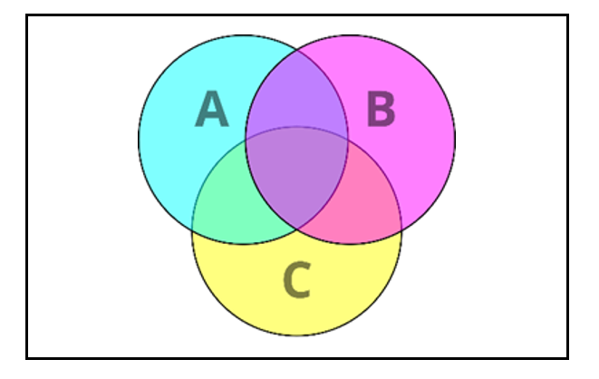

# Set Operations
|Set Operations|Notation|Definition|Venn Diagram|
|:---:|:---:|:---:|:---:|
|Complement|$`\overline{A},~A^\prime`$|$`\text{⁠not belong to }A`$|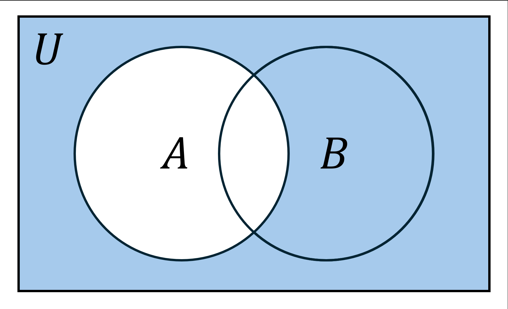|
|Intersection|$`A\cap B`$|$`\text{both }A\text{ and }B`$|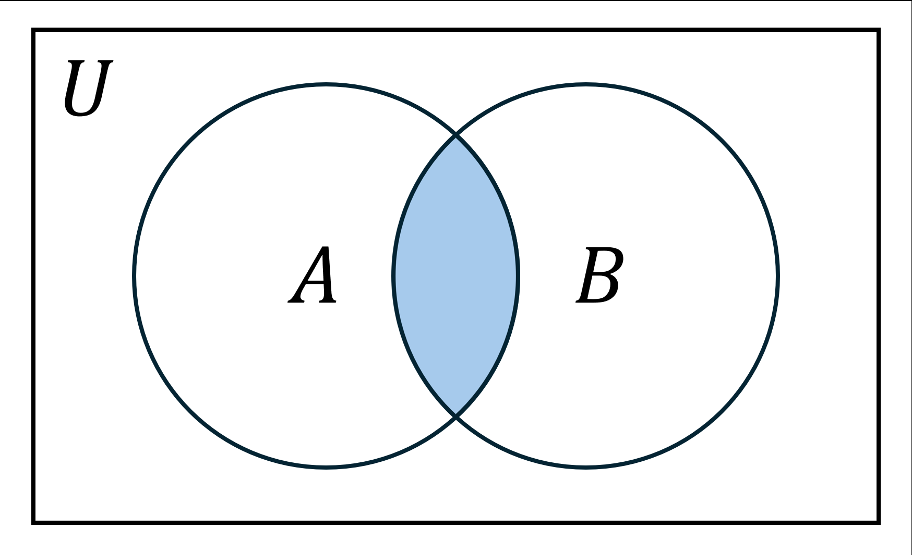|
|Union|$`A\cup B`$|$`A\text{ or }B\text{ or both}`$|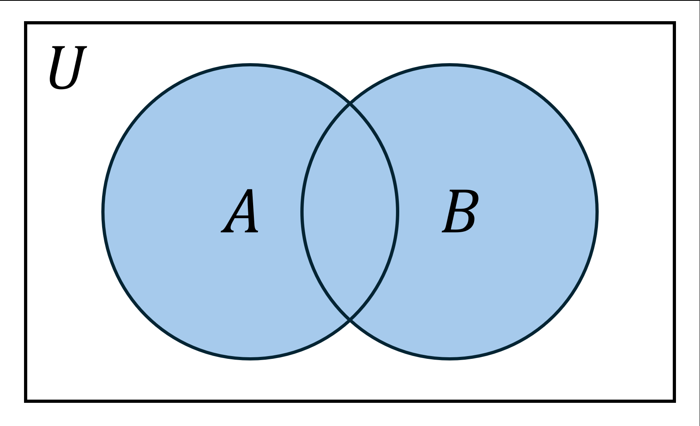|
|Difference|$`A-B,~A\backslash B`$|$`\text{belong to }A,~\text{but not to }B`$|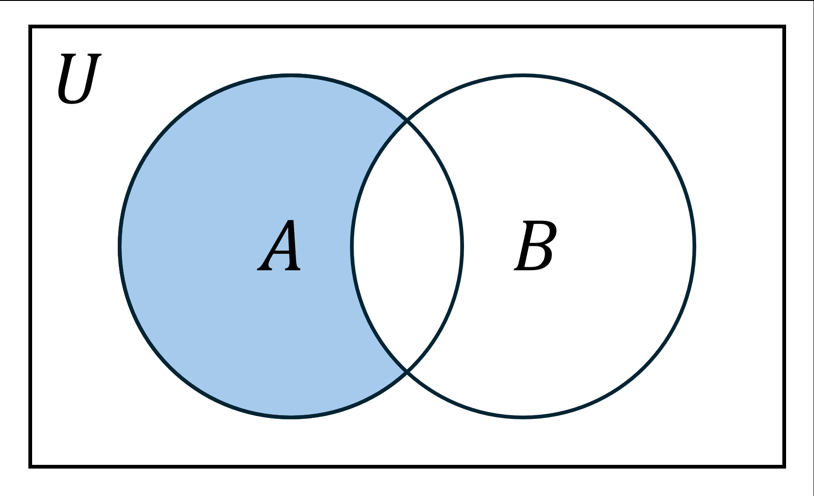|
|Symmetric Difference|$`A\,Δ\,B = \left(A-B\right) \cup \left(A-B\right)`$|$`\text{belong to }A\text{ or }B,~\text{but not to both}`$|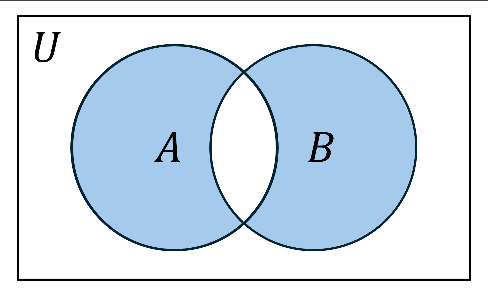|
- ### Finite Set Operations
    |Finite Set Operations|Notation|
    |:---:|:---:|
    |Finite Intersection|$`\bigcap\limits_{i=1}^{n}A_i=A_1\cap\cdots\cap A_n`$|
    |Finite Union|$`\bigcup\limits_{i=1}^{n}A_i=A_1\cup\cdots\cup A_n`$|

# Set Relations
|Set Operations|Notation|Definition|Venn Diagram|eg|
|:---:|:---:|:---:|:---:|:---:|
|Superset|$`A\supseteq B`$|$`A\text{ is a superset of }B,~A\text{ contains }B`$|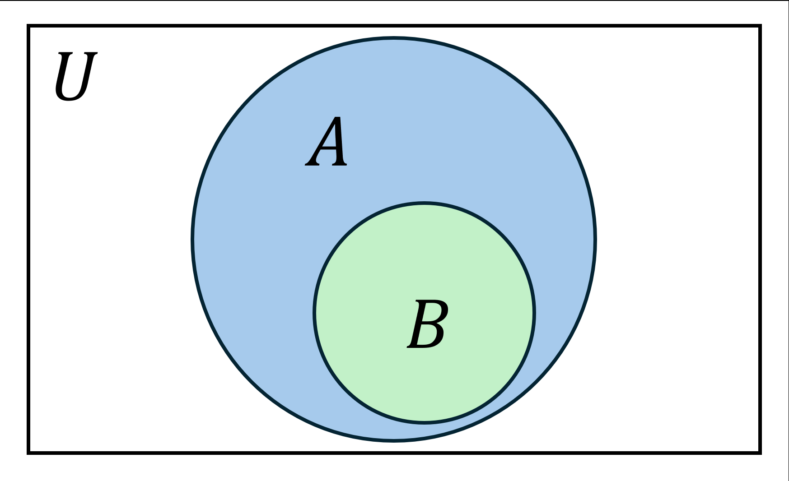|$`\set{1,~2,~3}\supseteq \set{1,~2}`$|
|Subset|$`A\subseteq B`$|$`A\text{ is a subset of }B,~B\text{ contains }A`$|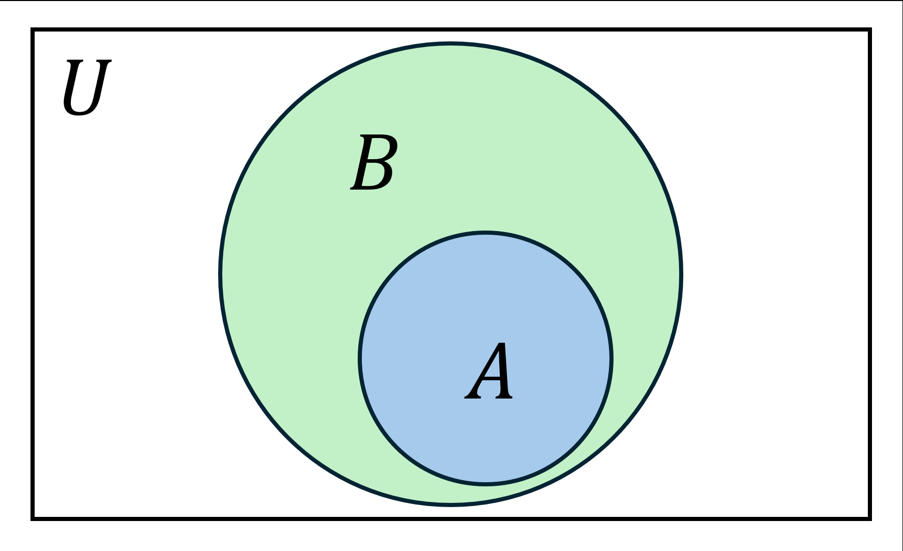|$`\set{1,~2}\subseteq \set{1,~2,~3}`$|
|Element of|$`A\in B`$|$`A\text{ is a element of }B`$||$`1\in \set{1,~2,~3}`$|

# Properties of Relations
- ### Reflexive
- ### Symmetric
    - ### Asymmetric
- ### Transitive

# Properties of Sets
- ### Commutative Law
    - $`A\cap B=B\cap A`$
    - $`A\cup B=B\cup A`$
- ### Associative Law
    - $`\left(A\cap B\right)\cap C=A\cap\left(B\cap C\right)`$
    - $`\left(A\cup B\right)\cup C=A\cup\left(B\cup C\right)`$
- ### Distributive Law
    - $`\left(A\cap B\right)\cup C=\left(A\cup C\right)\cap\left(B\cup C\right)`$
    - $`\left(A\cup B\right)\cap C=\left(A\cap C\right)\cup\left(B\cap C\right)`$
- ### Idempotent Law
    - $`A\cup A=A\cap A=A`$
- ### Identity Law
    - $`A\cap U=A\cup\emptyset=A`$
- ### Complement Law
    - $`A\cap A^\prime=\emptyset`$
    - $`A\cup A^\prime=U`$
- ### De Morgan's Laws
    - $`\left(A\cap B\right)^\prime=A^\prime\cup B^\prime`$
        
        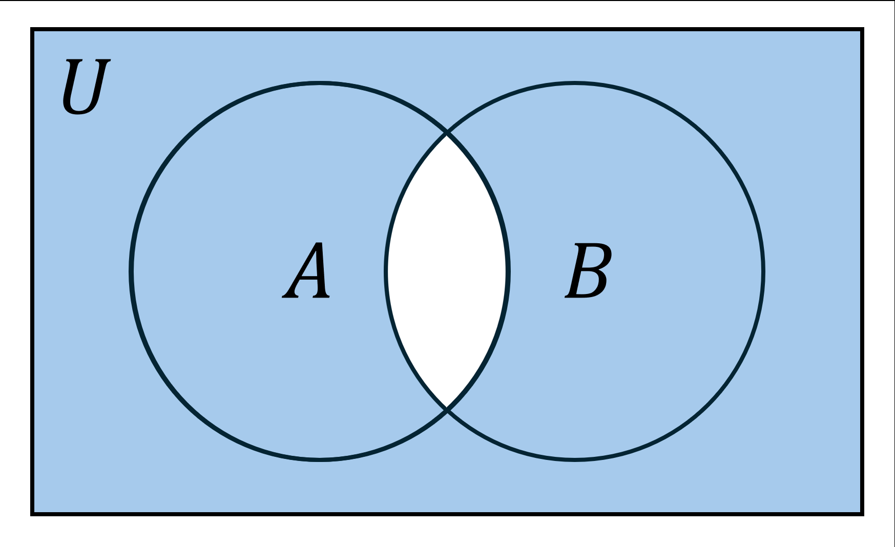
    - $`\left(A\cup B\right)^\prime=A^\prime\cap B^\prime`$
        
        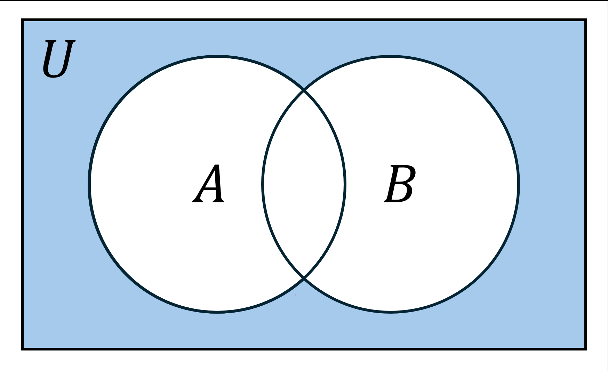

# Inclusion–Exclusion Principle
- ### $n$ sets：$`\bigcup\limits_{i=1}^{n}A_i=\sum\limits_{k=1}^{n}\left(\left(-1\right)^{k+1}\left(\sum\limits_{1\le i_1<\cdots<i_k\le n}\left(A_{i_1}\cap\cdots\cap A_{i_k}\right)\right)\right)=\sum\limits_{i=1}^{n}A_i-\sum\limits_{1\le i_1<i_2\le n}\left(A_{i_1}\cap A_{i_2}\right)+\cdots+\left(-1\right)^{n+1}\left(A_1\cap\cdots\cap A_n\right)`$
- ### 2 sets：$`\left(A\cup B\right)=\left(A+B\right)-\left(A\cap B\right)`$
- ### 3 sets：$`\left(A\cup B\cup C\right)=\left(A+B+C\right)-\left(\left(A\cap B\right)+\left(A\cap C\right)+\left(B\cap C\right)\right)+\left(A\cap B\cap C\right)`$
    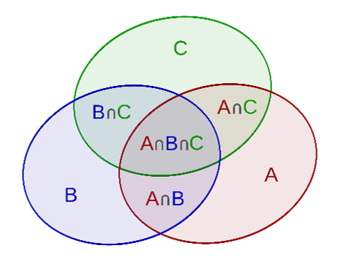

