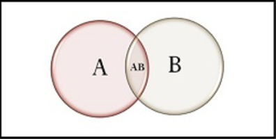

# Conditional Probability
- ### Conditional Probability：$`P\left(A|B\right)=\frac{P\left(A\cap B\right)}{P\left(B\right)}`$
    - #### $P\left(A|B\right)$ ＝ the probability of $A$ under the condition $B$
- ### Bayes' Theorem：$`P\left(A|B\right)=\frac{P\left(A\cap B\right)}{P\left(B\right)}=\frac{P\left(B|A\right)P\left(A\right)}{P\left(B\right)}`$

# Joint Probability
- ### Joint Probability：$`P\left(A\cap B\right)=P\left(A|B\right)P\left(B\right)=P\left(B|A\right)P\left(A\right)`$
- ### Independent events, Mutually Exclusive events
    |Independent events|Mutually Exclusive events|
    |:---:|:---:|
    |||
    |$P\left(A\cap B\right)=P\left(A\right)P\left(B\right)$|$P\left(A\cap B\right)=0=\varnothing$|
    |$`P\left(A\|B\right)=P\left(A\right),~P\left(B\|A\right)=P\left(B\right)`$|$`P\left(A\|B\right)=P\left(B\|A\right)=0`$|

# Union Probability
- ### Union Probability：$`P\left(A\cup B\right)=\left(P\left(A\right)+P\left(B\right)\right)-P\left(A\cap B\right)`$
    - #### [Inclusion–Exclusion Principle](../../../discrete-mathematics/set-theory/set-theory.md#inclusionexclusion-principle)
- ### Mutually Exclusive events, Collectively Exhaustive events
    - #### [Mutually Exclusive events](#independent-events-mutually-exclusive-events)：$`P\left(A\cup B\right)=P\left(A\right)+P\left(B\right)`$
    - #### Collectively Exhaustive events：$`P\left(A\cup B\right)=S`$
    - #### Mutually Exclusive and Collectively Exhaustive events：$`P\left(A\cup B\right)=P\left(A\right)+P\left(B\right)=S`$

# Law of Total Probability

    

- ### $\{A_1\cdots A_n\}$ is [Mutually Exclusive and Collectively Exhaustive events](#mutually-exclusive-collectively-exhaustive)
- ### $P\left(B\right)=\sum\limits_{k=1}^{n}{P\left(A_k\cap B\right)}=\sum\limits_{k=1}^{n}{\left(P\left(B|A_k\right)P\left(A_k\right)\right)}$
- ### [Bayes' Theorem](#bayes-theorem)：$`P\left(A_i|B\right)=\frac{P\left(A_i\cap B\right)}{P\left(B\right)}=\frac{P\left(B|A_i\right)P\left(A_i\right)}{P\left(B\right)}=\frac{P\left(B|A_i\right)P\left(A_i\right)}{\sum\limits_{k=1}^{n}{\left(P\left(B|A_k\right)P\left(A_k\right)\right)}}`$

