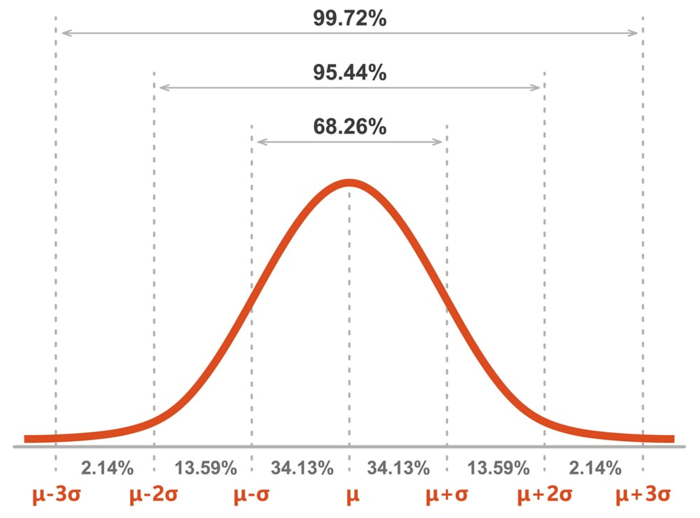

# Continuous Uniform Distribution
|Property|Description|
|:---:|:---:|
|Notation|$`X\sim U_c\left(a,b\right)`$|
|Random Variable ($`X`$)|$`X \in \left[a,~b\right]`$|
|Parameters|$`a\le b`$|
|[PDF](../distribution-function.md#probability-function)|$`\frac{1}{b-a}`$|
|[CDF](../distribution-function.md#cumulative-distribution-function-cdf)|$`\frac{x-a}{b-a}`$|
|[Mean ($`E\left[X\right])`$](../expected-value.md)|$`\frac{a+b}{2}`$|
|[Variance ($`σ^2`$)](../../statistics/variance.md#variance)|$`\frac{\left(b-a\right)^2}{12}`$|

# Normal Distribution (Gaussian Distribution)
|Property|Description|
|:---:|:---:|
|Notation|$`X\sim N\left(μ,~σ^2\right)`$|
|Random Variable ($`X`$)||
|Parameters|$`\begin{cases}{μ=\text{Mean}}\\{σ^2=\text{Variance}}\end{cases}`$||
|[PDF](../distribution-function.md#probability-function)|$`\frac{1}{σ\sqrt{2π}}\cdot \exp{\left(-\frac{\left(x-μ\right)^2}{2σ^2}\right)}`$|
|[CDF](../distribution-function.md#cumulative-distribution-function-cdf)|
|[Mean ($`E\left[X\right])`$](../expected-value.md)|$μ$|
|[Variance ($`σ^2`$)](../../statistics/variance.md#variance)|$σ^2$|
- ### Standard Normal Distribution ($`μ=0,~σ^2=1`$)
    - ### [Standardization](../../statistics/descriptive-statistics.md#standardization)：$`X\sim N\left(μ,~σ^2\right) \overset{Standardize}{\longrightarrow} Z=\frac{X-μ}{σ},~Z\sim N\left(0,~1\right)`$
- ### 68–95–99.7 Rule (Empirical Rule)
    

# Log-Normal Distribution
|Property|Description|
|:---:|:---:|
|Notation|$`X\sim Lognormal\left(μ,~σ^2\right)`$|
|Random Variable ($`X`$)||
|Parameters||
|[PDF](../distribution-function.md#probability-function)|$`\frac{1}{xσ\sqrt{2π}}\cdot \exp{\left(-\frac{\left(\ln{\left(x\right)}-μ\right)^2}{2σ^2}\right)}`$|
|[CDF](../distribution-function.md#cumulative-distribution-function-cdf)||
|[Mean ($`E\left[X\right])`$](../expected-value.md)|$`\exp{\left(μ+\frac{σ^2}{2}\right)}`$|
|[Variance ($`σ^2`$)](../../statistics/variance.md#variance)|$`\left(\exp{\left(σ^2\right)}-1\right)\cdot\exp{\left(2μ+σ^2\right)}`$|

# Distributions related to the Gamma Function
- ### [Distributions related to the Gamma Function](distributions-related-to-the-gamma-function.md)

