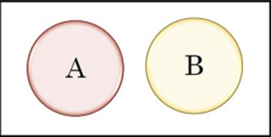

- ### Probability：$P(x)$
- ### Expected Value(Mean)：$E(x)$

# Conditional Probability
- ### Conditional Probability：$P(A\mid B)=\frac{P(A\cap B)}{P(B)}$
    - $P(A\mid B)$＝the probability of $A$ under the condition $B$
- ### Joint Probability：$P(A\cap B)=P(A\mid B)P(B)=P(B\mid A)P(A)$
    |Independent events|Mutually Exclusive events|
    |:---:|:---:|
    |||
    |$P(A\cap B)=P(A)P(B)$|$P(A\cap B)=0=\varnothing$|
    |$P(A\mid B)=P(A)$、$P(B\mid A)=P(B)$|$P(A\mid B)=P(B\mid A)=0$|
- ### Bayes' theorem：$P(A\mid B)=\frac{P(A\cap B)}{P(B)}=\frac{P(B\mid A)P(A)}{P(B)}$
- ### Law of Total Probability

---
- ### Sample Space
- ### Random Variable
    - ### [Probability Distribution](#probability-distribution-1)
    - ### [Random Process(Stochastic Process)](#random-processstochastic-process-1)
- ### Random Experiment
- ### Probabilistic Model
    - #### Cumulative Distribution Function(CDF)
        - Probability Density Function(PDF)
        - Probability Mass Function(PMF)
    - #### Probability Distribution Function
- ### Moment
    - ### Moment-Generating Function(MGF)

# Probability Distribution
- ### Continuous Probability Distribution
    |Probability Distribution|PMF|Random Process|
    |:---:|:---:|:---:|
    - ### Continuous Uniform Distribution
    - ### Normal Distribution(Gaussian Distribution)
    - ### Exponential Distribution
    - ### Gamma Distribution
- ### Discrete Probability Distribution
    - ### Multinomial Distribution
        - ### Binomial Distribution
    - ### Geometric Distribution
    - ### Bernoulli Distribution
    - ### Poisson Distribution

# Random Process(Stochastic Process)
- ### Bernoulli Process
    - Bernoulli Distribution
- ### Poisson Process
    - Poisson Distribution
- ### Markov Process
    - Markov Chain
- ### Brownian Motion