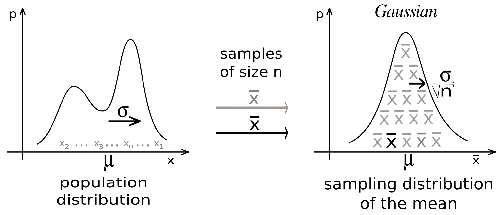

# Probability
- ### Probability
    - #### $`P\left(A\right)`$ = the Probability of Event $A$
    - ### [Conditional Probability](./conditional-probability/conditional-probability.md)
- ### [Probability of a Random Variable](./probability-distribution/distribution-function.md#probability-of-a-random-variable)
    - ### [Probability of a Multivariate Random Variable](./probability-distribution/joint-distribution/multivariate-distribution-function.md#probability-of-a-multivariate-random-variable)
- ### Sample Space($S$)
    - $P\left(S\right)=1$

# Random Variable
- ### Random Variable ($X$)
    |Continuous|Discrete|
    |:---:|:---:|
    |$`x\in A,~ x\in\left[a,b\right]`$|$`X=x_1,x_2,\cdots ,x_n`$|
- ### Random Vector (Multivariate Random Variable)
    - ### $`X=\left( X_1,~\cdots,~X_n \right)^T`$
- ### [Probability Distribution](./probability-distribution/probability-distribution.md)
    - ### [Distribution Function](./probability-distribution/distribution-function.md)
    - ### [Joint Distribution](./probability-distribution/probability-distribution.md#joint-distribution)
- ### [Random Process (Stochastic Process)](#random-process-stochastic-process)
- ### Random Experiment
- ### Probabilistic Model
- ### [Expected Value (Expectation, Mean)](expected-value.md)
- ### [Variance](../statistics/variance.md#variance)
- ### [Mode](../statistics/descriptive-statistics.md#mode) of Continuous Random Variable = [Maximum](../../algebra/calculus/differential-calculus.md#extremum) of [PDF](./probability-distribution/distribution-function.md#probability-function)
    - $`\big( α=\text{Mode},~f\left(α\right)=\text{Maximum} \big) ,~\text{when } \big( f^\prime\left(α\right)=0,~f^{\prime\prime}\left(α\right)<0 \big)`$
- ### [Moment](#moment)

# Inequality
- ### Chebyshev's Inequality
    - ### $`P\left( \left|X-μ\right|\ge kσ \right) \le \frac{1}{k^2}`$
- ### Markov's Inequality
    - ### $`P\left( X\ge a \right) \le \frac{E\left[X\right]}{a}`$

# Limit Theorems of Probability
- ### Central Limit Theorem (CLT)
    
    
    - ### $`X_1,~\cdots,~X_n \overset{i.i.d.}{\sim} D\left(θ_1,\cdots,~θ_k\right) \overset{n \to \infty}{\longrightarrow} \overline{X}\sim N\left(μ,~\frac{σ^2}{n}\right)`$
    - ### Population Distribution ([IID](./probability-distribution/probability-distribution.md#independent-and-identically-distributed-iid))：$`X_1,~\cdots,~X_n \overset{i.i.d.}{\sim} D\left(θ_1,\cdots,~θ_k\right)`$
        - $`μ`$ = [Population Mean](../statistics/descriptive-statistics.md#arithmetic-mean-am)
        - $`σ^2`$ = [Population Variance](../statistics/variance.md#variance)
        - $`σ`$ = [Population Standard Deviation](../statistics/descriptive-statistics.md#standard-deviation-sd)
    - ### [Sampling Distribution](../statistics/statistical-inference/sampling/sampling.md#sampling-distribution) of the mean ([Normal Distribution](./probability-distribution/continuous-probability-distribution/continuous-probability-distribution.md#normal-distribution-gaussian-distribution))：$`\overline{X}\sim N\left(μ,~\frac{σ^2}{n}\right)`$
        - $\overline{X}$ = [Sample Mean](../statistics/statistical-inference/estimation/point-estimation/estimator.md#sample-mean)
        - $`n`$ = Sample Size
    - ### [Standard Normal Distribution](./probability-distribution/continuous-probability-distribution/continuous-probability-distribution.md#standard-normal-distribution-)：$`Z\sim N\left(0,~1\right)`$
        - ### [Standardization](../../../statistics/descriptive-statistics.md#standardization)：$`\overline{X}\sim N\left(μ,~\frac{σ^2}{n}\right) \overset{Standardize}{\longrightarrow} Z\sim N\left(0,~1\right)`$
        - ### [Z-score](../statistics/descriptive-statistics.md#standard-score-z-score)：$`Z=\frac{\overline{X}-μ}{σ/\sqrt{n}} = \frac{\overline{X}-μ}{SE}`$
            - $`SE`$ = [Standard Error (SE)](../statistics/statistical-inference/estimation/point-estimation/estimator.md#standard-error-se)
- ### Law of Large Numbers

# Random Process (Stochastic Process)
- ### Bernoulli Process
    - ### Bernoulli Trial
        - $`\text{Probability of Success}=p`$
        - $`\text{Probability of Failure}=1-p`$
    - ### [Distributions derived from Bernoulli Trials](./probability-distribution/discrete-probability-distribution/distributions-derived-from-bernoulli-trials.md)
- ### Poisson Process
    - ### [Poisson Distribution](./probability-distribution/discrete-probability-distribution/discrete-probability-distribution.md#poisson-distribution)
- ### Markov Process
    - Markov Chain
- ### Random Walk
- ### Brownian Motion

# Moment
- ### nth Moment
    - ### $`μ_n=E\left[ \left(X-c\right)^{n} \right] = \begin{cases}{\int_{-\infty}^{\infty}{\left(x-c\right)^nf\left(x\right)\,dx}} & \text{if }X\text{ is Continuous} \\ {\sum\limits_x{\left(\left(x-c\right)^n\cdot f\left(x\right)\right)}} & \text{if }X\text{ is Discrete}\end{cases}`$
- ### Type
    ||nth Raw Moment|nth Central Moment|nth Standardized Moment|
    |:---:|:---:|:---:|:---:|
    |Moment|$`μ_n=E\left[X^n\right]`$|$`μ_n=E\left[\left(X-μ\right)^n\right]`$|$`\frac{μ_n}{σ^n}=\frac{E\left[(X-μ)^n\right]}{σ^n}`$|
    |$c$|$c=0$|$c=μ=E\left[X\right]$|$c=μ=E\left[X\right]$|
- ### Statistical Moments
    |Measure|Moment|Definition|
    |:---:|:---:|:---:|
    |[Mean](../statistics/descriptive-statistics.md#arithmetic-mean-am)|First Raw Moment|$E\left[x\right]=μ$|
    |[Variance](../statistics/variance.md#variance)|Second Central Moment|$Var\left(x\right)=μ_2=E\left[\left(X-μ\right)^2\right]$|
    |Skewness|Third Standardized Moment|$S(x)=\frac{μ_3}{σ^3}$|
    |Kurtosis|Fourth Standardized Moment|$K(x)=\frac{μ_4}{σ^4}$|
- ### Moment-Generating Function (MGF)：$`M_X(t)=E\left[e^{tX}\right] = \begin{cases}{\int_{-\infty}^{\infty}{e^{tx}f\left(x\right)\,dx}} & \text{if }X\text{ is Continuous} \\ {\sum\limits_x{\left(e^{tx}\cdot f\left(x\right)\right)}} & \text{if }X\text{ is Discrete}\end{cases}`$
    - #### nth Raw Moment：$`μ_n = E\left[X^n\right] = {M_X}^{\left(n\right)}{\left(0\right)} = \left.\frac{d^nM_X \left(t\right)}{dt^n} \right|_{t=0}`$

