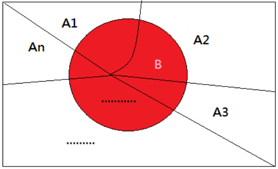

- ### Random Variable($X$)
    |Continuous|Discrete|
    |:---:|:---:|
    |$x\in A,\,x\in[a,b]$|$X=x_1,x_2,\cdots ,x_n$|
- ### Probability
    - #### $P(A)$ = the Probability of Event $A$
    - #### $P(X=x)$：the Probability of $Random~Variable(X)=x$
- ### Sample Space($S$)
    - $P(S)=1$

# Expected Value(Mean)：$E(x)$
- ### $E(x)=\sum\limits_{i=1}^{n}{x_ip_i}$
    - $p_i$ = Probability of $x_i$
- ### Random Variable
    |Continuous|Discrete|
    |:---:|:---:|
    |$E(x)=\int_{-\infty}^{\infty}{xf_d(x)\,dx}$|$E(x)=\sum\limits_{i=1}^{n}{(x_i\cdot P(X=x_i))}=\sum\limits_{i=1}^{n}{(x_i\cdot f_m(x_i))}$|
- ### Properties
    - $E(c)=c$
    - $E(cX)=cE(X)$
    - $E(X+Y)=E(X)+E(Y)$
---
- ### [Probability Distribution](probability-distribution.md)
- ### [Random Process(Stochastic Process)](#random-processstochastic-process-1)
- ### Random Experiment
- ### Probabilistic Model
- ### Moment
    - ### Moment-Generating Function(MGF)

# Conditional Probability
- ### Conditional Probability：$P(A\mid B)=\frac{P(A\cap B)}{P(B)}$
    - $P(A\mid B)$＝the probability of $A$ under the condition $B$
  - ### Bayes' Theorem：$P(A\mid B)=\frac{P(A\cap B)}{P(B)}=\frac{P(B\mid A)P(A)}{P(B)}$
- ### Joint Probability：$P(A\cap B)=P(A\mid B)P(B)=P(B\mid A)P(A)$
    |Independent events|Mutually Exclusive events|
    |:---:|:---:|
    |||
    |$P(A\cap B)=P(A)P(B)$|$P(A\cap B)=0=\varnothing$|
    |$P(A\mid B)=P(A),~P(B\mid A)=P(B)$|$P(A\mid B)=P(B\mid A)=0$|
- ### Union Probability：$P(A\cup B)=(P(A)+P(B))-P(A\cap B)$
    |Mutually Exclusive events|Collectively Exhaustive events|Mutually Exclusive and Collectively Exhaustive events|
    |:---:|:---:|:---:|
    |$P(A\cup B)=P(A)+P(B)$|$P(A\cup B)=S$|$P(A\cup B)=P(A)+P(B)=S$|
    - #### Inclusion–Exclusion Principle
- ### Law of Total Probability
    

    - $\{A_1\cdots A_n\}$ is Mutually Exclusive and Collectively Exhaustive events
    - ### $P(B)=\sum\limits_{k=1}^{n}{P(A_k\cap B)}=\sum\limits_{k=1}^{n}{(P(B\mid A_k)P(A_k))}$
    - ### Bayes' Theorem：$P(A_i\mid B)=\frac{P(A_i\cap B)}{P(B)}=\frac{P(B\mid A_i)P(A_i)}{P(B)}=\frac{P(B\mid A_i)P(A_i)}{\sum\limits_{k=1}^{n}{(P(B\mid A_k)P(A_k))}}$

# Distribution Function
- ### Probability Function
    |Continuous|Discrete|
    |:---:|:---:|
    |Probability Density Function(PDF)|Probability Mass Function(PMF)|
    |$f_d(x)=\frac{d}{dx}F(x)$|$f_m(x)=P(X=x)$|
    
- ### Cumulative Distribution Function(CDF)：$F(x)=P(X\leq x)$
    |Continuous|Discrete|
    |:---:|:---:|
    |$F(x)=\int_{-\infty}^{x}{f_d(t)\,dt}$|$F(x)=\sum\limits_{t\leq x}{f_m(t)}$
    - #### Properties
        - Boundedness
            - $\lim\limits _{x\to-\infty}{F(x)}=0$
            - $\lim\limits _{x\to+\infty}{F(x)}=1$
        - Monotonicity：if $x_1<x_2$, then $F(x_1)\leq F(x_2)$

# Random Process(Stochastic Process)
- ### Bernoulli Process
    - Bernoulli Distribution
- ### Poisson Process
    - Poisson Distribution
- ### Markov Process
    - Markov Chain
- ### Brownian Motion

