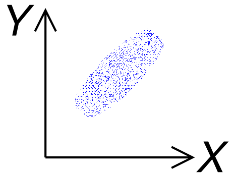

- ### Data：$`\begin{cases}{x_1,x_2,\cdots ,x_n}\\{y_1,y_2,\cdots ,y_n}\end{cases}`$
    - #### Number of Data：$`n`$
    - #### [Arithmetic Mean](../descriptive-statistics.md#arithmetic-mean-am)：$`μ_x,~μ_y`$
    - #### [Standard Deviation](../descriptive-statistics.md#standard-deviation-sd)：$`σ_x,~σ_y`$
- ### [Random Variable](../probability-theory/probability-theory.md#random-variable)：$`\begin{cases}{X=x_1,x_2,\cdots ,x_n}\\{Y=y_1,y_2,\cdots ,y_n}\end{cases}`$
    - #### [Expected Value (Mean)](../probability-theory/expected-value.md)：$`E\left[X\right],~E\left[Y\right]`$
    - #### [Standard Deviation](../descriptive-statistics.md#standard-deviation-sd)：$`\sqrt{Var\left(X\right)},~\sqrt{Var\left(Y\right)}`$

# Correlation
|Negative Correlation|Zero Correlation|Positive Correlation|
|:---:|:---:|:---:|
||||
|$-1\le r<0$|$r=0$|$0<r\le 1$|
|$Cov\left(X,~Y\right)<0$|$Cov\left(X,~Y\right)=0$|$0<Cov\left(X,~Y\right)$|
- ### Sum of Products of [Deviations from the Mean](../descriptive-statistics.md#deviation-from-the-mean)
    - $`D_{xy}=\sum\limits_{i=1}^{n}\left(x_i-μ_x\right)\left(y_i-μ_y\right)=\sum\limits_{i=1}^{n}{x_iy_i}-nμ_xμ_y`$
- ### [Covariance](../variance.md#covariance)
- ### [Correlation Coefficient](#correlation-coefficient-1)
- ### $`\text{If }X\text{ and }Y\text{ are }`$[Independent](../probability-theory/conditional-probability/conditional-probability.md#independent-events-mutually-exclusive-events\right), $`\text{then }X\text{ and }Y\text{ are Zero Correlation}`$

# Correlation Coefficient
- ### Pearson Correlation Coefficient
    - ### $`r=\frac{σ_{xy}}{σ_xσ_y}=\frac{D_{xy}}{nσ_xσ_y} = \frac{\sum\limits_{i=1}^{n}\left(x_i-μ_x\right)\left(y_i-μ_y\right)}{\sqrt{\sum\limits_{i=1}^{n}\left(x_i-μ_x\right)^2}\sqrt{\sum\limits_{i=1}^{n}\left(y_i-μ_y\right)^2}} = \frac{\sum\limits_{i=1}^{n}{x_iy_i}-nμ_xμ_y}{\sqrt{\sum\limits_{i=1}^{n}{x_i}^2-n{μ_x}^2}\sqrt{\sum\limits_{i=1}^{n}{y_i}^2-n{μ_y}^2}}`$
    - ### $`r = \frac{Cov\left(XY\right)}{\sqrt{Var\left(X\right)}\sqrt{Var\left(Y\right)}} = \frac{E\left[XY\right]-E\left[X\right]E\left[Y\right]}{\sqrt{E\left[X^2\right]-E\left[X\right]^2}\sqrt{E\left[Y^2\right]-E\left[Y\right]^2}}`$
- ### Partial Correlation Coefficient
    - ### $`r_{xy,~z}=\frac{r_{xy}-\left(r_{xz}\right)\left(r_{yz}\right)}{\sqrt{1-\left(r_{xz}\right)^2}\times\sqrt{1-\left(r_{yz}\right)^2}}`$

# Regression Analysis
- ### [Linear Regression](linear-regression.md)
    - ### Polynomial Regression
- ### Nonlinear Regression
    - ### Logistic Regression 

