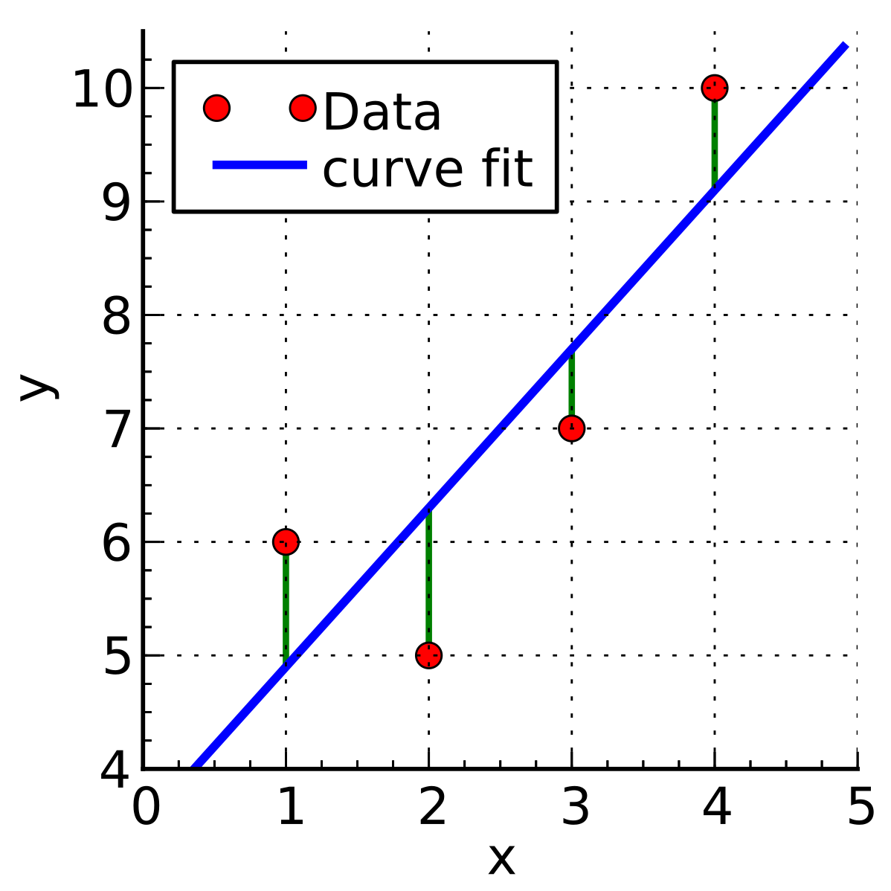

# Regression Line
- ### Least Square Method
    

    - #### Data：$`(x_1,y_1),(x_2,y_2),\cdots,(x_n,y_n)`$
    - #### Let $`L:y=mx+k`$
    - #### Sum of Squares：$`\sum_{i=1}^{n}((mx_i+k)-y_i)^2`$
        - the sum of squared vertical distances (from data point to line L)
    - #### Regression Line：$`y=ax+b`$
        - when $`m=a,~k=b`$：the Sum of Squares is minimized
- ### Standardization
    - #### Standardization：$`\frac{(y-μ_y)}{σ_y}=r\times\frac{(x-μ_x)}{σ_x}`$
    - #### Regression Line：$`(y-μ_y)=r\times\frac{σ_y}{σ_x}(x-μ_x)`$
        - The regression line passes through $(μ_x,μ_y)$

