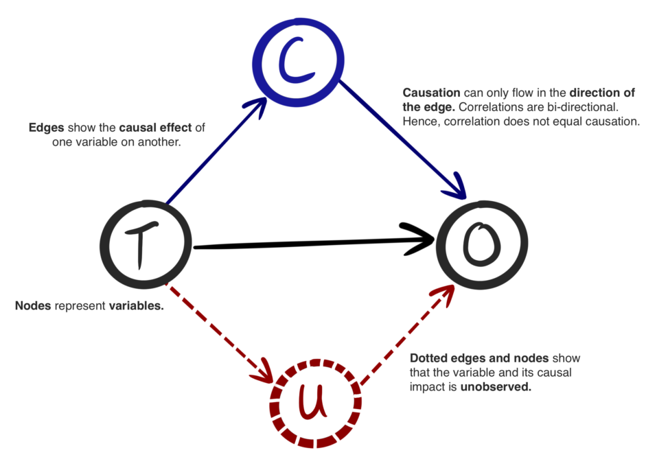
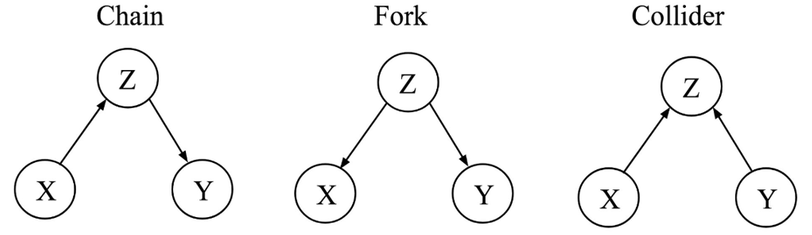
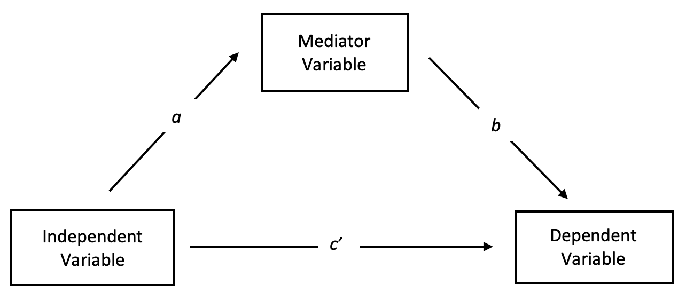

# Causal Graph

- ### [Directed Acyclic Graph (DAG)](/stem/it/coding/programming-language/data-structures-and-algorithms/data-structure/graph/graph.md#directed-acyclic-graph-dag)

- ### Fundamental Causal Graph Structures
    

    - ### Chain：X causes Z, which in turn causes Y
    - ### Fork：Z causes both X and Y
    - ### Collider：Both X and Y cause Z

# Mediation Analysis
- ### Mediation Model
    
- ### Mediation Variable

# Confounding
- ### Confounder (Confounding Factor, Confounding Variable)

# Causal Loop Diagram (CLD)

# Structural Equation Modeling

# Spurious Relationship (Spurious Correlation)

