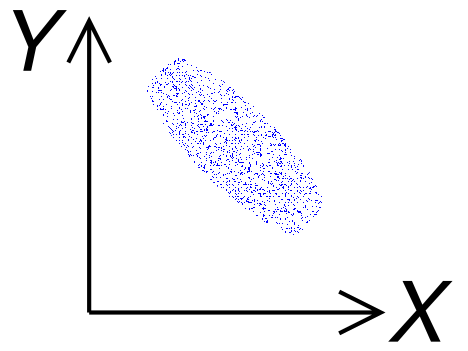
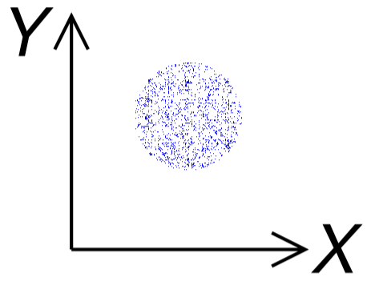

# Correlation
|Negative Correlation|Zero Correlation|Positive Correlation|
|:---:|:---:|:---:|
||||
|$-1\le r<0$|$r=0$|$0<r\le 1$|
|$Cov\left(X,~Y\right)<0$|$Cov\left(X,~Y\right)=0$|$0<Cov\left(X,~Y\right)$|
|$`X`$ and $`Y`$ have [Negative Linear Relationship](#negative-linear-relationship)|$`X`$ and $`Y`$ have [No Linear Relationship](#no-linear-relationship)|$`X`$ and $`Y`$ have [Positive Linear Relationship](#positive-linear-relationship)|
- ### $`\text{If } X\text{ and }Y \text{ are }`$[Independent](../../../probability-theory/conditional-probability/conditional-probability.md#independent-events-mutually-exclusive-events), $`\text{then } X\text{ and }Y \text{ are Zero Correlation}`$
- ### Correlation does not imply Causation

# Correlation Coefficient
- ### Pearson Correlation Coefficient
    - ### $`r=\frac{σ_{xy}}{σ_xσ_y}=\frac{D_{xy}}{nσ_xσ_y} = \frac{\sum\limits_{i=1}^{n}\left(x_i-μ_x\right)\left(y_i-μ_y\right)}{\sqrt{\sum\limits_{i=1}^{n}\left(x_i-μ_x\right)^2}\sqrt{\sum\limits_{i=1}^{n}\left(y_i-μ_y\right)^2}} = \frac{\sum\limits_{i=1}^{n}{x_iy_i}-nμ_xμ_y}{\sqrt{\sum\limits_{i=1}^{n}{x_i}^2-n{μ_x}^2}\sqrt{\sum\limits_{i=1}^{n}{y_i}^2-n{μ_y}^2}}`$
    - ### $`r = \frac{Cov\left(XY\right)}{\sqrt{Var\left(X\right)}\sqrt{Var\left(Y\right)}} = \frac{E\left[XY\right]-E\left[X\right]E\left[Y\right]}{\sqrt{E\left[X^2\right]-E\left[X\right]^2}\sqrt{E\left[Y^2\right]-E\left[Y\right]^2}}`$
- ### Partial Correlation Coefficient
    - ### $`r_{xy,~z}=\frac{r_{xy}-\left(r_{xz}\right)\left(r_{yz}\right)}{\sqrt{1-\left(r_{xz}\right)^2}\times\sqrt{1-\left(r_{yz}\right)^2}}`$

# [Covariance](../../variance.md#covariance)
- ### Sum of Products of [Deviations from the Mean](../../descriptive-statistics.md#deviation-from-the-mean)
    - $`D_{xy}=\sum\limits_{i=1}^{n}\left(x_i-μ_x\right)\left(y_i-μ_y\right)=\sum\limits_{i=1}^{n}{x_iy_i}-nμ_xμ_y`$
- ### [Covariance Matrix](../../variance.md#covariance-matrix)

# Relationship
- ### Linear Relationship ($`r\ne 0`$)
    - #### Positive Linear Relationship
    - #### Negative Linear Relationship
- ###  No Linear Relationship ($`r=0`$) 
    - #### Nonlinear relationship
    - #### No relationship ([Independent](../../../probability-theory/conditional-probability/conditional-probability.md#independent-events-mutually-exclusive-events))

