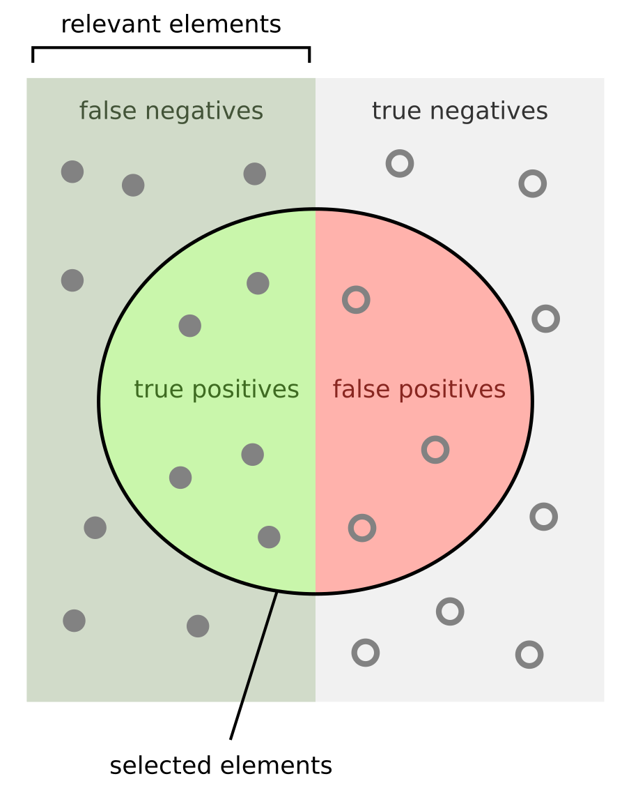

# Confusion Matrix

    
      
    <table border="1">
        <thead>
            <tr>
                <th align="center" rowspan="2" colspan="2">Total Population</th>
                <th align="center" colspan="2">Predicted Condition</th>
            </tr>
            <tr>
                <th align="center">Predicted Positive</td>
                <th align="center">Predicted Negative</td>
            </tr>
        </thead>
        <tr>
            <th align="center" rowspan="2">Actual Condition</th>
            <th align="center">Real Positive</td>
            <td align="center">True Positive (TP)</td>
            <td align="center">False Negative (FN)</td>
        </tr>
        <tr>
            <th align="center">Real Negative</td>
            <td align="center">False Positive (FP)</td>
            <td align="center">True Negative (TN)</td>
        </tr>
    </table>

# Evaluation Metrics
- ### Confusion Matrix Rates
    <table border="1">
        <thead>
            <tr>
                <th align="center" rowspan="2" colspan="2">Total Population</th>
                <th align="center" colspan="2">Predicted Condition</th>
            </tr>
            <tr>
                <th align="center">Predicted Positive</td>
                <th align="center">Predicted Negative</td>
            </tr>
        </thead>
        <tr>
            <th align="center" rowspan="2">Actual Condition</th>
            <th align="center">Real Positive</td>
            <td align="center">True Positive Rate (TPR, Recall, Sensitivity) $TPR = \frac{TP}{TP+FN}$</td>
            <td align="center">False Negative Rate (FNR) $FNR = \frac{FN}{TP+FN}$</td>
        </tr>
        <tr>
            <th align="center">Real Negative</td>
            <td align="center">False Positive Rate (FPR) $FPR = \frac{FP}{FP+TN}$</td>
            <td align="center">True Negative Rate (TNR, Specificity) $TNR = \frac{TN}{FP+TN}$</td>
        </tr>
    </table>
- ### $`\text{Accuracy} = \frac{TP+TN}{TP+TN+FP+FN}`$
- ### $`\text{Precision} = \frac{TP}{TP+FP}`$
- ### $`\text{F1-Score} = \frac{2 \times \text{Precision} \times \text{Sensitivity}}{\text{Precision} + \text{Sensitivity}}`$

# Curve
- ### Receiver Operating Characteristic Curve (ROC Curve)
- ### Area Under the Curve (AUC)

# Logistic Regression
- ### [Logistic Regression](logistic-regression.md)
