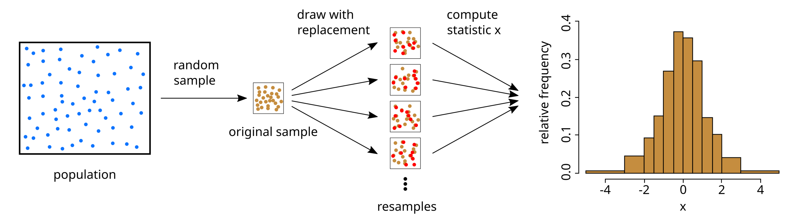

# Resampling
- ### $\text{Population} \xrightarrow{\text{sampling}} \text{Sample} \xrightarrow{\text{resampling}} \text{Resample}$
    - ### Sample Size = $n$

# Bootstrapping

- ### $\text{Population} \xrightarrow{\text{sampling}} \text{Sample} \xrightarrow{\text{sampling with replacement}} \begin{cases} \text{Resample}_1 \\ \vdots \\ \text{Resample}_m \end{cases}$
    - #### Sample Size = Resample Size = $n$

# Cross-Validation
- ### K-Fold Cross-Validation
- ### Leave-One-Out Cross-Validation (LOOCV)
- ### Holdout Cross-Validation

# Jackknife Resampling

# Permutation Test

