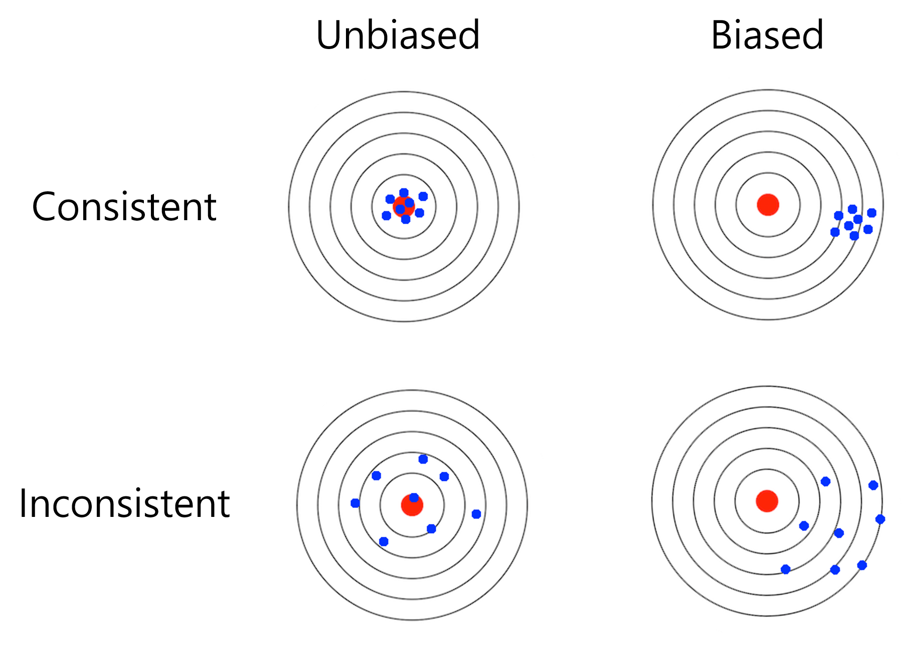

# Properties of Estimators

- ### Unbiasedness
    - ### $`\hat{θ} = \begin{cases} \text{Unbiased Estimator} & {\text{If } Bias\left( \hat{θ} \right)=0} \\ \text{Biased Estimator} & {\text{If } Bias\left( \hat{θ} \right)\ne 0} \end{cases}`$
- ### Consistency
    - ### $`\hat{θ} = \begin{cases} \text{Consistent Estimator} & {\text{If } \lim\limits_{n\to\infty}{MSE\left( \hat{θ} \right)}=0} \\ \text{Inconsistent Estimator} & {\text{If } \lim\limits_{n\to\infty}{MSE\left( \hat{θ} \right)}\ne 0} \end{cases}`$
- ### Efficiency
    - ### Efficiency of an [Unbiased Estimator](#unbiasedness)：$`e\left( \hat{θ} \right) = \frac{1/I\left(θ\right)}{Var\left( \hat{θ} \right)}`$
        - $`\hat{θ}`$ = [Unbiased Estimator](#unbiasedness)
        - $`I\left(θ\right)`$ = [Fisher Information](point-estimation.md#fisher-information)
    - ### Relative Efficiency：$`\text{If } Var\left( \hat{θ}_1 \right) < Var\left( \hat{θ}_2 \right) ,~\text{then } \hat{θ}_1 \text{ is more efficient than } \hat{θ}_2`$
        - $`\hat{θ}_1,~\hat{θ}_2`$ = [Unbiased Estimator](#unbiasedness)
- ### Bias
    - ### $`Bias\left( \hat{θ} \right) = E\left[ \hat{θ} \right]-θ = E\left[ \hat{θ}-θ \right]`$
- ### Mean Squared Error (MSE)
    - ### $`MSE\left( \hat{θ} \right) = E\left[ \left(\hat{θ}-θ\right)^2 \right] = Var\left( \hat{θ} \right) + Bias\left( \hat{θ} \right)^2`$
    - ### Root Mean Square Error (RMSE)：$`RMSE\left( \hat{θ} \right) = \sqrt{MSE\left( \hat{θ} \right)}`$
- ### [Uniformly Minimum Variance Unbiased Estimator (UMVUE)](#uniformly-minimum-variance-unbiased-estimator-umvue-1)

# Uniformly Minimum Variance Unbiased Estimator (UMVUE)
- ### Minimum Variance：$`\hat{θ}=\text{UMVUE},~\text{If }\Big( Var\left( \hat{θ} \right) \le Var\left( \tilde{θ} \right),~\forall θ \Big)`$
    - $`\hat{θ}`$ = [Unbiased Estimator](#unbiasedness)
    - $`\tilde{θ} = \text{any other unbiased estimator}`$
- ### Rao–Blackwell Theorem
- ### Lehmann–Scheffé Theorem
- ### Cramer-Rao Lower Bound (CRLB)：$`Var\left(\hat{θ}\right) \ge \frac{1}{I\left(θ\right)}`$
    - $`\hat{θ}`$ = [Unbiased Estimator](#unbiasedness)
    - $`I\left(θ\right)`$ = [Fisher Information](point-estimation.md#fisher-information)

# Estimator
- ### Sample [Mean](../../descriptive-statistics.md#arithmetic-mean-am)
    - ### $`\overline{x}=\frac{\sum\limits_{i=1}^{n}{x_i}}{n}=\frac{x_1+x_2+\cdots +x_n}{n}`$
- ### [Sample Variance](#sample-variance-1)
- ### Sample [Standard Deviation](../../descriptive-statistics.md#standard-deviation-sd)
    - ### $`S=\sqrt{\frac{\sum\limits_{i=1}^{n}\left(x_i-\overline{x}\right)^2}{n-1}}`$
- ### Standard Error (SE)
    - ### Exact value：$`SE = \sqrt{Var\left(\overline{X}\right)} = \frac{σ}{\sqrt{n}}`$
    - ### Estimate：$`\widehat{SE} = \frac{S}{\sqrt{n}}`$

# Sample Variance
- ### Biased Sample [Variance](../../variance.md)
    - ### $`\tilde{S}^2=\frac{\sum\limits_{i=1}^{n}\left(x_i-\overline{x}\right)^2}{n}`$
- ### Unbiased Sample [Variance](../../variance.md)
    - ### $`S^2=\frac{\sum\limits_{i=1}^{n}\left(x_i-\overline{x}\right)^2}{n-1}`$
- ### Sample [Covariance](../../variance.md#covariance)
    - ### $`q_{xy} = \frac{\sum\limits_{i=1}^{n}\left(x_i-\overline{x}\right)\left(y_i-\overline{y}\right)}{n-1}`$
- ### [Unbiased Estimation of Sample Variance](#unbiased-estimation-of-sample-variance-1)

# Unbiased Estimation of Sample Variance
- ### Bessel's Correction
    - ### $`\text{Unbiased Sample Variance}=\text{Biased Sample Variance}\times \text{Correction Factor}`$
- ### $`\text{Correction Factor}=\frac{\text{Sample Size}}{\text{Degree of Freedom}}=\frac{n}{n-1}`$
- ### Degree of Freedom：$`df=n-1`$
