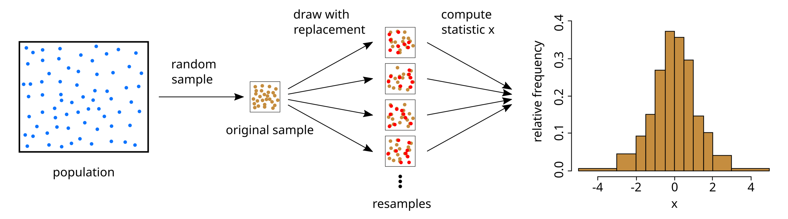

# Resampling
- ### $`\text{Population} \overset{\text{sampling}}{\longrightarrow} \text{Sample} \overset{\text{resampling}}{\longrightarrow} \text{Resample}`$
    - ### Sample Size = $`n`$

# Bootstrapping

- ### $`\text{Population} \overset{\text{sampling}}{\longrightarrow} \text{Sample} \overset{\text{sampling with replacement}}{\longrightarrow} \begin{cases} \text{Resample}_1 \\ \vdots \\ \text{Resample}_m \end{cases}`$
    - #### Sample Size = Resample Size = $`n`$

# Cross-Validation
- ### K-Fold Cross-Validation
- ### Leave-One-Out Cross-Validation (LOOCV)
- ### Holdout Cross-Validation

# Jackknife Resampling

# Permutation Test

