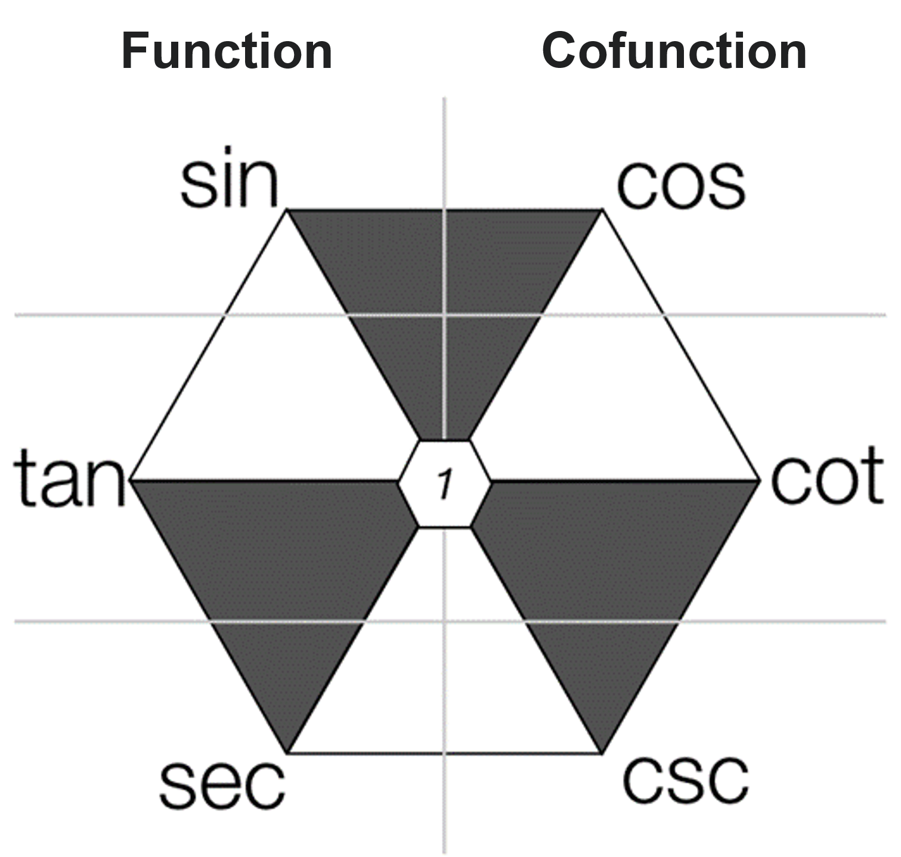
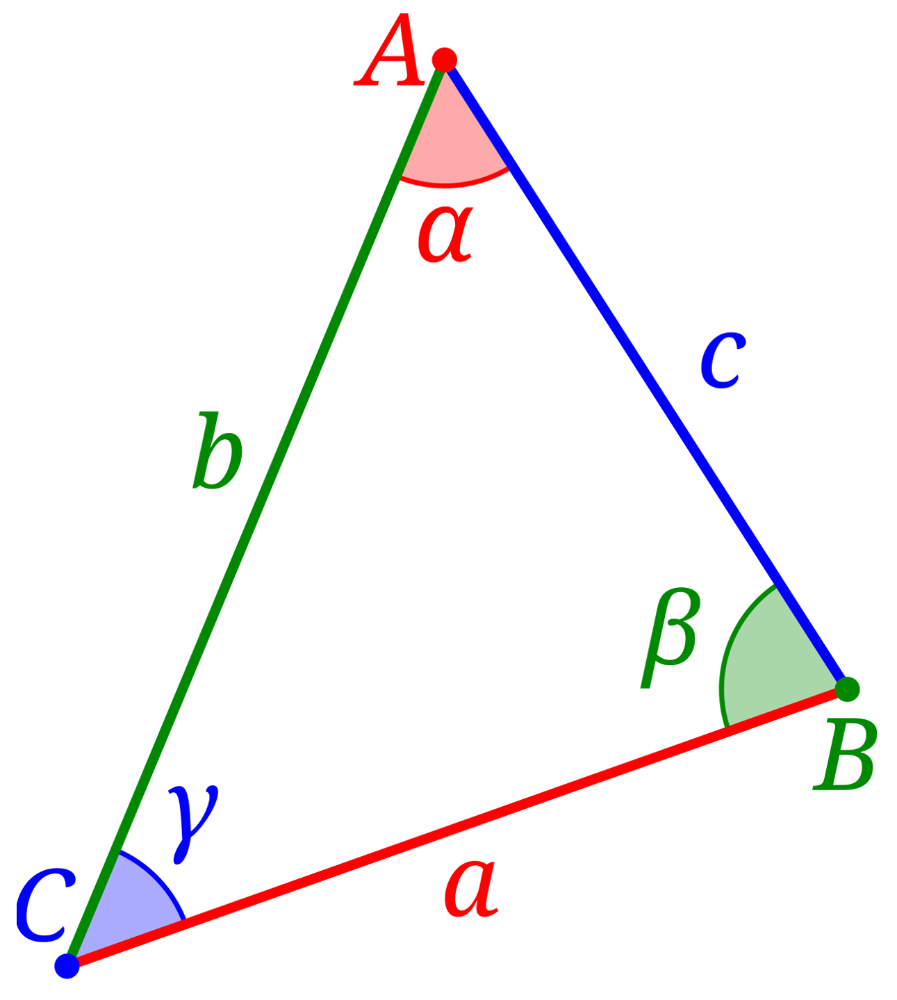

# Trigonometric Functions
- ### Complementary Function (Cofunction)
    |Functions|Cofunction|
    |:--:|:---:|
    |sine (sin)|cosine (cos)|
    |tangent (tan)|cotangent (cot)|
    |secant (sec)|cosecant (csc)|
    - [Cofunction Identities](#complementary-angles-identities-cofunction-identities)
- ### Reciprocal
    |Functions|Reciprocal|
    |:--:|:---:|
    |$`\sin{θ} = \frac{\text{opposite}}{\text{hypotenuse}}`$|$`\csc{θ} = \frac{1}{\sin{θ}} = \frac{\text{hypotenuse}}{\text{opposite}}`$|
    |$`\cos{θ} = \frac{\text{adjacent}}{\text{hypotenuse}}`$|$`\sec{θ} = \frac{1}{\cos{θ}} = \frac{\text{hypotenuse}}{\text{adjacent}}`$|
    |$`\tan{θ} = \frac{\text{opposite}}{\text{adjacent}}`$|$`\cot{θ} = \frac{1}{\tan{θ}} = \frac{\text{adjacent}}{\text{opposite}}`$|
    - [Reciprocal Identities](#reciprocal-identities)

# Value of Trigonometric Functions
|Degrees|Radians|$`\sin{\theta}`$|$`\cos{\theta}`$|$`\tan{\theta}`$|$`\csc{\theta}`$|$`\sec{\theta}`$|$`\cot{\theta}`$|
|:---:|:---:|:---:|:---:|:---:|:---:|:---:|:---:|
|$`0^{\circ}`$|$`0`$|$`0`$|$`1`$|$`0`$|$`\infty`$|$`1`$|$`\infty`$|
|$`15^{\circ}`$|$`\frac{π}{12}`$|$`\frac{\sqrt{6}-\sqrt{2}}{4}`$|$`\frac{\sqrt{6}+\sqrt{2}}{4}`$|$`2-\sqrt{3}`$|$`\sqrt{6}+\sqrt{2}`$|$`\sqrt{6}-\sqrt{2}`$|$`2+\sqrt{3}`$|
|$`30^{\circ}`$|$`\frac{π}{6}`$|$`\frac{1}{2}`$|$`\frac{\sqrt{3}}{2}`$|$`\frac{\sqrt{3}}{3}`$|$`2`$|$`\frac{2\sqrt{3}}{3}`$|$`\sqrt{3}`$|
|$`45^{\circ}`$|$`\frac{π}{4}`$|$`\frac{\sqrt{2}}{2}`$|$`\frac{\sqrt{2}}{2}`$|$`1`$|$`\sqrt{2}`$|$`\sqrt{2}`$|$`1`$|
|$`60^{\circ}`$|$`\frac{π}{3}`$|$`\frac{\sqrt{3}}{2}`$|$`\frac{1}{2}`$|$`\sqrt{3}`$|$`\frac{2\sqrt{3}}{3}`$|$`2`$|$`\frac{\sqrt{3}}{3}`$|
|$`75^{\circ}`$|$`\frac{5π}{12}`$|$`\frac{\sqrt{6}+\sqrt{2}}{4}`$|$`\frac{\sqrt{6}-\sqrt{2}}{4}`$|$`2+\sqrt{3}`$|$`\sqrt{6}-\sqrt{2}`$|$`\sqrt{6}+\sqrt{2}`$|$`2-\sqrt{3}`$|
|$`90^{\circ}`$|$`\frac{π}{2}`$|$`1`$|$`0`$|$`\infty`$|$`1`$|$`\infty`$|$`0`$|
|$`180^{\circ}`$|$`π`$|$`0`$|$`-1`$|$`0`$|$`\infty`$|$`-1`$|$`\infty`$|
|$`270^{\circ}`$|$`\frac{3π}{2}`$|$`-1`$|$`0`$|$`\infty`$|$`-1`$|$`\infty`$|$`0`$|
|$`360^{\circ}`$|$`2π`$|$`0`$|$`1`$|$`0`$|$`\infty`$|$`1`$|$`\infty`$|

# Inverse Trigonometric Functions
- ### $`\arcsin{x} = \sin^{-1}{x}`$
- ### $`\arccos{x} = \cos^{-1}{x}`$
- ### $`\arctan{x} = \tan^{-1}{x}`$

# Trigonometric Identities

- ### Pythagorean Identities
    - #### black triangle：$`\text{top left}^2+\text{top right}^2 = \text{bottom}^2`$
    - #### $`\sin^2{θ}+\cos^2{θ} = 1`$
    - #### $`\tan^2{θ}+1 = \sec^2{θ}`$
    - #### $`1+\cot^2{θ} = \csc^2{θ}`$
- ### [Reciprocal](#reciprocal) Identities
    - #### $`\text{product of diagonals} = \text{middle} = 1`$
    - #### $`\sin{θ} \times \csc{θ} = 1`$
    - #### $`\cos{θ} \times \sec{θ} = 1`$
    - #### $`\tan{θ} \times \cot{θ} = 1`$
- ### Ratio Identities
    - #### $`\text{middle} = \text{left} \times \text{right}`$
    - #### $`\sin{θ} = \tan{θ} \times \cos{θ}`$
    - #### $`\cos{θ} = \sin{θ} \times \cot{θ}`$
    - #### $`\tan{θ} = \sec{θ} \times \sin{θ}`$
    - #### $`\cot{θ} = \cos{θ} \times \csc{θ}`$
    - #### $`\sec{θ} = \csc{θ} \times \tan{θ}`$
    - #### $`\csc{θ} = \cot{θ} \times \sec{θ}`$
- ### Complementary Angles Identities ([Cofunction](#complementary-function-cofunction) Identities)
    - #### [Cofunction](#complementary-function-cofunction) of Complementary angles are equal
    - #### $`\sin{\left( 90^{\circ}-θ \right)} = \cosθ ,~ \cos{\left( 90^{\circ}-θ \right)} = \sinθ`$
    - #### $`\tan{\left( 90^{\circ}-θ \right)} = \cotθ ,~ \cot{\left( 90^{\circ}-θ \right)} = \tanθ`$
    - #### $`\sec{\left( 90^{\circ}-θ \right)} = \cscθ ,~ \csc{\left( 90^{\circ}-θ \right)} = \secθ`$

# Reduction Formulas
- ### 

# Sum and Difference Formulas
- ### $`\sin{\left(α\pmβ\right)} = \sin{α}\cos{β}\pm\cos{α}\sin{β}`$
- ### $`\cos{\left(α\pmβ\right)} = \cos{α}\cos{β}\mp\sin{α}\sin{β}`$
- ### $`\tan{\left(α\pmβ\right)} = \frac{\tan{α}\pm\tan{β}}{1\mp\tan{α}\tan{β}}`$

# Product-to-Sum and Sum-to-Product Identities
- ### Product-to-Sum Identities
    - #### $`2\sin{α}\cos{β} = \sin{\left(α+β\right)}+\sin{\left(α-β\right)}`$
    - #### $`2\cos{α}\sin{β} = \sin{\left(α+β\right)}-\sin{\left(α-β\right)}`$
    - #### $`2\sin{α}\sin{β} = \cos{\left(α-β\right)}-\cos{\left(α+β\right)}`$
    - #### $`2\cos{α}\cos{β} = \cos{\left(α+β\right)}+\cos{\left(α-β\right)}`$
- ### Sum-to-Product Identities
    - #### $`\text{Let }(α = \frac{A+B}{2}、β = \frac{A-B}{2}) \to \text{substitute into}$ [Product-to-Sum Identities](#product-to-sum-identities)
        - #### $`A = α+β、B = α-β`$
    - #### $`\sin{A}+\sin{B} = 2\sin{\frac{A+B}{2}}\cos{\frac{A-B}{2}}`$
    - #### $`\sin{A}-\sin{B} = 2\cos{\frac{A+B}{2}}\sin{\frac{A-B}{2}}`$
    - #### $`\cos{B}-\cos{A} = 2\sin{\frac{A+B}{2}}\sin{\frac{A-B}{2}}`$
    - #### $`\cos{A}+\cos{B} = 2\cos{\frac{A+B}{2}}\cos{\frac{A-B}{2}}`$

# Multiple-Angle Formulas
- ### Double-Angle Formulas
    - #### $`\sin{2θ} = 2\sin{θ}\cos{θ}`$
        - $`\cos{20^\circ} \cos{40^\circ} \cos{80^\circ} = \frac{1}{8}`$
    - ####  $`\cos{2θ} = \cos^2{θ}-\sin^2{θ}`$ 
        - $`\cos{2θ} = 2\cos^2{θ}-1`$
        - $`\cos{2θ} = 1-2\sin^2{θ}`$
        - $`\tan{2θ} = \frac{2\tan{θ}}{1-\tan^2{θ}}`$
- ### Triple-Angle Formulas
    - ### $`\sin{3θ} = 3\sin{θ}-4\sin^3{θ}`$
        - hint：$`山富士山`$
    - ### $`\cos{3θ} = -3\cos{θ}+4\cos^3{θ}`$
        - hint：$`-\sin{3θ}`$
    - ### $`\tan{3θ} = \frac{3\tan{θ}-\tan^3{θ}}{1-3\tan^2{θ}}`$

# Half-Angle Formulas
- ### Derived from [Double-Angle Formulas ($`\cos{2θ}`$)](#double-cos)
- ### $`\sin{\frac{θ}{2}} = \pm\sqrt{\frac{1-\cos{θ}}{2}}`$
- ### $`\cos{\frac{θ}{2}} = \pm\sqrt{\frac{1+\cos{θ}}{2}}`$
- ### $`\tan{\frac{θ}{2}} = \pm\sqrt{\frac{1-\cos{θ}}{1+\cos{θ}}} = \frac{\sin{θ}}{1+\cos{θ}} = \frac{1-\cos{θ}}{\sin{θ}}`$

# Power Reduction Formulas
- ### Derived from [Double-Angle Formulas ($`\cos{2θ}`$)](#double-cos)
- ### $`\sin^2{θ} = \frac{1-\cos{2θ}}{2}`$
- ### $`\cos^2{θ} = \frac{1+\cos{2θ}}{2}`$
- ### $`\tan^2{θ} = \frac{1-\cos{2θ}}{1+\cos{2θ}}`$

# Tangent Half-Angle Formulas
- ### $`\sin{2θ} = \frac{2\tan{θ}}{1+\tan^2{θ}}`$
- ### $`\cos{2θ} = \frac{1-\tan^2{θ}}{1+\tan^2{θ}}`$
- ### $`\tan{2θ} = \frac{2\tan{θ}}{1-\tan^2{θ}}`$

# Laws of Triangles

- ### Law of sines
    - $`\frac{a}{\sin{α}}=\frac{b}{\sin{β}}=\frac{c}{\sin{γ}}=2R`$
    - $`R`$ = [Circumradius]()
- ### Law of cosines
    - $`a^2=b^2+c^2-2bc\cos{α}`$
    - #### If $a$ is the longest side:
        - Acute triangle：$`a^2<b^2+c^2`$
        - Right triangle (Pythagorean Theorem)：$`a^2=b^2+c^2`$
        - Obtuse triangle：$`a^2>b^2+c^2`$
- ### Law of tangents
    - $`\frac{a-b}{a+b}=\frac{\tan{\left(\frac{α-β}{2}\right)}}{\tan{\left(\frac{α+β}{2}\right)}}`$
- ### Others
    - $`\sin{α}+\sin{β}+\sin{γ} = 4\cos{\frac{α}{2}}\cos{\frac{β}{2}}\cos{\frac{γ}{2}}`$
    - $`\cos{α}+\cos{β}+\cos{γ} = 4\sin{\frac{α}{2}}\sin{\frac{β}{2}}\sin{\frac{γ}{2}}+1`$
    - $`\tan{α}+\tan{β}+\tan{γ} = \tan{α}\tan{β}\tan{γ}`$
    - $`a\cos{α}+b\cos{β}+c\cos{γ} = 4R\sin{α}\sin{β}\sin{γ} = 2a\sin{β}\sin{γ} = 2b\sin{α}\sin{γ} = 2c\sin{α}\sin{β}`$
