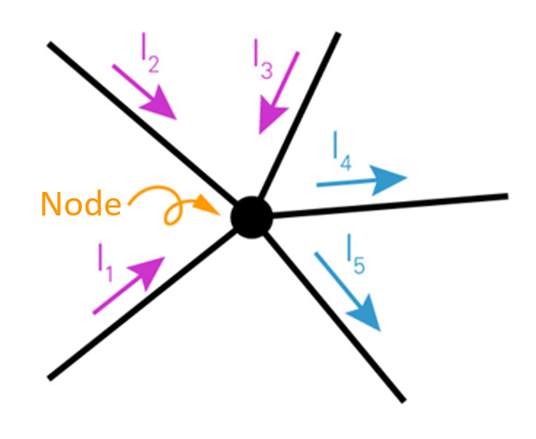
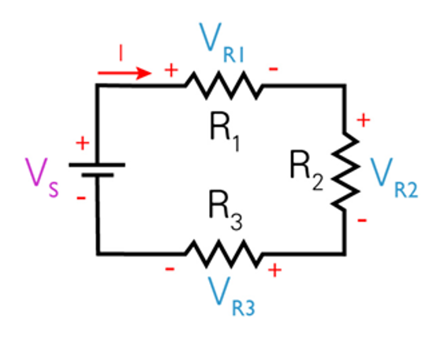
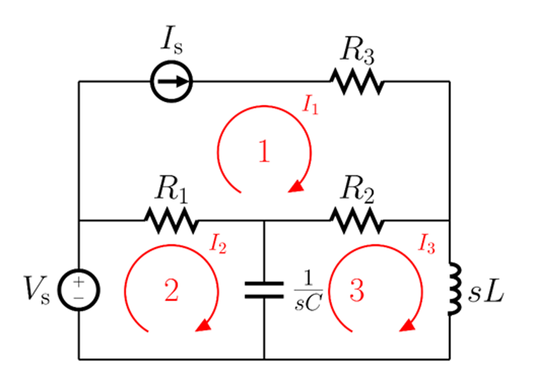

# Circuit Analysis
- ### [Kirchhoff's Law](#kirchhoffs-law-1)
- ### [Node Analysis](#node-analysis-1)
- ### [Mesh Analysis](#mesh-analysis-1)
- ### [Linear Circuit Analysis](linear-circuit-analysis.md)
- ### [Nonlinear Circuit Analysis](nonlinear-circuit-analysis.md)

# Kirchhoff's Law
- ### Kirchhoff's Current Law (KCL)
    - ### 經過節點的電流和＝0
        - ### 流入節點的電流和＝流出節點的電流和
    - ### eg：$`I_1+I_2+I_3=I_4+I_5`$
        
- ### Kirchhoff's Voltage Law (KVL)
    - ### 封閉迴路上的電壓和＝0
    - ### 電壓正負
        - ### 正(供電)：與電流方向一樣的電池
        - ### 負(耗電)：電阻、與電流方向不一樣的電池
    - ### eg：$`V_S-IR_1-IR_2-IR_3=0`$
        
 

# Node Analysis
- ### Supernode

# Mesh Analysis
- ### 解法
    - ### 假設每一個Mesh的電流
    - ### 用KVL列出每一個Mesh的電壓等式
- ### 元件的電流
    - ### 元件只通過Mesh-n：元件電流＝$`I_n`$
    - ### 元件通過兩個Mesh：元件電流＝$`I_n-I_m`$
- ### Supermesh
- ### eg
    

    - ### 假設$`I_1,~I_2,~I_3`$
    - ### Mesh-1：$`I_1=I_s`$
    - ### Mesh-2：$`-V_s+R_1(I_2-I_1)+\frac{1}{sC}(I_2-I_3)=0`$
    - ### Mesh-3：$`\frac{1}{sC}(I_3-I_2)+R_2(I_3-I_1)+sLI_3=0`$

