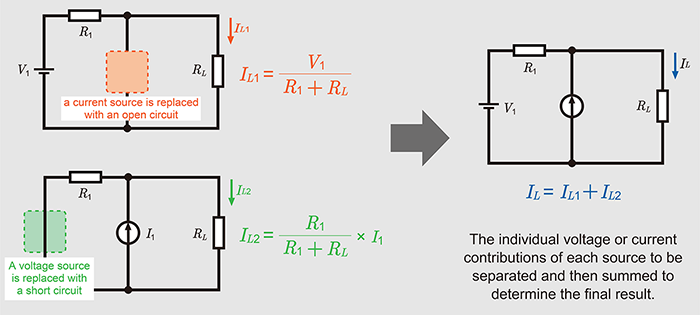
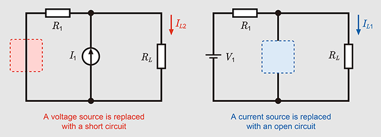
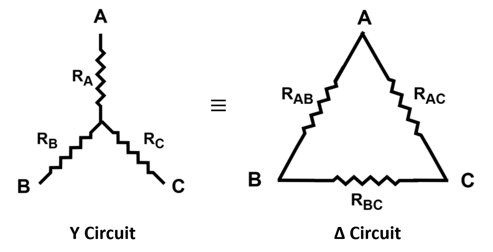
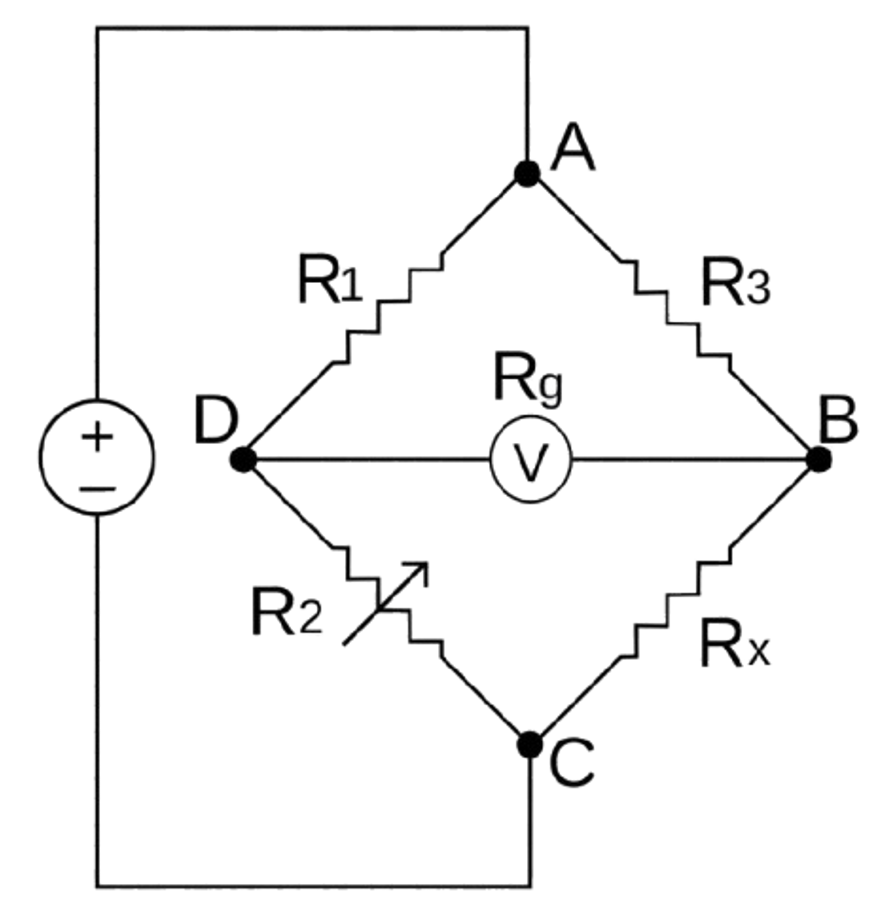

# Linear Circuit Analysis
- ### [Superposition Theorem](#superposition-theorem-1)
- ### Miller Theorem
    - ### Miller Effect
- ### [Equivalent Circuit](#equivalent-circuit-1)
- ### [Series circuits and Parallel circuits](#series-circuits-and-parallel-circuits-1)
- ### [Y-Δ transform](#y-δ-transform-1)
- ### [Wheatstone Bridge](#wheatstone-bridge-1)

# Superposition Theorem
- ### Multiple [Independent Sources](../../analog-electronics.md#source) = the sum of each [Independent Sources](../../analog-electronics.md#source) acting alone
    
- ### Replacement of [Independent Sources](../../analog-electronics.md#source)
    

    - #### Replace [Independent Voltages Source](../../analog-electronics.md#source) with [Short Circuits](../../analog-electronics.md#circuit-conditions)
    - #### Replace [Independent Current Source](../../analog-electronics.md#source) with [Open Circuits](../../analog-electronics.md#circuit-conditions)

# Equivalent Circuit
|Thévenin's theorem|Norton's theorem|
|:---:|:---:|
|||
|獨立電壓源+串聯阻抗|獨立電流源+並聯阻抗|
|AB兩端開路|AB兩端短路|
|$`V_{th}`$＝獨立電壓源＝開路電壓|$`I_{no}`$＝獨立電流源＝短路電流|
- ### 等效電路轉換 ($`\text{Thevenin}\leftrightarrow\text{Norton}`$)
    - ### AB兩端電阻：$`R_{AB}=R_{th}=R_{no}`$
    - ### $`V_{th}=I_{no}R_{AB}`$
- ### Millman's Theorem

# Series circuits and Parallel circuits
||Series circuits|Parallel circuits|
|:---:|:---:|:---:|
|**Electric Current ($`I`$)**|$`I=I_1=I_2=\cdots=I_n`$|$`I=\sum\limits_{k=1}^{n}I_k`$|
|**Voltage ($`V`$)**|$`V=\sum\limits_{k=1}^{n}V_k`$|$`V=V_1=V_2=\cdots=V_n`$|
|**Resistance ($`V=IR`$)**|$`R=\sum\limits_{k=1}^{n}R_k`$|$`\frac{1}{R}=\sum\limits_{k=1}^{n}\frac{1}{R_k}`$|
|**Capacitance ($`Q=CV`$)**|$`\frac{1}{C}=\sum\limits_{k=1}^{n}\frac{1}{C_k}`$|$`C=\sum\limits_{k=1}^{n}C_k`$|
|**Inductance ($`L=V\frac{Δt}{ΔI}`$)**|$`L=\sum\limits_{k=1}^{n}L_k`$|$`\frac{1}{L}=\sum\limits_{k=1}^{n}{\frac{1}{L_k}}`$`|
|**Impedance ($`Z`$)**|$`Z=\sum\limits_{k=1}^{n}Z_k`$|$`\frac{1}{Z}=\sum\limits_{k=1}^{n}\frac{1}{Z_k}`$|

- ### Divider
    |Voltage Divider|Current Divider|
    |:---:|:---:|
    |Series circuits|Parallel circuits|
    |$`V_1:\cdots:V_n=Z_1:\cdots:Z_n`$|$`I_1:\cdots:I_n=\frac{1}{Z_1}:\cdots:\frac{1}{Z_n}`$|

# Y-Δ transform

- ### $`R_Y`$ (Δ Circuit → Y Circuit)
    - ### $`R_A=\frac{R_{AB}R_{AC}}{R_{AB}+R_{AC}+R_{BC}}`$
    - ### $`R_B=\frac{R_{AB}R_{BC}}{R_{AB}+R_{AC}+R_{BC}}`$
    - ### $`R_C=\frac{R_{AC}R_{BC}}{R_{AB}+R_{AC}+R_{BC}}`$

- ### $`R_Δ`$ (Y Circuit → Δ Circuit)
    - ### $`R_{AB}=\frac{R_AR_B+R_AR_C+R_BR_C}{R_C}`$
    - ### $`R_{AC}=\frac{R_AR_B+R_AR_C+R_BR_C}{R_B}`$
    - ### $`R_{BC}=\frac{R_AR_B+R_AR_C+R_BR_C}{R_A}`$

# Wheatstone Bridge

- ### Balanced：$`\text{If }\frac{R_1}{R_2}=\frac{R_3}{R_x},~\text{then }V_{BD}=I_{BD}=0`$

