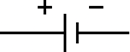
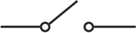
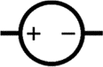
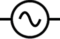
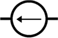
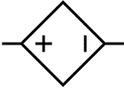
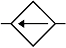
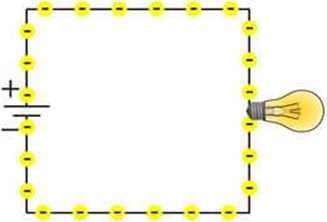
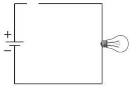
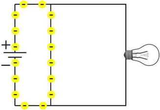

- ### Elementary Charge：$`e=1.602176\times{10}^{-19}(C)`$
- ### Electric Charge：$`Q=It=CV`$
    - ### [Unit](../../../../unit.md)：$`C`$ (Coulomb)
    - ### $t$＝time($s$)
- ### Electric Current：$`I=\frac{Q}{t}=\frac{V}{R}`$
    - ### [Unit](../../../../unit.md)：$`A`$ (Ampere)
- ### Voltage：$`V=IR=\frac{Q}{C}`$
    - ### [Unit](../../../../unit.md)：$`V`$ (Volt)
- ### Electrical Energy：$`E=QV=ItV`$
    - ### [Unit](../../../../unit.md)：$`J`$ (Joule)
    - ### $`E(t)=\int_{t_0}^{t}{I(t)\cdot V(t)\,dx}`$
- ### Electric Power：$`P=\frac{E}{t}=\frac{QV}{t}=IV`$
    - ### [Unit](../../../../unit.md)：$`W`$ (Watt)

# Electric Current and Electron Flow
- ### Electric Current (Current)：正電荷的移動方向
    - ### 電流方向相反：變號
    - ### DC、AC
        - #### Direct Current(DC)
        - #### Alternating Current(AC)
    - ### 電池的電流方向
        - #### 電池外部的電流方向：正極→負極
        - #### 電池內部的電流方向：負極→正極
- ### Electron Flow：負電荷的移動方向

# Electronic Symbol
|Electrical Components|Symbol|
|:---:|:---:|
|Electric Battery||
|Switch||
|Ground||

- ### Source
    ||Voltage Source|Current Source|
    |:---:|:---:|:---:|
    |**Independent Source**|&emsp; DC Voltage Source&emsp;AC Voltage Source| Independent Current Source|
    |**Dependent Source**| Dependent Voltage Source| Dependent Current Source|

# Circuit Conditions
|Closed Circuit|Open Circuit|Short Circuit|
|:---:|:---:|:---:|
||||

# Electric Battery
- ### Electromotive Force(EMF)：$`\varepsilon=\frac{E}{Q}=IR`$
    - #### [Unit](../../../../unit.md)：$`V`$ (Volt)
    - #### $R$＝總電阻
- ### 內電阻(電池內部的電阻)：$`r`$
- ### 端電壓：$`V=\varepsilon-Ir=I(R-r)`$
    - #### $`R-r=電池外部的電阻`$
- ### 理想電池：無內電阻
    - #### $總電阻=電池外部的電阻$
    - #### 理想電池的端電壓：$`V=\varepsilon`$

# Analog Circuit
- ### Circuit Analysis
- ### Linear Circuit
    - ### First-Order Circuit
    - ### Linear Circuit
    - ### Nonlinear Circuit
- ### Nonlinear Circuit

# Immittance
- ### Immittance

# Amplifier
- ### Amplifier

# Network
- ### Two-Port Network

