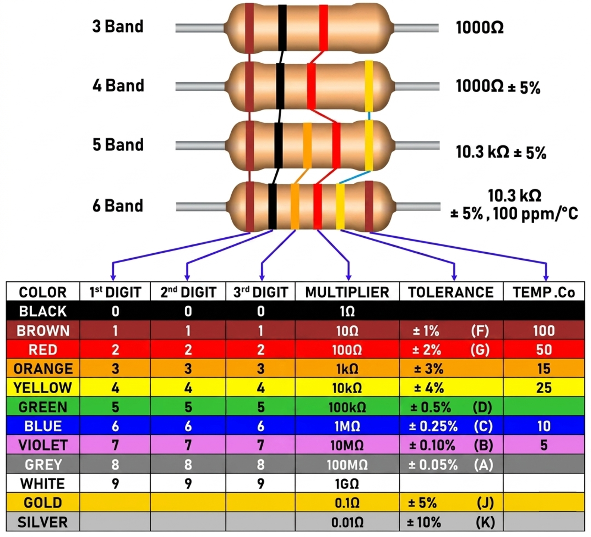

# Impedance
- ### Impedance：$`Z=R+jX`$
    - ### $`j=\sqrt{-1}`$
- ### $`Z=|z|\left(\cos{θ}+j\sin{θ}\right)=|z|\times e^{jθ}`$
    - ### 幅值：$`|z|=\sqrt{R^2+X^2}`$
    - ### 幅角：$`θ=\arctan{\left(\frac{X}{R}\right)}`$
    - ### $`\sin{θ}=\frac{X}{|z|},\cos{θ}=\frac{R}{|z|},\tan{θ}=\frac{X}{R}`$
- ### [Resistance ($`R`$)](#resistance)
- ### Reactance：$`X=X_L-X_C`$
    - ### 容抗：$`X_C=\frac{1}{ωC}=\frac{1}{2πfC}`$
    - ### 感抗：$`X_L=ωL=2πfL`$
    - ### 角速度：$`ω2πf`$
- ### Linear Component → Impedance
    - ### Impedance of Resistor：$`Z_R=R`$
    - ### Impedance of Capacitance：$`Z_c=-jX_C=\frac{1}{jωC}=\frac{1}{sC}`$
    - ### Impedance of Inductance：$`Z_L=jX_L=jωL=sL`$
- ### [Unit](../../../../unit.md) (阻抗、電抗、容抗、感抗)：$`Ω`$ (Ohm)

# Admittance
- ### Admittance：$`Y=G+jB=\frac{1}{Z}`$
- ### Conductance：$`G=\frac{1}{R}=\frac{I}{V}`$
- ### Susceptance：$`B=\frac{1}{X}`$
- ### [Unit](../../../../unit.md) (Admittance, Conductance, Susceptance)：$`S`$ (Siemens)

# Resistance, Capacitance, Inductance
- ###  Resistance：$`R=\frac{V}{I}=ρ\frac{l}{A}`$ 
    - ### [Unit](../../../../unit.md)：$`Ω`$ (Ohm)
    - ### $`l`$ = 長度
    - ### $`A`$ = 截面積
- ### Capacitance：$`C=\frac{ε A}{d}=\frac{Q}{V}`$
    - ### [Unit](../../../../unit.md)：$`F`$ (法拉)
    - ### $`ε`$ = 電容率
    - ### $`A`$ = 電極板面積
    - ### $`d`$ = 電極板間隔
- ### Inductance：$`L=N\frac{ΔΦ_B}{ΔI}`$
    - ### [Unit](../../../../unit.md)：$`H`$ (亨利)
    - ### 電動勢：$`ε=-N\frac{ΔΦ_B}{Δt}=-L\frac{ΔI}{Δt}`$
    - ### 螺線管的電感：$`L=\frac{μ_0N^2A}{l}`$
        - ### $`μ_0`$ = 真空磁導率
        - ### $`A`$ = 截面積
        - ### $`l`$ = 導線長度
        - ### $`N`$ = 圈數

# Linear Component
- ###  Resistor (R) 
    - ### Resistor Color Code
        
        
        - 3 Band Resistor：$`\text{Digit}\times 2,~\text{Multiplier}`$
        - 4 Band Resistor：$`\text{Digit}\times 2,~\text{Multiplier},~\text{Tolerance}`$
        - 5 Band Resistor：$`\text{Digit}\times 3,~\text{Multiplier},~\text{Tolerance}`$
        - 6 Band Resistor：$`\text{Digit}\times 3,~\text{Multiplier},~\text{Tolerance},~\text{Temperature Coefficient}`$
    - ### Ohm's Law：$`V=IR`$
    - ### 電阻器電位能：$`E=QV=ItV=I^2Rt=\frac{V^2}{R}t`$
- ###  Capacitor (C)：$`Q=CV`$ 
    - ### 電容器電流：$`I\left(t\right)=\frac{dQ}{dt}=C\frac{dV\left(t\right)}{dt}`$
    - ### 電容器電壓：$`V\left(t\right)=\frac{1}{C}\int_{t_0}^{t}{I\left(t\right)\,dt}+V\left(t_0\right)`$
        - ### $`t_0`$ = 初始時間
    - ### 電壓連續性：$`V\left(t^-\right)=V\left(t^+\right)`$
    - ### 電容器電位能：$`E=\frac{1}{2}CV^2=\frac{1}{2}QV=\frac{Q^2}{2C}`$
- ###  Inductor (L)：$`V=-L\frac{ΔI}{Δt}`$ 
    - ### 電感器電壓：$`V\left(t\right)=L\frac{dI\left(t\right)}{dt}`$
    - ### 電感器電流：$`I\left(t\right)=\frac{1}{L}\int_{t_0}^{t}{V\left(t\right)\,dt}+I\left(t_0\right)`$
        - ### $`t_0`$ = 初始時間
    - ### 電流連續性：$`I\left(t^-\right)=I\left(t^+\right)`$
    - ### 電感器電位能：$`E=\frac{1}{2}LI^2`$

# Resistivity, Conductivity
- ### Resistivity：$`ρ=R\frac{A}{l}=ρ_0\left(1+α\left(T-T_0\right)\right)`$
    - ### $`l`$ = 長度
    - ### $`A`$ = 截面積
    - ### $`α`$ = 電阻率的溫度係數
    - ### $`ρ_0`$ = 溫度$`T_0`$的電阻率
    - ### $`T`$ = 電阻率$`ρ`$的溫度
      - ### $`T_0`$ = 電阻率$`ρ_0`$的溫度
- ### Conductivity：$`σ=\frac{1}{ρ}=\frac{J}{E}`$
    - ### $`J`$ = 電流密度
    - ### $`E`$ = 電場

