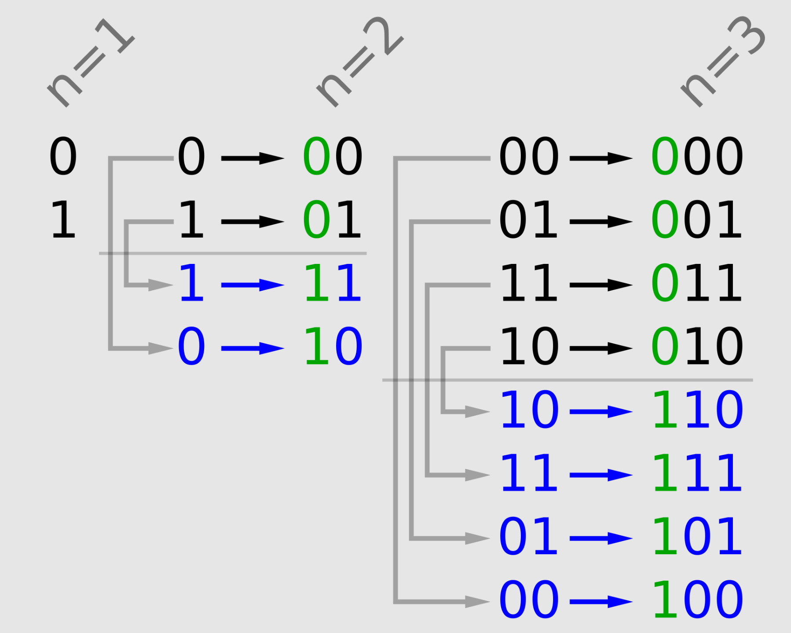
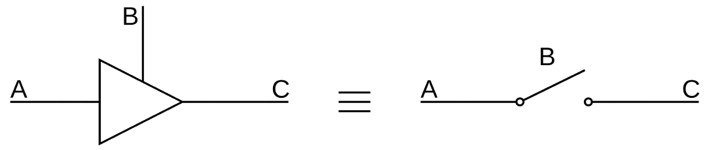

- ### Boolean Expression
- ### Logic Diagram
- ### Truth Table
    - ### [Karnaugh map(K-map)](#karnaugh-mapk-map-1)
- ### Hardware Description Language(HDL)
    - ### [VHDL](./hdl/vhdl.md)
    - ### Verilog

# Logic Gate
||Boolean Expression|Logic Diagram Symbol|Truth Table|
|:---:|:---:|:---:|:---:|
|Buffer|$`A`$||
|NOT|$`A^\prime,\overline{A}`$|
|AND|$`A\cdot B`$|
|OR|$`A+B`$|
|Exclusive OR (XOR)|$`A\oplus B`$|
|NAND|$`\overline{A\cdot B}`$|
|NOR|$`\overline{A+B}`$|
|Exclusive NOR (XNOR)|$`A\odot B,~\overline{A\oplus B}`$|

# Properties
- ### De Morgan's laws
    - NAND：$`\overline{A\cdot B}=\overline{A}+\overline{B}`$
    - NOR：$`\overline{A+B}=\overline{A}\cdot\overline{B}`$
- ### XOR：$`A\oplus B=\overline{A}\cdot B+A\cdot\overline{B}`$
    - XNOR：$`A\odot B=\overline{A\oplus B}=A\cdot B+\overline{A}\cdot\overline{B}`$

# Karnaugh map(K-map)

# Digital Electronics
- ### Combinational Logic
- ### [Sequential Logic](./digital-electronics/sequential-logic/sequential-logic.md)

# Encoding
|Decimal|Binary|Gray Code|One-Hot|
|:---:|:---:|:---:|:---:|
|0|000|000|00000001|
|1|001|001|00000010|
|2|010|011|00000100|
|3|011|010|00001000|
|4|100|110|00010000|
|5|101|111|00100000|
|6|110|101|01000000|
|7|111|100|10000000|
- ### Binary Encoding
- ### Gray Code：two continuous values differ in only one bit    
    - #### 1-bit Gray Code：$`\{0,~1\}`$
        |Binary|Gray Code|
        |:---:|:---:|
        |0|0|
        |1|1|
    - #### $`G_n=\{0\cdot G_{n-1}\}\cup \{1\cdot Reflect(G_{n-1})\}`$
        

        - $`G_i=\text{i-bit Gray Code}`$
        - $`Reflect(\{S_1,~\cdots ,~S_n\})=\{S_n,~\cdots ,~S_1\}`$
    - #### eg：2-bit Gray Code
        - $`Reflect(G_{1})=Reflect(\{0,~1\})=\{1,~0\}`$
        - $`G_2=\{0\cdot G_{1}\}\cup \{1\cdot Reflect(G_{1})\}=\{00,~01\}\cup \{11,~10\}=\{00,~01,~11,~10\}`$

- ### One-Hot：only one of the bits of the value is $1$

# Tri-State Logic
- ### Tri-States
    - High Voltage Output State ($1$)
    - Low Voltage Output State ($0$)
    - High Impedance State ($Z$)
- ### Tri-State Buffer
    - ### Signals
        - Input：$`A,~B`$
        - Output：$`C`$
    - ### Logic Diagram
        
    - ### Truth Table
        |$B$|$C$|
        |:---:|:---:|
        |$0$|$Z$|
        |$1$|$A$|
- ### Tri-State Bus

# Hazard
- ### Static Hazard
- ### Static 1-Hazards
- ### Static 0-Hazards
- ### Dynamic Hazard

# Programmable Logic Device(PLD)
- ### Programmable Logic Array(PLA)
- ### Complex PLD(CPLD)
- ### Field-Programmable Gate Array(FPGA)
---
- ### General-Purpose Input/Output(GPIO)
- ### Seven-Segment Display
- ### DIP Switch
