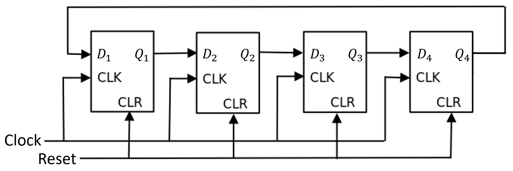
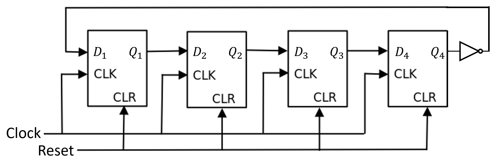

# Circular Shift Register
||[Ring Counter](#ring-counter)|[Johnson Counter](#johnson-counter)|
|:---:|:---:|:---:|
|Feedback|Non-Inverted|Inverted|
|Number of States ($n$-bit)|$n$|$2n$|
- ### State-Transition Table
    |Current State|Next State|
    |:---:|:---:|
    |$S_i$ ($0\leq i<m-1$)|$S_{i+1}$|
    |$S_{m-1}$|$S_0$|
    - $`m=\text{Number of States}`$
- ### Uses Shift Register (D Flip-Flop)

# Ring Counter
- ### Encoding：One-Hot
- ### State ($n$-bit)：$`S_i=\underbrace{0\cdots 0}_{i}\,1\,\underbrace{0\cdots 0}_{n-i-1}`$
- ### Logic Diagram (4-bit)
    
- ### Truth Table ($4$-bit)
    |State|Data Ouput ($Q_1 Q_2 Q_3 Q_4$)|
    |:---:|:---:|
    |$S_0$|1000|
    |$S_1$|0100|
    |$S_2$|0010|
    |$S_3$|0001|

# Johnson Counter
- ### State ($n$-bit)：$`S_i=\begin{cases}{\underbrace{1\cdots 1}_{i}\,\underbrace{0\cdots 0}_{n-i}}&{\text{if }0\leq i\leq n}\\ {\underbrace{0\cdots 0}_{i-n}\,\underbrace{1\cdots 1}_{2n-i}}&{\text{if }n<i< 2n}\end{cases}`$
- ### Logic Diagram (4-bit)
    
- ### Truth Table ($4$-bit)
    |State|Data Ouput ($Q_1 Q_2 Q_3 Q_4$)|
    |:---:|:---:|
    |$S_0$|0000|
    |$S_1$|1000|
    |$S_2$|1100|
    |$S_3$|1110|
    |$S_4$|1111|
    |$S_5$|0111|
    |$S_6$|0011|
    |$S_7$|0001|

