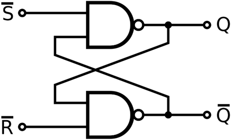
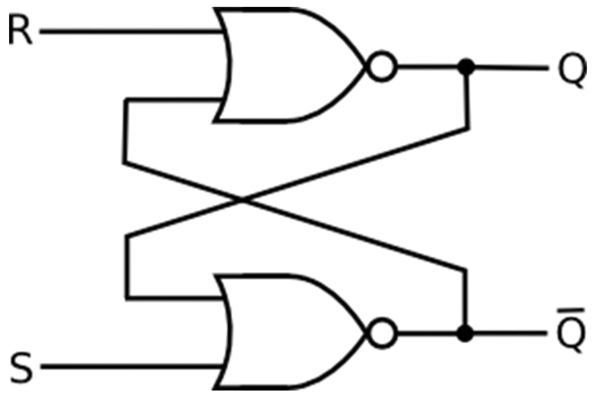

# SR Latch(Set-Reset)
- ### Signals
    - Input：$`S,~R,~Q`$
    - Output：$`Q_{next}`$
- ### Logic Diagram
    - ### SR NAND Latch
        
    - ### SR NOR Latch
        
- ### Truth Table
    |Action|$`S`$|$`R`$|$`Q_{next}`$|
    |:---:|:---:|:---:|:---:|
    |Hold|0|0|$`Q`$|
    |Reset|0|1|0|
    |Set|1|0|1|
    |Not Allowed|1|1|✗|

# D Latch(Data)
- ### Signals
    - Input：$`E,~D,~Q`$
      - $`E=\text{Enable}`$
    - Output：$`Q_{next}`$
- ### Logic Diagram
    - ### Logic Diagram(NAND、NOR)
- ### Truth Table
    |Action|$`E`$|$`Q_{next}`$|
    |:---:|:---:|:---:|
    |Hold|0|$`Q`$|
    |Data|1|$`D`$|

