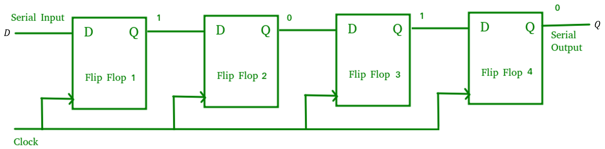
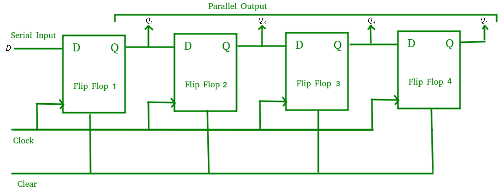
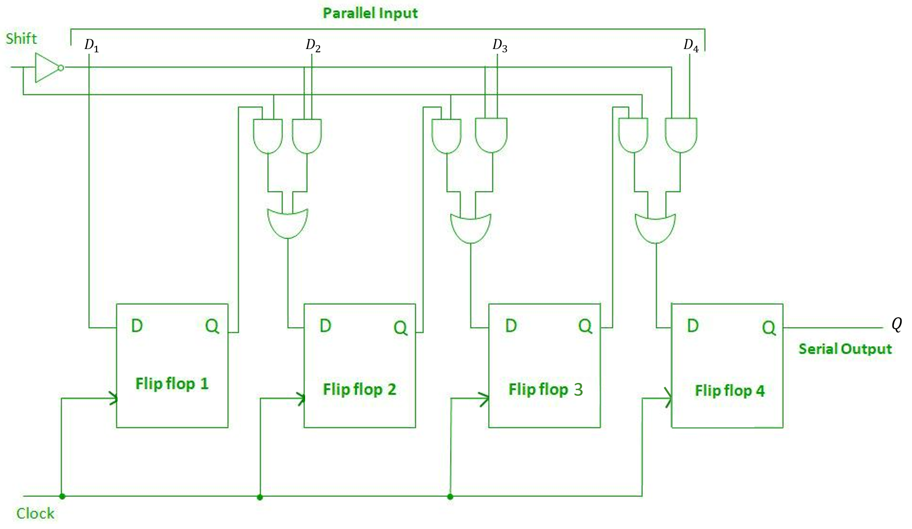
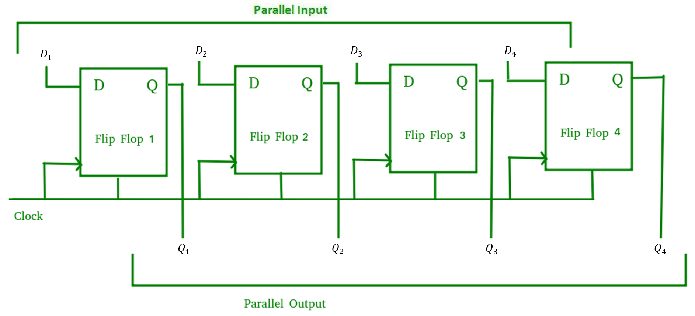

# Shift Register
- ### Signals
    - $`clk=\text{Clock input}`$
    - $`D=\text{Data input}`$
    - $`D=\text{Data output}`$
- ### Uses D Flip-Flop

# Serial-In Serial-Out (SISO)
- ### Logic Diagram (4-bit)
    

# Serial-In Parallel-Out (SIPO)
- ### Logic Diagram (4-bit)
    
- ### Additional Input：$`Clr\text{(Clear)}`$

# Parallel-In Serial-Out (PISO)
- ### Logic Diagram (4-bit)
    
- ### Additional Input：$`Shift`$

# Parallel-In Parallel-Out (PIPO)
- ### Logic Diagram (4-bit)
    

# Linear Feedback Shift Register (LFSR)
- ### Number of States ($n$-bit)：$`2^n-1`$

# Circular Shift Register
- ### [Circular Shift Register](../counter/circular-shift-register/circular-shift-register.md)
