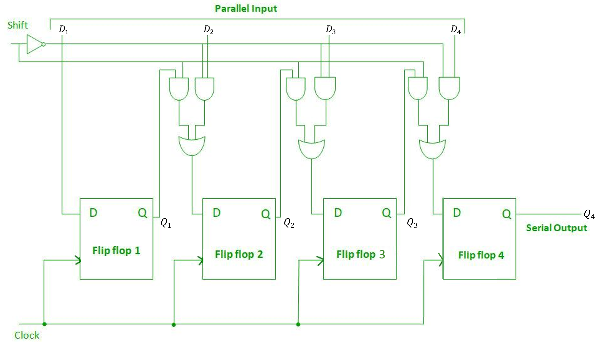
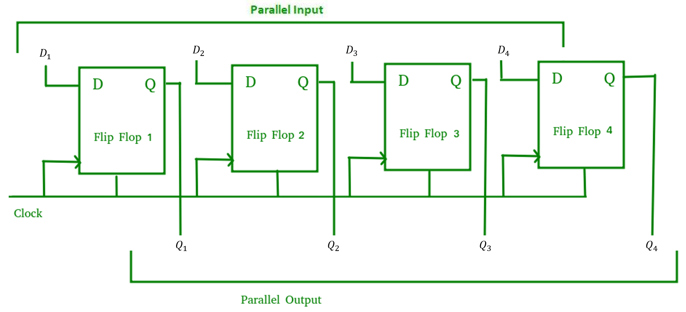

# Shift Register
- ### Signals
    - $clk=\href{../sequential-logic.md#clk}{Clock input}$
    - $D=\text{Data input}$
    - $Q=\text{Data output}$
- ### Uses [D Flip-Flop](../memory-element/flip-flop.md#d-flip-flop-data)

# Serial-In Serial-Out (SISO)
- ### Logic Diagram (4-bit)
    
- ### [Truth Table](../../../digital-electronics-and-logic-design.md#truth-table)
    |Action|$clk$|$Q$|
    |:---:|:---:|:---:|
    |Hold|$0/1/\downarrow$|$Q_i=Q_i$|
    |Shift|$\uparrow$|$Q_i=\begin{cases} D & i=1 \\ Q_{i-1} & i\ne 1\end{cases}$|

# Serial-In Parallel-Out (SIPO)
- ### Logic Diagram (4-bit)
    
- ### Additional Input：[Clear ($Clr$)](../sequential-logic.md#clear)
- ### [Truth Table](../../../digital-electronics-and-logic-design.md#truth-table)
    |Action|$CLR$|$clk$|$Q$|
    |:---:|:---:|:---:|:---:|
    |Clear|$1$|X|$Q_i = 0$|
    |Hold|$0$|$0/1/\downarrow$|$Q_i=Q_i$|
    |Shift|$0$|$\uparrow$|$Q_i=\begin{cases} D & i=1 \\ Q_{i-1} & i\ne 1\end{cases}$|

# Parallel-In Serial-Out (PISO)
- ### Logic Diagram (4-bit)
    
- ### Additional Input：$Shift$ ($\overline{Load}$)
- ### [Truth Table](../../../digital-electronics-and-logic-design.md#truth-table)
    |Action|$clk$|$Shift$ ($\overline{Load}$)|$Q$|
    |:---:|:---:|:---:|:---:|
    |Hold|$0/1/\downarrow$|X|$Q_i=Q_i$|
    |Load|$\uparrow$|$0$|$Q_i=D_i$|
    |Shift|$\uparrow$|$1$|$Q_i=\begin{cases} D_i & i=1 \\ Q_{i-1} & i\ne 1\end{cases}$|

# Parallel-In Parallel-Out (PIPO)
- ### Logic Diagram (4-bit)
    
- ### [Truth Table](../../../digital-electronics-and-logic-design.md#truth-table)
    |Action|$clk$|$Q$|
    |:---:|:---:|:---:|
    |Hold|$0/1/\downarrow$|$Q_i = Q_i$|
    |Load|$\uparrow$|$Q_i = D_i$|

# Bidirectional Shift Register
- ### Logic Diagram (4-bit, SISO)
    
- ### Additional Input：$Right$ ($\overline{Left}$)
- ### [Truth Table](../../../digital-electronics-and-logic-design.md#truth-table)
    |Action|$Right$ ($\overline{Left}$)|$clk$|$Q$|
    |:---:|:---:|:---:|:---:|
    |Hold|X|$0/1/\downarrow$|$Q_i = Q_i$|
    |Shift Left|$0$|$\uparrow$|$Q_i = \begin{cases} D & i=4 \\ Q_{i+1} & i\ne 4 \end{cases}$|
    |Shift Right|$1$|$\uparrow$|$Q_i = \begin{cases} D & i=1 \\ Q_{i-1} & i\ne 1 \end{cases}$|

# Universal Shift Register

# Linear Feedback Shift Register (LFSR)
- ### Number of States ($n$-bit)：$2^n-1$

# [Circular Shift Register](../counter/circular-shift-register/circular-shift-register.md)
- ### [Ring Counter](../counter/circular-shift-register/circular-shift-register.md#ring-counter)
- ### [Johnson Counter](../counter/circular-shift-register/circular-shift-register.md#johnson-counter)
